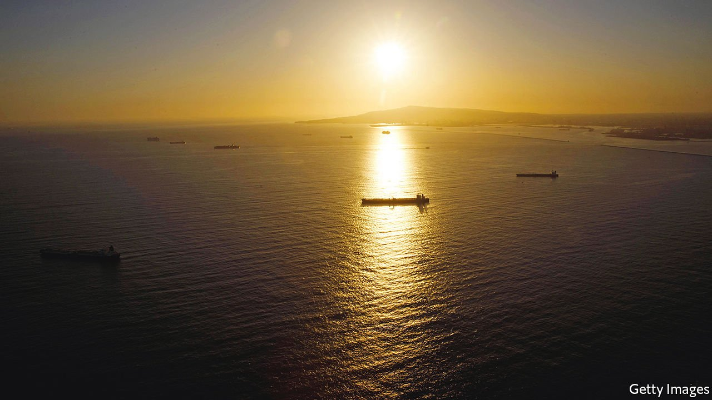

###### Shipping sleuthing

# Tracking ships at sea can help catch sanction-busters 

##### Radio data, satellites and a high-tech game of cat and mouse 

 

> Apr 16th 2022 

NEVER BEFORE have the activities of ocean-going vessels been under so much scrutiny. So says Oleg Ustenko, the economics adviser to Volodymyr Zelensky, Ukraine’s president, and a leader of a government initiative called the Russian Tanker Tracking Group (RTTG). Working with tips from a network of experts and spies, including foreign officials who contribute on the sly, the RTTG, Dr Ustenko says, tracks the energy shipments with which “Russia is desperately trying to finance its military machine”.

Despite the sanctions imposed by America and Europe, most of Russia’s energy shipments have remained legal. Outrage over its war on Ukraine, however, has left many firms keen to avoid the reputational risks of dealing with entities or goods of Russian origin. Beyond that, as the pandemic and war have tightened commodity markets, the value of detailed data on shipments has risen. As Reid I’Anson of the Houston office of Kpler, a firm of commodities analysts, notes, even traders who won’t buy illicit oil can make better decisions if they can gauge how much sanctioned countries such as Iran are managing to smuggle out.


Technology hopes to provide such information. The RTTG, for example, uses “network analysis” software to find revealing relationships among disparate bits of information. The group is already notching up successes. These include identifying shipments of Kazakh oil believed to contain portions of clandestinely loaded Russian crude, says Dr Ustenko. Alerts are sent to relevant governments and firms, as well as several Ukrainian ministries.

Data from ship transponders inform much of the analysis. Big commercial vessels must transmit their location and an identifying code to networks of terrestrial and satellite receivers known as the Automatic Identification System (AIS). Something as simple as an unusual acceleration may be a clue that a crew is buying time for an illicit deal. But the key to flagging potential mischief, says Ivan Ladan, the boss of Marine Digital, an analytics firm in Lübeck, Germany, is to use software that analyses the behaviour of ships in light of many different bits of information.

Marine Digital’s software, for instance, examines a ship’s declared cargo, route, and insurance details, as well as historical navigation patterns in various weather and market conditions. Crime and corruption in different places are also taken into account. The software is even fed port records on how low a vessel sits in the water, revealing the tonnage of cargo aboard. When it smells something fishy, the firm alerts authorities and its clients, mostly shipowners unhappy to hear that one of their leased vessels may be up to no good.

Sanctions-busting often involves transfers of cargo between ships, far from the eyes of port authorities. Vortexa, a London-based firm, runs software that looks for these “trans-shipments”. One clue is when a full and an empty vessel built to carry the same type of cargo meet away from crowded shipping lanes. Vortexa’s software also looks for encounters between a vessel that has a dodgy reputation and one that does not (or does not yet). The latter are preferred for passing off sanctioned cargo as a legitimate delivery. A ship’s age also matters. The riskier the voyage, the older the vessel is likely to be.

It is too soon to see how efforts to dodge sanctions on Russia will shape up. But Ioannis Papadimitriou, a Vortexa freight analyst, reckons illicit ship-to-ship transfers will be concentrated in the Baltic Sea and eastern Mediterranean. He also expects ships to meet in those areas and swap transponders, a trick sometimes done near Malaysia to deliver Iranian oil to China.

But AIS has its shortcomings. Satellites struggle to distinguish signals from crowded ports and littoral waters. To improve resolution, AIS receivers are being built along some coasts, but more are needed. A company based in Athens called Marine Traffic is posting AIS antennae to seaside building owners around the world, who volunteer to install the kit on rooftops. Marine Traffic’s network of roughly 3,600 antennae collects data that it fuses with information from other terrestrial networks and satellites. The resulting analytics are sold to trading firms, financial outfits and government bodies. Spokesman Georgios Hatzimanolis notes rising demand for information on vessels linked to Russia, be they tankers or superyachts.

Rubs remain. One is that a vessel’s AIS transponder can be switched off. Ami Daniel, the boss of Windward, a shipping-analytics firm based in Tel Aviv, sees “a huge spike” in the number of ships that have recently cut AIS transmissions. Many are in waters near Russia, including the Black Sea. Some have no doubt “gone dark” to reduce their visibility to Russian warships, which have fired upon merchant vessels. Even so, Mr Daniel, a former officer in Israel’s navy, reckons that the drop in transmissions heralds an increase in “deceptive shipping practices”.

Eyes in the sky

But there are other ways to keep tabs on ships. These include satellites with cameras and synthetic-aperture radar, which sees objects at night and through clouds. A more recently developed approach uses satellites in low orbits to hoover up signals from shipborne radars. These are used for navigation and to avoid collisions, so mariners are disinclined to switch them off. Fancy software for signal processing geolocates the signals’ sources, at times within just several hundred metres.

A handful of firms track ships in this way. Their clients include coast guards, navies and America’s National Geospatial-Intelligence Agency. This autumn a British firm, Horizon Technologies, aims to begin providing radio-frequency intelligence to Britain’s Royal Navy and governments in Greece, Italy and Singapore. It will also compile, in partnership with the International Maritime Organisation, a library of radar-pulse “fingerprints” of ships worldwide, made possible by minute idiosyncrasies in componentry in radar units of even the same make and model.

It adds up to a heap of data. Making sense of it, however, can be quite tricky. For one thing, a growing number of ships “spoof” AIS by transmitting bogus data that changes the vessel’s apparent identity or location. TankerTrackers, a firm with analysts in London and Stockholm, monitors more than 40 vessels, some with links to Russia, that visit Iranian and Venezuelan ports. Nearly half, the company says, transmit counterfeit AIS data. Such spoofing used to require hard-won expertise with fiddly software. These days, one manufacturer in Istanbul advertises a model smaller than a shoebox that transmits bogus data for up to ten vessels—“position offset, false identity, fake type, fake echo”, and so forth.

Beyond that, ships themselves are only one part of the game. Analysts must also figure out who is behind ships and their cargo. This is hard, for the shipping industry is a notorious mess of shell companies, flags of convenience and opaque accounting. To complicate matters further, many outfits are attempting to disassociate from Russia. Recent weeks, Windward reports, have seen an unprecedented number of vessels “flag out” of Russia and register with other countries.

Which comes back to the role of network-analysis software. Like Ukraine’s RTTG, Kharon, a Los Angeles firm, feeds its software with corporate records, shipping documents, court filings, news articles, police reports and regulatory paperwork. The software, says Benjamin Schmidt, head of product, even sucks up obscure databases “hosted by some random country where we’re able to identify one thread of information”—an address, perhaps, that connects a shady entity to a certain businessman. Social media helps. If a snapshot of that businessman at a trade show reveals another logo in the background, Kharon’s analysts begin poking around that company, too.

Kpler, for its part, is eyeing a different type of software upgrade. Mr I’Anson sees future iterations of Kpler’s software taking into account the political developments likely to shape appetites for busting sanctions, whether on Russia or other countries. He notes that when Joe Biden became president, China, presumably expecting “a little more leeway”, began to smuggle in greater amounts of discounted Iranian oil.

For technologists and technocrats, all this is heady stuff. But not all recent developments have worked in their favour. Western sanctions on Russia have shut off access to Russian registries of corporate filings. Jessica Abell of Sayari, an American business-intelligence firm that makes extensive use of such data, says that will make it much harder to work out who is doing what on the high seas. There is plenty, in other words, to play for. ■

To enjoy more of our mind-expanding science coverage, , our weekly newsletter. 

