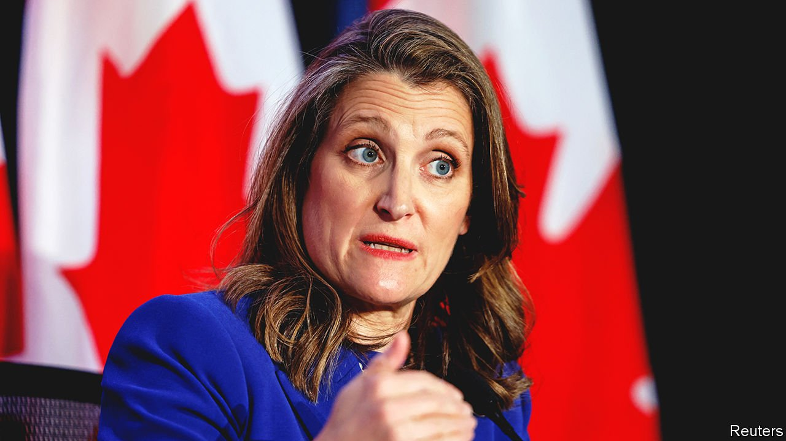

###### Going for growth

# Canada’s Liberal government tries to boost the economy 

##### But Chrystia Freeland’s budget lacks ambition 

 

> Apr 16th 2022 

OVER THE next four decades Canada’s growth per person is expected to be the lowest in the OECD, a club mostly of rich countries. On April 7th Chrystia Freeland, the finance minister, sought to correct that. In presenting the federal budget for the 2022-23 fiscal year, which began on April 1st, she vowed to tackle the “insidious” problem of low productivity growth. She coupled that with a promise to reduce debt, which soared during the pandemic, as a share of GDP.

The budget looks like an attempt by the Liberals, in office since 2015, to reclaim their reputation for centrism after years of rising federal spending. Critics say it falls short. It comes as the fortunes of Justin Trudeau, the prime minister, are improving after a rough patch. Police removed anti-government protesters from the streets of Ottawa, the capital, in February. The recent jump in the prices of commodities Canada exports should help protect its economy from an expected decline in global growth. In March Mr Trudeau, who leads a minority government, struck a “confidence-and-supply” agreement with the left-leaning New Democrats (NDP), which will probably keep him in power until elections in 2025. The opposition Conservatives are preoccupied with choosing a new leader in a vote due to take place in September.


Ms Freeland also has some money to spend, partly because of a post-pandemic economic recovery. She plans to fork out C$9.5bn ($7.5bn) over five years, 0.4% of total spending, on measures to spur home-building. A 50% rise in house prices over the past two years is among voters’ biggest concerns. Construction is supposed to double over the next decade. Foreigners, who are implausibly blamed for pushing up prices, will be barred from buying houses for two years.

Despite the deal with the NDP, Ms Freeland “did show some restraint” on spending, says Rebekah Young, an economist at Scotiabank. The budget sets almost nothing aside for a proposal, backed by both parties, to provide universal coverage of the cost of prescription drugs. Debt is projected to fall from 46.5% of GDP last year to 41.5% in 2026-27. But the government should do more to restrain deficits “when times are good”, says Ms Young. She argues that the government’s plans to sustain growth lack “a coherent vision”.

Ms Freeland’s most notable idea is to establish an “arm’s-length” Canada Growth Fund. Initially capitalised at C$15bn, it is supposed to attract at least three times that from the private sector to boost green businesses and exports. Missing from the budget are measures that would have a bigger payoff, such as giving incentives to provinces to remove barriers to trade. Ms Freeland’s quest for growth could have been bolder.

