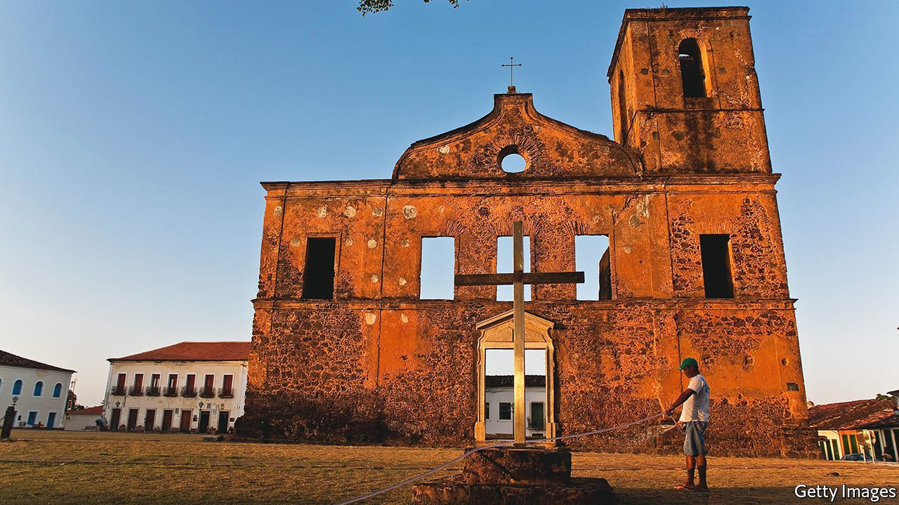
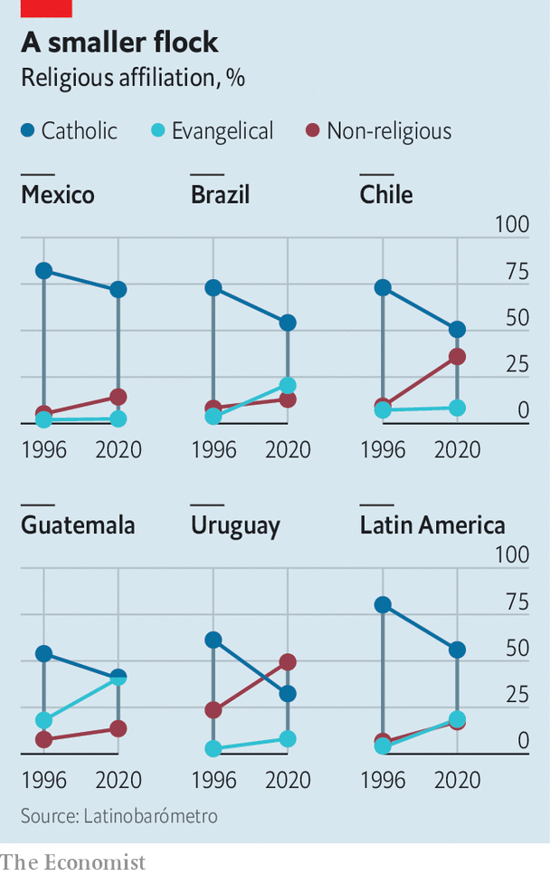

###### Losing their religion

# Latin America is becoming more secular 

##### Catholicism is in swift decline, although there are growing numbers of evangelicals 

 

> Apr 16th 2022 

ALEJANDRA LEMONNIER joined the convent of the Handmaids of the Sacred Heart of Jesus when she was 20. She came from a religious family, attended a Roman Catholic school and lived in a conservative part of Buenos Aires. Her four younger siblings were all, to varying degrees, Catholic—at least officially. Today Sister Lemonnier, who is now 31, is the only devout member of her family. Her oldest brother became a New Age spiritualist. One of her sisters came out as a lesbian and became an apostate, formally renouncing her Catholic faith. Another sister is “indifferent”. For the youngest brother, who is 18, religion is “just not part of his universe”.

 


The diversity of belief in Sister Lemonnier’s family reflects a growing trend. Latin America holds more than a third of the world’s Catholics, but their numbers are shrinking. In 1995 80% of people in the region identified as Catholic. Today just 56% do. Many have become evangelical Christians instead. Since 1995 evangelicals’ share of the regional population rose from 3.5% to 19%, according to Latinobarómetro, a pollster (see chart).


Yet an even more striking trend is the rise of those who do not profess adherence to any religion, known as ningunas (or “nones”). Their share of Latin America’s population has quadrupled to 16%, and is particularly high among young people. That may help explain the region’s growing liberalism on matters like abortion and same-sex marriage.

The data on religion is not always consistent. In Latinobarómetro’s survey, only 5% of Mexicans identified as evangelicals, whereas 11% did so in the 2020 census. There is also wide variation across the region. In Uruguay a whopping 40% are “nones”, while another 10% are agnostic or atheist. In some countries, such as Guatemala and Honduras, there are now as many evangelicals as Catholics. Bolivia, Mexico, Paraguay and Bolivia appear more immune to religious competition, with Catholicism remaining dominant. Yet even here, change is afoot. The share of Mexican “nones” in the census has almost doubled in a decade, to 10m people in 2020 (or 7% of the population).

Evangelicalism is particularly widespread among poorer people and prisoners. In Argentina evangelical pastors negotiated with prison authorities in the 1990s and early 2000s to set up separate wards for their adherents, says Verónica Giménez Béliveau, a researcher. Such wards tend to be less violent and cleaner, attracting further converts. Over time, however, evangelicals have joined the mainstream. In 2015 Guatemala elected the region’s first evangelical president.

A secret chord

Those with no religious affiliation are more homogenous, in that they tend to be more educated. Having a university degree appears to reduce religiosity. Nowhere is this more evident than in Chile, which has experienced one of the biggest increases in its share of “nones”. Access to higher education has quintupled since 1990, and GDP per capita has grown sixfold. At the same time, the share of “nones” has tripled, to around a third of the population.

The secular trend is far from absolute. Many “nones” continue to have spiritual beliefs. In Chile almost 70% of people continue to believe in life after death, including more than half of those with no religious affiliation. In Colombia 80% of people believe in miracles, including 14% of agnostics and a whopping 65% of the unaffiliated. There are also new beliefs. In Argentina 72% of the unaffiliated, whose ranks have almost doubled in the past decade, say they believe in spiritual “energy” and a third believe in astrology. And despite the increase in “nones”, very few people describe themselves as atheists.

This reflects the strength of cultural Catholicism, says Andrés Casas of Pontifical Xavierian University in Bogotá, Colombia. He notes that even members of former communist guerrilla groups in Colombia say things like, “Thanks be to God”. When a Swedish satanist heavy-metal band tried to host a concert in Bogotá in 2018, officials quickly had the venue shut down. Dr Giménez Béliveau notes that there are crucifixes in police stations and courts in Argentina. “Religion is inscribed culturally,” she says.

But religious identities are becoming more fluid. A Brazilian Catholic may attend an evangelical service every now and again because they like the style of worship. They might also dabble in candomblé, a belief system with African roots first imported to the country by slaves, says Arlene Sánchez-Walsh of Azusa Pacific University in California. Charismatic Catholicism, which mimics some aspects of evangelicalism, has grown, too.

The political implications of these changes are already being felt. The evangelical lobby in Brazil’s Congress includes 195 of 513 federal deputies. Jair Bolsonaro, Brazil’s right-wing president, courted the evangelical vote. Although he is a Catholic, he was re-baptised in the River Jordan shortly before his election in 2018 by an evangelical pastor.

Evangelicals are a political force elsewhere, too. In Costa Rica an evangelical singer reached the presidential run-off in 2018 after the Inter-American Court on Human Rights, which is based in the country, ruled that same-sex marriage should be legal. Mexico’s president won office partly because of evangelical support. “Con mis hijos no te metas” (Don’t mess with my kids), an educational pressure group founded by the son of a Pentecostal pastor, successfully agitated for the dismissal of an education minister in Peru. In Colombia an alliance of religious groups caused an openly gay education minister to resign after her ministry tried to reduce discrimination against LGBT youths in schools.

As Latin Americans’ spiritual choices become more varied, their politics could become more polarised. Although the trends are not uniform across the region, believers tend to vote for right-wing parties, whereas “nones” lean far more to the left. In Chile’s recent presidential election, José Antonio Kast, a hard-right Catholic candidate with nine children, courted religious voters. Gabriel Boric, the leftist who won, was supported by young graduates.

Father Fabián Báez, a Catholic priest in Argentina, hopes that the church can win back adherents. He loosely quotes Pope Francis, an Argentinian and the first Latin American pontiff, when he insists, “The priest and the church need to be where the people are, on social media, in the villages, in the barrios.” But even if the priests do go to those places, it is unclear that people will follow them again. ■

