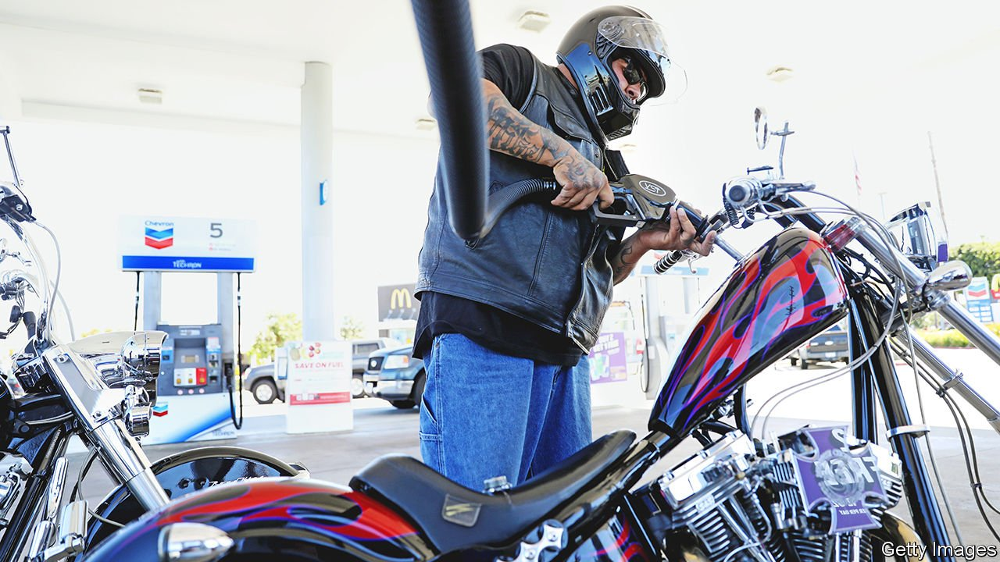

###### The world this week

# Business 

#####  

 

> Apr 16th 2022 

America’s annual rate of  inflation as measured by the official consumer-price index  in March to 8.5%, from 7.9% in February. Inflation is being fuelled by surging energy and commodity prices. There may be some respite for consumers this month as oil prices have fallen back recently, in part because of weaker demand in China. Brent crude is trading around $100 to $105 a barrel having hurtled towards $140 in early March. Petrol prices rose by 18% in America last month, but have been in retreat in April. Britain’s annual inflation rate rose to 7%.

Responding to “rising inflation expectations”, New Zealand’s central bank lifted its main interest rate by half a percentage point, to 1.5%. The Federal Reserve may raise rates by the same amount next month.


Global food prices hit a new high, according to an index from the UN Food and Agriculture Organisation. The war in Ukraine has amplified existing supply strains, such as crop conditions in America. Russia and Ukraine account for 30% of the world’s wheat exports and 20% of maize (corn). The price of both staples soared by close to 20% in March. Higher prices for sunflower seed oil, of which Ukraine is the biggest exporter, have pushed up the prices of palm, soya and rapeseed oil.

The World Bank forecast that  will shrink by 45% this year because of Russia’s invasion. Half of the country’s businesses are closed and others are struggling. Russian GDP is set to contract by 11%.

Russia’s central bank unexpectedly cut its main interest rate to 17%, having doubled it to 20% at the start of the war. It now thinks the rouble has sufficiently recovered from its rout in the markets to lessen the threat of a spike in inflation. It also lifted one of its temporary capital controls by allowing people to buy cash foreign currencies again.

Société Générale decided to sell Rosbank, a big Russian firm it owns, joining a long list of companies to leave Russia. The French bank is one of several Western companies with a serious presence in Russia’s financial industry. It is selling the assets to Vladimir Potanin, Russia’s richest man, who is not subject to sanctions by America, Britain or the EU, though Canada recently added him to its list.

Titter ye not

Elon Musk flashed his mercurial side by declining a seat on Twitter’s board, days after he was offered one. He also deleted a number of sarcastic tweets that he had posted about the company, including one that suggested it dropped the “w” from Twitter. Parag Agrawal, the chief executive, didn’t give a reason for Mr Musk’s change of mind, but said, “I believe this is for the best.” Tesla’s boss has amassed a 9.2% stake in the social-media platform.

Disruptions to supply chains caused by covid-19 lockdowns in China were a factor behind this week’s jitters in the country’s stockmarkets. Nio, an electric-car maker with ambitions to take on Tesla, halted production at a factory because of problems obtaining components, which drove its share price down by 10%.

GOTO had a successful IPO on the Jakarta stock exchange. Formed last year by the merger of Gojek, a ride-hailing platform, and Tokopedia, an e-commerce firm, GoTo’s backers include SoftBank and Alibaba. It wants to use proceeds from the $1.1bn it raised during its stockmarket flotation to expand its business outside Indonesia to other countries in South-East Asia, increasing its rivalry with Grab, which is based in Singapore.

An estimated 4.5bn passengers flew last year, according to Airports Council International. That was up by 25% from 2020 but down by half from 2019. Atlanta regained ACI’s crown of world’s busiest airport. Heathrow was the only airport in the top ten for international passengers to register a decline in 2021, although March this year was its busiest month since the outbreak of covid-19. Its hopes for a busy summer depend in part on how airlines cope with fewer staff following huge lay-offs during the pandemic.

Bowing to the inevitable

With its plan to split in two in tatters, Toshiba formed a “special committee” to “engage with potential investors” and “review strategic alternatives”. Shareholders have been pressing the Japanese conglomerate to consider buy-out offers from private-equity groups. Bain Capital is expected to submit its offer soon.

Amazon reportedly filed a legal complaint about the vote at its warehouse in Staten Island which unionised workers there, the first time the retailer’s staff have formed a union. One of Amazon’s grievances is that organisers allegedly distributed cannabis, which is legal in New York, to entice votes. Nonsense, said the union’s lawyer: distributing cannabis “is no different than distributing free T-shirts” and did not affect the outcome.

