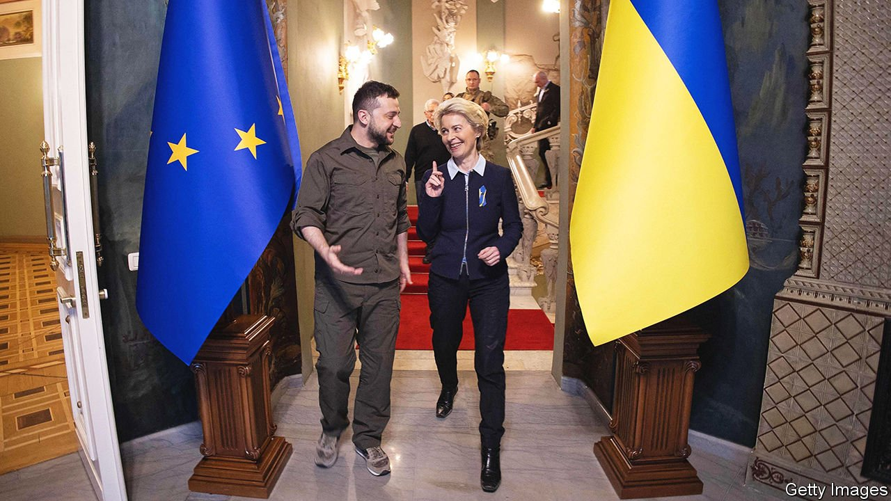
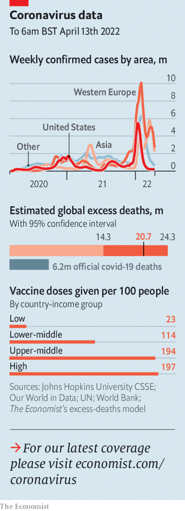

###### The world this week

# Politics 

#####  

 

> Apr 16th 2022 

Following Russia’s  from northern Ukraine, the inhabitants of Kyiv, the capital, as well as other northern cities such as Sumy and Chernihiv, enjoyed a week with no shelling or rocket attacks for the first time since the war started on February 24th. Ukraine’s second city, Kharkiv, farther to the east, was largely quiet, too. But there are fears that Russia is preparing a massive new assault in the Donbas region in the south-east. Vladimir Putin said peace talks were at a dead end and that Russia would prevail. Joe Biden, America’s president, described Russia’s actions in Ukraine as genocide.


Karl Nehammer, the chancellor of Austria, became the first Western leader to visit Mr Putin since the war began. He emerged gloomy about the prospects for peace.

Nice to see you

Ursula von der Leyen, the president of the European Commission, travelled to Kyiv to meet Volodymyr Zelensky, Ukraine’s president. Boris Johnson, Britain’s prime minister, also called on Mr Zelensky. Britain, Slovakia and other European governments also gave Ukraine more weapons, including tanks and anti-aircraft missile systems.

The UN said that two-thirds of children in Ukraine have been displaced because of the conflict, mostly within the country, although 2m have been taken abroad. Ukraine’s ambassador to the UN claimed that Russia has forcibly removed 121,000 children. More reports emerged of rapes by Russian soldiers and human-trafficking.

Russia withdrew from the UN Human Rights Council after a vote in the General Assembly to suspend it. China joined 23 other countries in voting against Russia’s suspension; 58 countries abstained.

 went to the polls in the first round of its presidential election. Just as in 2017, the top two candidates, who will proceed to a run-off on April 24th, are Emmanuel Macron, the incumbent, and Marine Le Pen, the right-wing leader of the National Rally. The opinion polls predict a much tighter race than last time.

Imran Khan was ousted as  Pakistan’s prime minister when he lost a vote of confidence in parliament. He had tried to ward off the vote by dissolving the legislature, but the Supreme Court ruled the manoeuvre illegal. Legislators selected as the new prime minister , the younger brother of Nawaz Sharif, a former prime minister. Mr Khan called for protests.

 suspended payments on all foreign debt until it can reach agreement with creditors on restructuring the loans, paving the way for the country’s first default. The move will allow the government to use its dwindling foreign reserves to import food and fuel while it negotiates a restructuring and a bail-out from the IMF.

Australia’s prime minister, Scott Morrison, called a general election for May 21st. His conservative coalition trails the opposition Labor Party in the polls.

A gunman opened fire at a station on a New York subway train, wounding ten people. He also let off a smoke canister. Another 13 were injured in the mêlée. The attacker’s motive was not immediately clear.

A murder charge against a woman in Texas who induced an abortion was dropped. The woman reportedly told hospital staff that she had tried to abort her fetus herself, which led to her arrest. Last year Texas passed a law that in effect bans abortion after six weeks. The local district-attorney said the woman would not be prosecuted.

 


After an all-night manhunt Israeli forces killed a Palestinian man who murdered three people on a busy street in Tel Aviv. It was the latest in a number of fatal attacks carried out in Israel by Palestinians and Israeli Arabs. Naftali Bennett, the prime minister, vowed that anyone who helped the terrorists “would pay a heavy price”.

Abd Rabbo Mansour Hadi, the president of Yemen, who was long ago forced into exile in Saudi Arabia, was replaced at the behest of his hosts by an eight-man council. The new body supposedly represents a cross-section of Yemenis.

The EU said it would wind down a mission training Mali’s army because of a row over the country’s award of a security contract to the Wagner Group, a mercenary outfit with close links to Russia’s government. The decision also casts doubt over the future of other EU forces who are part of a UN peacekeeping mission in Mali.

Nigeria’s vice-president, Yemi Osinbajo, decided to run for president in elections next year. Mr Osinbajo is seen as a more competent figure than his boss, Muhammadu Buhari, who is completing his second and final term.

Andrés Manuel López Obrador, the president of Mexico, easily won a referendum on whether he should continue in office. Turnout, at 18%, was low. Mr López Obrador’s fortunes were also boosted after the Supreme Court upheld his proposed electricity-market reform, which will favour state-owned utility companies over private producers.

Luiz Inácio Lula da Silva, a former president of Brazil and the front-runner in October’s presidential election, chose Geraldo Alckmin, a former governor of São Paulo, as his running-mate, despite a history of political disagreements. Lula is polling first at around 40%, but Jair Bolsonaro, the incumbent, is gaining ground.

A British-born supporter of Islamic State was found guilty of murdering Sir David Amess, a British MP, last October. He had considered several MPs as targets before deciding to stab Sir David, who was holding meetings with his constituents.

The party hangover

Officials confirmed that Boris Johnson, Britain’s prime minister; his wife, Carrie, and Rishi Sunak, the chancellor, had been fined by the police for  by attending social events. Mr Johnson is the first sitting British prime minister to be penalised for breaking a law. He is also accused of misleading Parliament.

