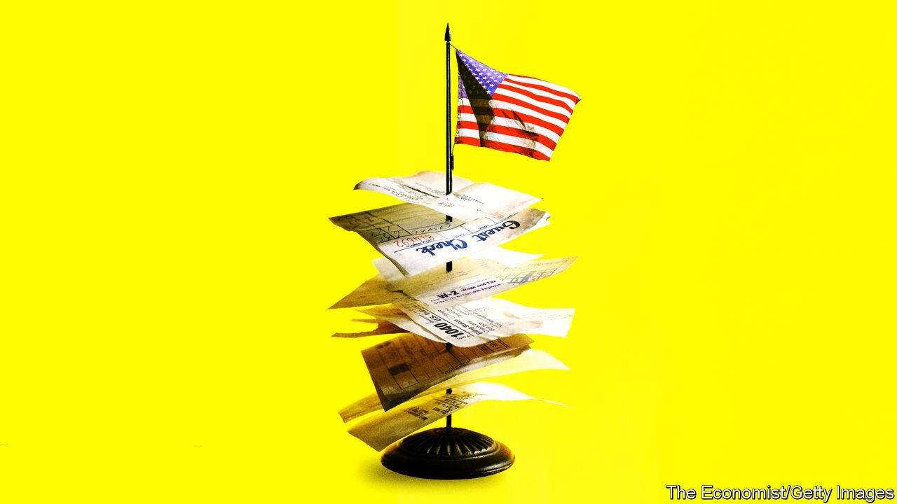

###### Taxation in America

# In praise of the Internal Revenue Service 

##### The much-maligned tax agency, battered by the pandemic, has kept the economy going 

 

> Apr 16th 2022 

“NOW YOU may only see a pile of receipts. But I see a story. I can see where this story is going. It does not look good.” These lines, spoken by an Internal Revenue Service agent in “Everything Everywhere All At Once”, a dark sci-fi comedy now showing in cinemas, is perfectly calibrated to strike fear into the hearts of Americans ahead of their tax-filing deadline on April 18th. The agent has a paper trail neatly arrayed on her desk as she conducts an audit. Reality is more frightening, for the exact opposite reason. “Paper is the IRS’s kryptonite,” Erin Collins, a watchdog within the IRS, recently told Congress. “The agency is buried in it.”

The IRS entered this tax season with a backlog of 24m returns, 20 times worse than normal, as it struggled to recover from pandemic disruptions. Good luck to anyone wanting help by phone: just one in nine callers reached an agent last year, according to Ms Collins. Now in the midst of a hiring drive, the IRS thinks it can clear the backlog by the end of 2022. But it will be up to two years late in processing many returns. “It’s a crisis,” says Mark Everson, former head of the IRS. “Millions of people and businesses who were due tax refunds don’t have that money yet. This is very detrimental for compliance.”


Even without the pandemic, the IRS was struggling, the victim of chronic underfunding. Spending on the agency has declined by nearly 20% since 2010. At the same time, the number of tax returns has increased by 20%. The backbone of the system, a nationwide taxpayer database, is built on top of a 1960s computer language rarely taught in schools. One major element of President Joe Biden’s legislative programme is a funding boost for the IRS. Yet that is stalled, along with much of the rest of his agenda.

It is hard for lawmakers to summon enthusiasm for the IRS. Who enjoys paying taxes? Even for those who recognise the social value, the act of filing tax returns is a hassle. The 1040 form, the basic document for personal-income-tax reporting, came with just one page of instructions when introduced in 1913. This year’s version has 230 pages of instructions when counting all the branches added to it, reckons Demian Brady of the National Taxpayers Union Foundation, an advocacy organisation.

Like any good story, though, there is also a plot twist. Despite its awful backlog, the IRS has, from another perspective, had a very good pandemic. It has played a critical role in delivering support to Americans. And it has been surprisingly efficient at it. For each of the three rounds of stimulus payments, the IRS was the conduit. Within two weeks of Mr Biden’s signing of the stimulus bill in March 2021, for instance, it sent out $325bn via 127m separate payments, mainly by direct bank deposit. Some people fell through the cracks and cheques took longer. But most got the money quickly. The IRS operated at even greater frequency in making child-tax-credit payments every month.

Along with doling out vast sums of cash, the IRS also took less in. The government gave the unemployed tax breaks on their benefits and gave businesses tax breaks for retaining workers. It also expanded the earned-income tax credit, a subsidy given to low earners, one of America’s biggest anti-poverty programmes. Putting it together, a poor family with two young children could expect $20,000 from the IRS last year, double what they would normally receive. In all, the agency paid out more than $600bn in pandemic-related support in 2021, equivalent to about two-thirds of Social Security spending in the federal government’s budget. “We have seen a substantial share of what used to be the social safety-net migrate from the public-expenditure side of the federal ledger to being run through the tax code,” points out Gordon Gray of the American Action Forum, a think-tank.

By the agency’s own count, Americans spend about 13 hours doing their taxes on average—mostly condensed into one frantic spring weekend. In fact this is an improvement: in 2010 the estimate was 18 hours. Increased use of software such as TurboTax, made by Intuit, has sped up the filing process. More could be done: the IRS provides a free-software option for poorer Americans but does a bad job advertising it (the Federal Trade Commission is suing Intuit for allegedly attracting customers in the belief that filing would be free, only to charge them). There are also perennial calls for the IRS to collect tax via withheld pay, allowing many to avoid filing returns altogether, as is common elsewhere, including Britain.

That, however, misses the point about the IRS as a welfare provider. It needs a range of information from taxpayers in order to assess their eligibility. “We don’t look at stores like Walmart and say, oh, it’s so complicated. We say, hey, that’s convenient. A similar thing should apply to some extent to the income-tax system,” says William Gale of the Brookings Institution, another think-tank. Using the 1040 form as the gateway to multiple social programmes and tax credits means that people do not have to go to a series of different agencies for each payout.

Eventually, the IRS will hack its way through the pandemic backlog. That, however, will do nothing to fix another serious problem: the degradation of its auditing abilities. About a fifth of agency staff are eligible for retirement, and many have taken covid as the moment to leave. “We’re losing exactly the kind of people we need to be able to maintain enforcement scrutiny,” says a senior Treasury official. The IRS audited 0.3% of corporate tax returns filed in 2018, down from 1.6% in 2010. The number this year may well be lower. Charles Rettig, who leads the agency as its commissioner, has estimated that the government loses about $1trn in tax revenues annually because of cheating. The agency is “outgunned” against big companies, he says.

The answer to so many of the IRS’s woes—antiquated tech systems, congested phone lines, threadbare enforcement—is more funding. It stands as one of the few federal agencies that would generate a large and nearly immediate return on investment were the government to spend more on it. The hope for the harried tax agents is that the highs and lows of IRS performance during the pandemic will have earned it grudging support in Washington, demonstrating that it is both overstretched and indispensable. ■

For more coverage of Joe Biden’s presidency, visit our dedicated  and follow along as we track shifts in his . For exclusive insight and reading recommendations from our correspondents in America, , our weekly newsletter.

