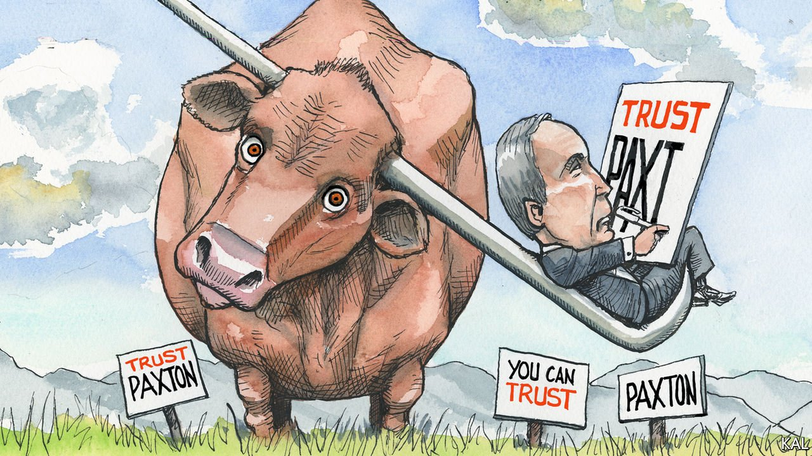

###### Lexington

# Ken Paxton’s bid for re-election is a test of Texas Republicans’ values 

##### And a test for Texas Democrats’ prospects too 

 

> Apr 16th 2022 

IN 2013 A little-known state senator passed through the security check at a courthouse in Collin County, Texas, and noticed a few pens that had been left behind. He pocketed one of them, a $1,000 Montblanc. Later, the pen’s rightful owner asked officials to review video footage, which revealed they had been grabbed by Ken Paxton, the state senator who would soon be elected Texas’s attorney-general. After a sheriff’s deputy called Mr Paxton, he returned the Montblanc and said it was a mistake.

The incident was minor enough not to attract much attention, but Mr Paxton has since become a prominent symbol of red-state resistance to Democratic policies. He has sued the federal government 25 times since President Joe Biden was inaugurated in January 2021, on issues such as immigration enforcement, covid-19 restrictions, guns, energy policy and the minimum wage. His pugnaciousness, and devotion to Donald Trump, have endeared him to the Republican base.


On May 24th Mr Paxton will be in a Republican primary run-off for attorney-general against George P. Bush, Texas’s land commissioner and a nephew of George W. Bush, a former governor and president. Both candidates competed for Mr Trump’s endorsement, which is high-octane fuel in Texan Republican primary-voter circles. Although his father, Jeb Bush, was insulted by Mr Trump during the Republican presidential primary in 2016, on the campaign trail George P. Bush handed out beer koozies with a quote from Mr Trump: “This is the only Bush that likes me…I like him.” In the end, Mr Paxton won the endorsement, probably thanks to his willingness to use his office to challenge the 2020 election results of four swing states in court on Mr Trump’s behalf.

Will Republican voters care whether the supposed protector of laws follows them himself? Mr Paxton’s resilience so far suggests they won’t. In 2014 the Texas State Securities Board fined Mr Paxton $1,000 for violating securities laws in soliciting investments three times without registering as an investment adviser. Voters shrugged and elected him as attorney-general anyway. A few months after assuming office in 2015, he was indicted on three securities-fraud charges, including allegedly encouraging people to invest in a technology startup without revealing he was being compensated. (Mr Paxton denies wrongdoing.) The federal charges were dismissed by a judge, and the state’s case has yet to proceed due to wrangling over lawyers’ fees and jurisdiction. Even some efforts to help protect Mr Paxton have raised eyebrows. Soon after his wife, Angela, became a state senator in 2019, she proposed a bill to modify Texas’s securities laws so that it would no longer be a felony for individuals to act as investment advisers without registering (one of Mr Paxton’s alleged offences) and granting greater control to the attorney-general’s office to oversee consumer fraud.

Bigger allegations followed. In September 2020, eight of Mr Paxton’s deputies reported him to the FBI, accusing him of “criminal bribery, tampering with government records, harassment, obstruction of justice and abuse of office”. The deputies, several of whom filed a lawsuit under the Whistleblower Act, said the attorney-general used his office to benefit a campaign donor, Nate Paul, who had allegedly hired a woman with whom Mr Paxton had an extramarital affair. According to their complaint, Mr Paxton intervened improperly in a federal investigation into Mr Paul (who has also denied any wrongdoing).

Mr Paxton has rejected the whistleblowers’ claims, accused them of being “rogue employees” and has even argued that the Whistleblower Act should not apply to him as attorney-general. His own office released a 374-page report in an attempt to clear him. But a federal investigation is reported to be ongoing.

Mr Paxton’s resilience tells a broader story about politics in Texas today. A recent poll found that only 11% of Republicans had an unfavourable view of him, and 75% a favourable one. A different poll gives him a 42-point lead over Mr Bush. This is due not least to Mr Trump’s continued support. Although Texas helped to send its former governor to the White House, the run-off election for attorney-general is likely to result in “the imminent end of the Bush dynasty”, argues Mark Jones, a professor at Rice University. The Bushes are considered too establishment these days.

Mr Trump has also helped Mr Paxton in a less direct way. By shaking trust in institutions, such as the media and law enforcement, Mr Trump has conditioned voters not to believe what they hear. It’s all “fake news”, as Mr Paxton is happy to claim. This has helped him sail through his scandals. He can accuse whistleblowers of being rogue, partisan employees, without primary voters questioning whether people who had worked in his office for years would really turn on him for political reasons. Those who reported him were his deputies and allies, not his enemies.

Lone Star litmus

Democrats have not won a statewide office in Texas since 1994. The election in November for attorney-general should, in theory, be their best shot. Everything will hinge on whether a Democratic candidate can woo independents and Republicans who dislike Mr Trump and acolytes like Mr Paxton. The party would have to offer a moderate candidate to fit Texan tastes. Joe Jaworski, an ex-mayor of Galveston and grandson of the former Watergate special prosecutor Leon Jaworski, would be the most electable Democrat statewide, although among Democratic primary voters he is currently polling behind the progressive candidate, Rochelle Garza. Some Democrats are hoping that Mr Paxton may be indicted after the primary but before the general election, giving them an edge.

Whatever happens, the race for attorney-general will not just be a test of Republican primary voters’ values but of Democrats’ priorities and standing too. If they cannot win against Mr Paxton, Democrats’ dreams of soon turning Texas blue seem as improbable as finding an orphaned $1,000 pen. ■

Read more from Lexington, our columnist on American politics: (Apr 9th) (Apr 2nd)

 (Mar 26th)

For exclusive insight and reading recommendations from our correspondents in America, , our weekly newsletter.

