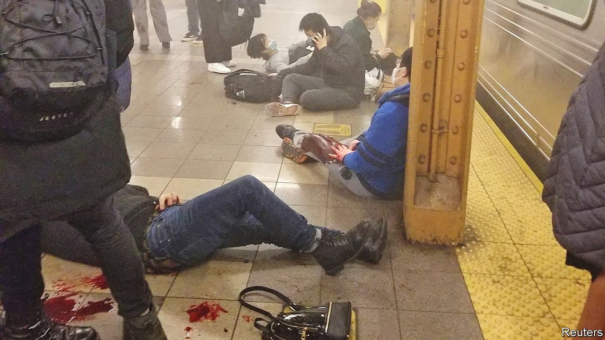

###### Crime in New York City

# Shootings at Brooklyn subway station 

##### The incident will add to concerns about the city’s safety 

 

> Apr 16th 2022 

ON APRIL 12TH a gunman set off a smoke canister and shot ten people on a train as it pulled into a Brooklyn subway station during the morning rush hour. The shooting will add to fears that the subway and city are unsafe. Since January, transit crime is up by 68% compared with the same period in 2021. Major crimes in the city are up by 44%. The subway had already been struggling to restore ridership to pre-pandemic levels.

