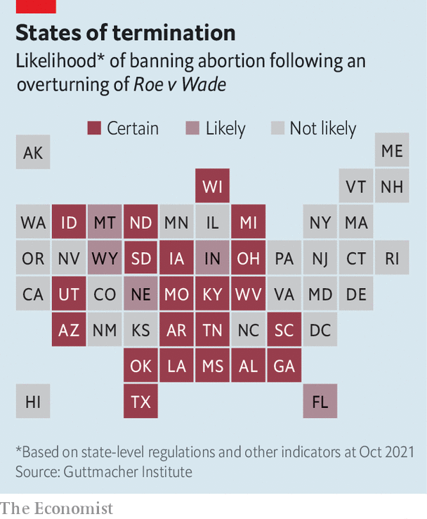

###### After Roe

# What happens if America’s Supreme Court overturns women’s right to abortion 

##### Defenders and opponents alike are preparing for a frenzy 

 

> Apr 16th 2022 

A WOMAN IN Missouri who decides to end her pregnancy has a choice, of sorts. She can go to the state’s last remaining abortion clinic, in St Louis, where state law dictates she must be told that “the life of each human being begins at conception” and warned of the psychological damage the termination could cause. She must then wait 72 hours before returning. Or she can travel 15 miles (24km) east, across the Mississippi River, to a larger clinic in Fairview Heights, Illinois, where the doctor (it may even be the same one) can speak to her patient as she thinks best. The abortion can be done that day.

This gulf between two neighbouring states illustrates the mess that surrounds abortion in America. Since 1973, when the Supreme Court ruled in Roe v Wade that abortion was a constitutional right, lawmakers in conservative states have introduced hundreds of regulations designed to make it hard for abortion clinics to function. Missouri is one of six states with only one clinic left.

 


The mess may be about to get much worse. This spring or summer the justices will rule on a law in Mississippi, blocked by a lower court, which bans abortions after 15 weeks of pregnancy. If they use the case to overturn Roe (thus sending decisions on abortion back to the states), the repercussions will be momentous. More than half the states are likely to make most abortions illegal (see map). In November, Americans will vote in mid-term elections. Republicans currently look likely to win back Congress, but if Roe is overturned Democrats will hope it will energise a broad range of voters.


How likely is the Supreme Court to ditch Roe? At first, it seemed its conservative majority might use the case to lower the gestational limit on abortion on demand. The court had done this before: in 1992 it lowered that set by Roe (26 weeks) to fetal viability (around 23 weeks). Though abortion-rights activists rail against lowering the limit, it would change little: the vast majority of abortions happen in the first 12 weeks. It would also reflect popular opinion. Though many states impose stringent restrictions, America has one of the most liberal frameworks in the world: of 59 countries that allow abortion on demand, it is one of only seven that allow it after 20 weeks. Polls suggest most Americans’ support for abortion drops dramatically after the first trimester.

But abortion-rights groups are increasingly concerned that the court will scrap Roe altogether. In September Texas banned all abortions after about six weeks of pregnancy, with no exceptions for rape or incest, and the court failed to stop it. That seemed to express five justices’ belief that Roe is not worth upholding.

Then in December the conservative justices made this plain. During oral arguments in the Mississippi case, Brett Kavanaugh, one of Donald Trump’s three nominees, cited many occasions when the court had overturned earlier decisions and suggested it should be “neutral” on an issue about which the constitution says nothing. Mary Ziegler, a legal historian at Florida State University, says that because introducing a new gestational limit would make it harder for the court to overturn Roe later, the likeliest alternative, “would be to do something more modest, such as saying viability is the wrong line and the right line could be decided in future cases”. The question, she says, is whether Roe will be reversed “gradually or immediately”.

A gradual reversal could come about if the court undermined the viability standard. Anti-abortion states could pass all sorts of bans and expect that the courts would be more likely to uphold them. In the event of an outright reversal, the impact would be immediate. Twelve states already have “trigger laws” that would click into effect the moment Roe was undone; a further 12 are expected to dust off pre-Roe bans or make new ones. Congress is unlikely to provide a remedy. Though House Democrats have passed a bill that would guarantee abortion rights, it has little chance in the Senate.

Texas offers a glimpse of how this would play out. On September 1st, the first day clinics in America’s second-most-populous state were forced to turn away patients, those in nearby states saw a sudden influx. Kristina Tocce, medical director of Planned Parenthood of the Rocky Mountains in Denver, Colorado, says she saw a 1,650% increase in the number of patients from Texas in the 45 days to mid-January compared with the same period last year. “If Roe is overturned I fear Texas is a prologue to absolute chaos and confusion,” she says.

When Sara (not her real name) drove from Texas into Oklahoma, having distributed her seven children among several sitters, and stayed in a hotel, it cost her half her monthly income. Groups which help women with such costs say they have been flooded with requests for support. Anna Rupani, the director of Fund Texas Choice, says donors have been quick to step up, but she worries about what will happen if a lot more cash is suddenly needed.

Getting ready for the rush

Even before the Texan law, clinics in states with decent abortion provision had become used to serving women far from home. This has helped them prepare for the demise of Roe. In Illinois, Planned Parenthood, the biggest supplier of abortions in America, has been readying itself for years. The clinic in Fairview Heights was built in 2019 to handle growing numbers of abortion refugees from nearby states. Planned Parenthood has also built clinics on the Illinois borders of Indiana and Wisconsin, two of five neighbouring states that are likely to ban abortion if Roe goes.

In January the Fairview Heights clinic and an operation nearby, the Hope Clinic, opened a regional logistics centre to deal with the expected surge in non-clinical workload: arranging transport, hotels and funding for the many more women who were expected to arrive. Colleen McNicholas, Planned Parenthood’s chief medical officer in the region, says staff are preparing to put in longer days and work seven days a week instead of six.

Where pregnant women go, anti-abortionists follow. Local armies have moved their campaigns from states like Missouri, where the battle has been largely won, into Illinois. As patients drive into the Fairview Heights clinic they pass a large gallows from which the image of a fetus is hanging. Parked trucks, operated by an anti-abortion group, try to entice pregnant women into conversation by offering “free on board” ultrasounds and pregnancy testing; posters advertise “abortion pill reversal”. At Planned Parenthood’s clinic in Missouri, by contrast, it is quiet: a couple of softly spoken protesters wait with leaflets encouraging women to have their babies; the only ones they saw, one recent morning, were there for contraception.

Only in America

Elsewhere, smaller abortion providers are weighing their options. Tammi Kromenaker, director of the Red River abortion clinic in Fargo, North Dakota, the only one in that state, says she is often asked why she doesn’t move a few miles east into Minnesota, where abortion will remain legal if Roe is overturned. She is torn, she says, between practicality and principle (“our community needs us to be here”), adding that in no other field of health care would providers face such uncertainty.

This points to another example of American exceptionalism. In other countries abortion tends to be embedded in broader health-care systems. In the United States it is practised almost exclusively in stand-alone clinics, largely so that providers can avoid the costly billing systems found in hospitals. Yet this has made the job of anti-abortion campaigners easier, allowing them to find the right women to shout at and enabling them to portray abortion as being separate and different.

Partly as a result, clinics have become powerful defenders of abortion rights, including in the courts. When these places close, says Carole Joffe, a professor at the Bixby Centre for Global Reproductive Health at the University of California, San Francisco (USCF), “huge political clout and grassroots support for the rights of women is lost”. Several clinics in Texas, she says, are close to shuttering.

As great as the post-Roe upheaval is likely to be, it would be greater still but for three mitigating factors. First, it is not just the likes of Planned Parenthood that have been making preparations. A handful of states have scrapped all regulations on when or for what reason a woman may terminate a pregnancy. In California, lawmakers are expected to consider a plan to make the state a “sanctuary” for anyone seeking an abortion.

Second, the abortion rate today is half what it was in 1980. That is mostly down to improved access to more effective methods of contraception. It may also be linked to better sex education, especially in states that used to teach only abstinence (although in Jackson, Mississippi, Shannon Brewer, the director of the state’s last abortion clinic, which is at the heart of the case the Supreme Court will soon rule on, raises her eyebrows exaggeratedly when asked whether many young patients lack basic knowledge about reproduction).

A third element is the increasing use of abortion medication, which has transformed abortion care globally (because tracking it is hard it may also make America’s abortion rate look lower than it really is). By taking two drugs several hours apart, women are able to abort at home without a clinic appointment. The pills can be posted after an online consultation. Several telemedicine startups now offer the pills more cheaply than clinics do. The drugs are also available illegally from Aid Access, a charity in Europe, and from online pharmacies overseas. Their efficacy and safety up until 11 weeks of pregnancy mean America should not return to an era of backstreet abortions.

Anti-abortion lawmakers are onto that. Last year, 15 states introduced bills restricting medication abortion. If Roe is overturned, more will surely follow. Even if women can get hold of the pills, they could still be in trouble. The cramping and heavy bleeding that these pills cause prompt some women to seek medical help. A number of abortion providers suggest they tell doctors they are having a miscarriage if necessary. They worry that such women—or doctors who have helped them—may be charged with a crime. Such fears have intensified since several states have said they plan to copy Texas’s law. It enables private citizens to sue anyone who “aids or abets” an illegal abortion, and for every case that is successful it authorises “damages” (in effect a bounty) of $10,000.

How much will voters care?

Some women—those who wish to keep their abortion secret from their parents or partner, say, or those whose pregnancy has passed 11 weeks—will continue to need care in an abortion clinic. And the number of those needing abortions later in pregnancy will grow if women have to travel farther, with the time-consuming burdens that entails. Thus the number who fail to have an abortion altogether will also increase, with woeful consequences.

Using data from a nationwide longitudinal study that investigated the effects of either having an abortion or being turned away, researchers found that women who were denied abortions experienced a sharp spike in financial hardship. Their children suffered. Some obstetricians worry that overturning Roe could push up America’s maternal and infant mortality rates.

Democrats are ready to use such fears to try to boost turnout in the mid-terms in November. This may work among some educated women in suburbs where many of the competitive Senate races will be decided. But whether it would prevent Republicans from taking the House and Senate is far from clear. In Virginia’s gubernatorial race last year, Terry McAuliffe, a Democrat, repeatedly castigated Texas’s new law. But he lost to Glenn Youngkin, his Republican rival, who has supported abortion restrictions. Exit polls revealed, as they have done before, that abortion is a bigger voting issue for Republicans than it is for Democrats.

Overall, however, abortion is some way behind a lot of other issues in voters’ minds. The end of Roe may not necessarily prompt huge protests. After Texas banned most abortions some businesses in the state offered to relocate employees; otherwise their response was subdued. Terminating Roe would undoubtedly cause a bigger stir, but it is unclear how the effects would really be felt beyond the lives of women and the abortion providers who serve them. And on that, “The only thing we know for sure is that it will be a mess,” says Dr Joffe of the USCF Bixby Centre, “and that rich women will do better than poor women. What else is new in America?” ■

For exclusive insight and reading recommendations from our correspondents in America, , our weekly newsletter.

