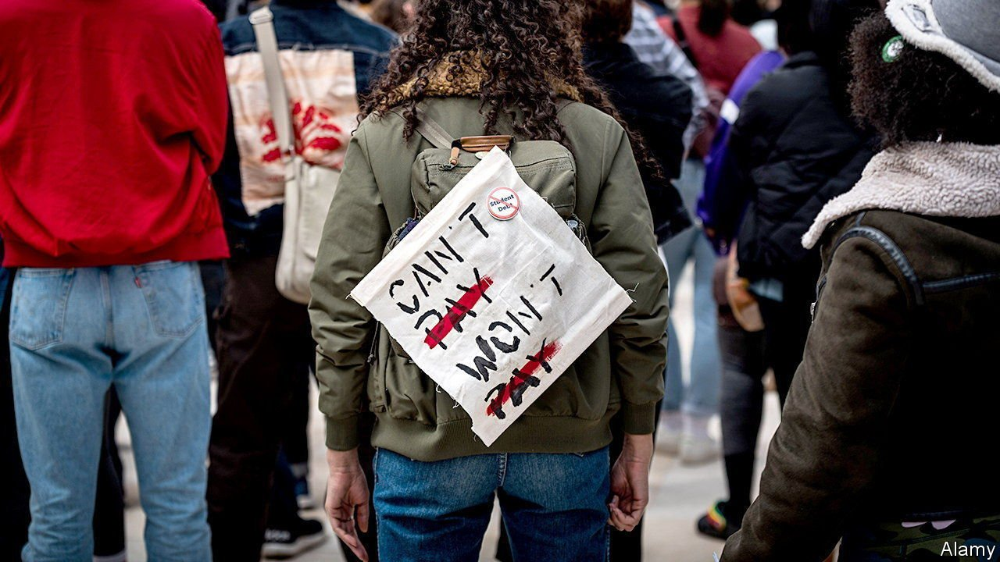
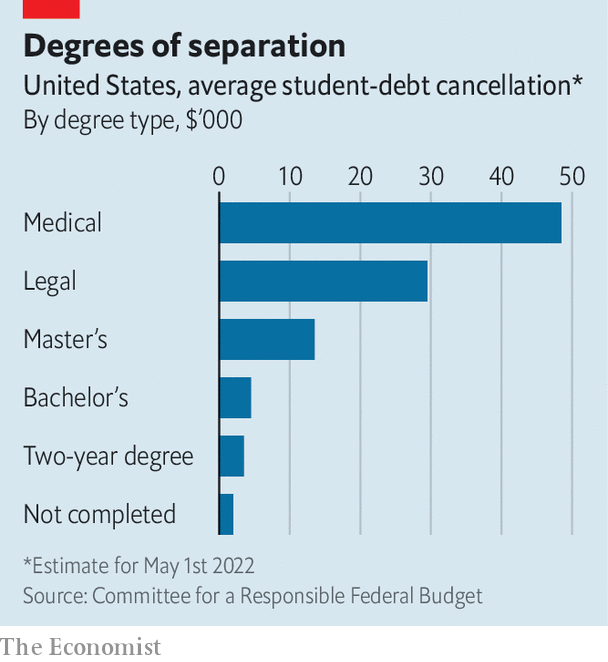

###### Keep the change

# Why America keeps delaying student-loan repayments 

##### Bureaucratic snags and internal Democratic debates prolong a flawed policy 

 

> Apr 16th 2022 

EMERGENCY MEASURES often outlast the crises that prompt them. So it is with federal student-loan repayments, which were suspended in March 2020 as a pandemic-relief measure. In August 2021 the Department of Education announced a “final extension” of the moratorium on payments for the $1.6trn owed to the government, to January 2022. Then, one month before that deadline, the White House announced a final, final extension, to run to the end of May 2022. Then, on the cusp of that new cut-off date, a final, final, final date was announced on April 6th. This extends the moratorium to August 31st.

Most economic-relief programmes initiated in response to covid-19 have already been wound down: enhanced unemployment benefits, stimulus cheques and generous child benefits are all things of the past. A moratorium on evictions was struck down by the Supreme Court in August 2021. In May the Biden administration will lift “Title 42”, a Trump-era policy that limited asylum-seeking on public-health grounds. It has usefully allowed Mr Biden to keep America’s southern border mostly closed, at a time when the number of arriving migrants is the highest in a generation. If the unemployed, poor children, renters at risk of eviction and migrants are no longer receiving special support, then why are college-educated Americans?


Unlike other measures, which require congressional approval or have been subjected to judicial review, the decision to delay student-loan repayments can be made by the executive branch alone. The education department has been slow to set out the post-moratorium payments regime, thereby justifying continued delays.

The stalling is also one of the few sops that Mr Biden can throw to progressives in the party who are dejected at the failure of his boldest proposals in Congress. Democratic senators such as Elizabeth Warren and Chuck Schumer, the majority leader, have been pushing for a more sweeping policy that would cancel debt of up to $50,000 per student. They argue that the president has the authority to do so unilaterally because the Higher Education Act of 1965 grants the education secretary the right to waive and release loans. Mr Biden, who supports cancellation of a more modest $10,000, is sceptical of such reasoning.

In announcing the latest extension, Mr Biden said resumption of normal payments would plunge millions of borrowers into “significant economic hardship”. Yet in the same statement he crowed about “the greatest year of job growth on record”.

The indecision is costly. The effective average cancellation has amounted to $5,500 per student so far (based on the present-value cost of the delays), calculates the Committee for a Responsible Federal Budget (CRFB), a think-tank. Already, the policy has cost $100bn (forgiving $50,000 would cost almost $1trn, or 0.4% of GDP).

 


And it is not particularly progressive. College-educated Americans command a sizeable wage premium. Those who attend graduate school often take out large loans at higher interest rates than for undergraduate degrees. The CRFB estimates that the effective debt cancellation for students who went to medical or law school is between $29,500 and $48,500 (see chart). For those with two-year degrees and those who did not finish college—the most economically vulnerable—the effective benefit has been less than $3,500. “The problem with universal loan forgiveness is that you end up with a system where a lot of the money goes to successful, affluent, white students,” says Adam Looney, a professor at the University of Utah and former official at the Treasury Department.

Government management of income-driven repayment plans, which are supposed to limit the burden on poorer borrowers, has been shambolic. An investigation by National Public Radio found that out of 4.4m borrowers eligible for forgiveness after 20 or 25 years of payment, only 32 had actually received it. There are also big disparities in financial outcomes based on race. “Black borrowers borrow more, they are more likely to borrow, and they struggle more with repayment than other borrowers do,” says Victoria Jackson of the Education Trust, a research and advocacy group. Twelve years after starting college, white men have typically paid off 44% of their student-loan debts, her research shows; black students owe 12% more than when they started.

Targeted approaches to remedying this exist already. Federal Pell grants, which pay for poor students’ attendance, have fallen far behind the increased cost of higher education. Granting relief based on debt-to-income ratios would be more progressive than less discriminating policies. But come August, with mid-term elections looming, Mr Biden may find yet more justification for pushing off hard choices. ■

For more coverage of Joe Biden’s presidency, visit our dedicated  and follow along as we track shifts in his . For exclusive insight and reading recommendations from our correspondents in America, , our weekly newsletter.

