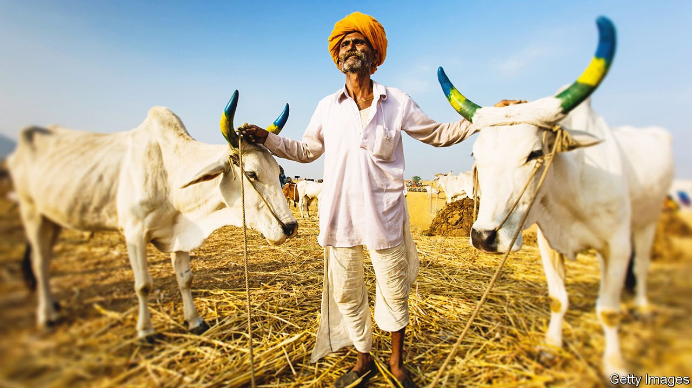

###### Moo with the times

# Indian cows (and buffaloes) are going online 

##### A new breed of startups wants to formalise cattle trading 

 

> Apr 21st 2022 

SIX COWS munch on dry grass in a barn in Vajeghar, a village some five hours from Mumbai. Ajay Shilimkar, a dairy farmer, beams as he introduces them to your correspondent. One, named Laali, is his most recent acquisition. “She listens to what I say. I don’t need a stick,” he says. Laali moos triumphantly.

Until recently, Mr Shilimkar would have gone to one of India’s many livestock fairs in search of a new beast. But he found Laali on Animall, a cattle-trading platform. The seller, who listed her for 45,000 rupees ($590), lived just 20km away. Mr Shilimkar reckons he saved at least 10,000 rupees that would otherwise have gone to a middleman.


Mr Shilimkar is among 75m dairy farmers in India, and Laali one of 200m cows (there are another 100m buffaloes). The dairy industry is worth $174bn and produces a fifth of the world’s milk. Enticed by the prospect of juicy margins from formalising a highly fragmented market, many startups have emerged in the past few years. The companies make money by charging fees or providing extra services, such as online vet appointments. Animall claims to have made 1m sales since it was set up in 2019, and has received $23m in investment. Gaurav Choudhary of Pashushala, the first such startup to be founded, in 2018, says his aim is “democratising cattle”.

Livestock fairs, where most animals are still bought and sold, can be expensive and chaotic. Farmers shell out entry fees to register their beasts. They must pay for labourers to load and unload the animals, as well as for transport to and from the fair. They worry about cattle thieves. Making a sales pitch to every prospective customer takes a toll in the heat. And if your cows find no buyers, you must go through the whole rigmarole again, complains Anil Renusay, another cattle farmer in Vajeghar.

Then there is fraud, says Satish Birnale, who rears buffaloes in Sangli, a small western city. Some traders inject their animals with steroids. Horns are often polished “as if the cows have just been to a beauty parlour,” he says. “It’s like searching for a bride in an arranged marriage. We have to be careful and not go just by the looks.”

Firms like Pashushala and Animall claim to have solved such problems with a system of checks, including a nod from a local veterinarian. Animall requires sellers to upload videos and pictures of their cattle, and provide details not just of breed or age, but also past pregnancies, how much milk they provide and so on. A team calls every user to verify the information. Ads with blurry photos or listings with pictures taken from the internet are swiftly removed. A close-up of the cow’s udders is important. So are comments by the farmer about the animal’s temperament. In one video a seller croons, “Beautiful! Oh, look at those singhs (horns)“. It is not a new pitch. But it is now easier and cheaper to make.

