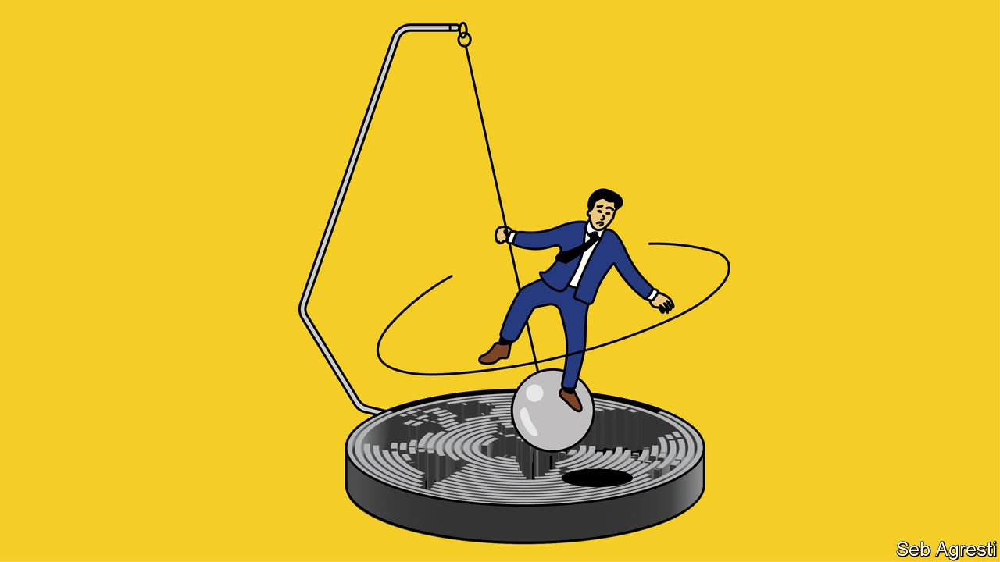
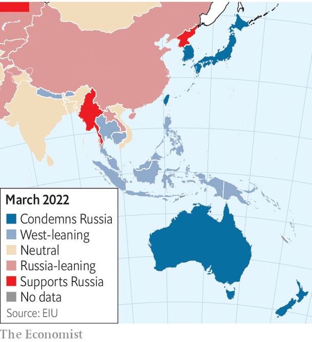

###### Asia’s Ukraine dilemma

# Interests, not values, underpin Asia’s ambivalence about Russia 

##### “Democracy v autocracy” is an unhelpful lens through which to see the region’s calculations 

 

> Apr 23rd 2022 

HAVING FOUND itself at a crossroads, Indonesia is attempting to go in every direction at once. On March 2nd it joined much of the world in deploring Russia’s invasion of Ukraine. A few days later its president, Joko Widodo, known as Jokowi, said Russia and Ukraine were both friends of Indonesia. By the middle of April, against a domestic backdrop of protests against rising costs, a fierce debate had broken out within government about whether to take advantage of the crisis by buying discounted Russian oil, with payments perhaps routed through India.

Indonesia is in a tricky position. This year it holds the rotating presidency of the G20, a club of the world’s biggest economies. Jokowi does not want to humiliate Russia. Nor does he want to preside over a high-profile flop: Western leaders have indicated they could ditch the main meeting in Bali in November if President Vladimir Putin turns up. “Our strategy is Bon Jovi’s ‘Livin’ on a Prayer’,” says Evan Laksmana, an Indonesia expert at the National University of Singapore, meaning, “just hope that something gets resolved in the next month or so”.


Governments across Asia are performing feats of acrobatics to avoid antagonising America, Russia, China or their own citizens. Some leaders elsewhere, such as President Joe Biden, consider the swift condemnation of Russia’s actions by Asia’s West-leaning economic heavyweights—Australia, Japan, New Zealand, Singapore, South Korea and Taiwan—proof that “democracies are rising to the moment and the world is clearly choosing the side of peace and security.”

Yet many Asian countries, including big democracies like India and Indonesia, are reluctant to criticise Russia openly. The number of Asian states siding with America and Europe at the UN on Ukraine-related issues has been declining. Commentators in Washington see this as a failure of the West to win the moral argument. They think Asians see America and its allies as hypocrites, who have themselves invaded countries and given refugees from war-torn places outside Europe a hard time.

But few Asians share the European and American perception of the war as a grand battle between democracies and autocracies. For many of them, including most of America’s allies in Asia, responses to Russia’s invasion have been dictated first by cold calculations of interests, with values coming a distant second.

Many Asian governments look to America for security even though China is their chief economic partner. Their backyard—the “Indo-Pacific”, as America now likes to call it—is where the tussle between the two powers is playing out. “The future of global order will be decided not by wars in Europe but by the contest in Asia,” Shivshankar Menon, a former Indian foreign secretary, wrote recently. For Asia, the war in Ukraine has added an unhelpful extra dimension to what was already a tricky balancing act.

In Asia this year, planned gatherings of world leaders will highlight the problem. These include the G20 as well as APEC meetings in Thailand and the annual East Asia Summit in Cambodia, also in the autumn. In normal times, Mr Putin might attend all of them. “Those countries haven’t made a strategic choice over the Russia-Ukraine conflict: they are still sending invitations to Putin,” says Jimbo Ken of Keio University in Tokyo.

At the end of May Japan is set to host a summit of the Quad, a security grouping whose other members are America, Australia and India. Its discussions—which usually focus on China—may be complicated by India’s neutral stance towards Russia. “How can we pursue Quad co-operation without sharing principles?” Mr Jimbo asks. For Japan’s government, India’s position is worrisome mainly because of the message it sends: it may be harder to rally European support for Asian countries facing Chinese pressure if they remain neutral on Ukraine. “It is important to share with other Asian nations a view that we mustn’t allow any change to the status quo by force,” Kishida Fumio, Japan’s prime minister, has said.

From America’s point of view, Yoon Suk-yeol, South Korea’s president-elect, talks the right talk. He says he wants to make his country a “global pivotal state” that spreads “freedom, peace and prosperity through liberal democratic values”. Mr Yoon has called for more help for Ukraine and pressure on Russia.

But South Korea also frets. China is by far its largest trading partner and the source of many inputs for its giant manufacturing sector. Antagonising Russia and China would create security risks—both have sway in North Korea. Though it is a big exporter of arms, South Korea has repeatedly refused to supply Ukraine with weapons. It has imposed sanctions on Russia, albeit more slowly than its Western allies. But since the war began it has boosted its imports of cheap Russian energy. (So, too, has Taiwan.)

Take my hand, we’ll make it I swear

Mr Yoon has hard choices to make. During his campaign, he promised to ask America to redeploy nuclear weapons to South Korea (they were removed three decades ago) and said he would install more American-made anti-missile defences, known as THAAD. China would be enraged by either move. It may retaliate with economic and other punishments.

In South-East Asia, Singapore has been the most vocal critic of the invasion. Concerned that it might embolden big countries to bully small ones, the city-state has placed sanctions on Russia. But among others in the region, including American allies such as Thailand and the Philippines, pragmatism has won the day. Although most countries voted at the UN in early March to condemn the invasion, many in their follow-up statements refrained from naming and shaming Russia, and later abstained from the vote suspending it from the UN’s human-rights body.

Russia is South-East Asia’s largest supplier of weapons. Most of the kit goes to Vietnam, which imports 80% of its arms from Russia, but hundreds of millions of dollars’ worth of guns also flow to Myanmar, Laos and Thailand. “It would be extremely costly for Vietnam if it lost access to Russian arms and military technology,” says Carl Thayer of the University of New South Wales. Yet Vietnam disapproves of Russia’s invasion and views America as a more important partner, says Le Hong Hiep of the ISEAS-Yusof Ishak Institute, a think-tank in Singapore.

That both Vietnam and India are reacting to the Russian invasion with similarly calculated ambivalence shows how countries’ political systems do not necessarily determine their responses to the war. India is a noisy democracy. Vietnam is a secretive Communist dictatorship. Both are on increasingly good terms with America and wary of China, but are also big buyers of Russian arms. For their own security, they see a need to preserve good relationships in Moscow.

Or consider the case of Cambodia, an autocratic country which has close ties to both China and Russia. To the surprise of both, Hun Sen, its prime minister, took a stand against Russia’s aggression by co-sponsoring one of the UN resolutions. In recent months he has been making it clear he wants better relations with the West.

 


That countries in South-East Asia are responding to the Ukraine crisis on the basis of perceived self-interest rather than ideology should be of no surprise to America. Even before the war, Mr Biden’s administration had been fostering a spirit of diplomatic pragmatism. It was being careful not to overemphasise human rights in its dealings with countries in the region. When touring South-East Asia, senior White House officials mainly focused on finding ways of meeting countries’ economic and security needs, rather than lecturing to them about politics.

But across Asia, government policies towards the war are often out of sync with public sentiment. In Singapore, where officials have been gung-ho about joining in with America, citizens are more circumspect. Many ethnic-Chinese Singaporeans consume China’s state media, which tout a pro-Russian line. They think that Singapore should cosy up to China, and believe that America provoked the Russian invasion, says Ian Chong of the National University of Singapore.

In South Korea, official backing for Ukraine has failed to match the enthusiasm of ordinary people’s support. Many citizens have made donations to Ukraine. There have been frequent public protests against Russia. Yet when Volodymyr Zelensky, Ukraine’s president, addressed South Korea’s parliament he found himself speaking to a near-empty hall where the few lawmakers fiddled with their phones. There was no standing ovation.

Whoa, we’re half-way there

It is in non-aligned countries such as India and Indonesia where the attitudes of government and the public seem most at odds. On Indian television popular commentators who usually devote their energies to praising the government and attacking its enemies have taken a strongly anti-American line. They blame the war on American provocation of Russia, including NATO’s expansion. They push this angle much harder than the government itself, which has avoided saying who is at fault. Their views are echoed in India’s living rooms. According to a YouGov poll in late March, 54% of Indians approved of Mr Putin’s leadership in the first month of the war (and, confusingly, 63% of Mr Zelensky’s). Fully 40% supported Russia’s invasion.

Indonesians feel similarly. “This is about the sovereignty of Russia,” says Riza Ghautama, a 42-year-old exporter of crude palm oil. He says he does not support Russia’s invasion but understands why it felt compelled to act. Russia, he says, was just trying “to defend itself”. Connie Bakrie, an Indonesian defence expert who has the ear of the armed forces, accuses the West of hypocrisy. How can it condemn Russia for securing a sphere of interest, when Western powers have done the same with Guam, the Falkland Islands and New Caledonia—territories belonging to America, Britain and France, respectively? “What is the difference?” she asks.

Such talk stems from a widely held perception in Indonesia that America is at heart an imperialist power that does not play by its own rules, says Radityo Dharmaputra of the University of Tartu in Estonia. “If you are pro-Ukraine, then you are pro-America, and thereby supporting the idea of American imperialism in the region,” says Mr Radityo, summing up a common belief among Indonesians. Social-media posts in many Asian countries propagate such narratives. Though many of these online fulminations against the West may be the product of disinformation campaigns, they find receptive audiences.

Indonesia’s rulers have so far managed to avoid alienating America, Russia, China and their own citizens. Their reluctance to make hard choices has yet to cause major embarrassment. But cracks are showing: on April 20th Janet Yellen, America’s treasury secretary, and others walked out of a meeting of G20 finance ministers when the Russian delegate started speaking.

Relative to the other great powers, Russia is a bit player in Asia. For countries in the region the really difficult decisions lie ahead. They relate to the rivalry between America and China, which has been fuelled by Russia’s invasion. American talk of an intensifying “battle between democracy and autocracy” has ratcheted up the tension. Time and again South-East Asian countries have said they do not want to have to choose between America and China. But there will be “a point where many in the region will be hard pressed not to choose”, says Mr Evan of the National University of Singapore. “You are going to be made to choose, or at least you will be pulled one way or another.” ■

Read more of our recent coverage of the 

