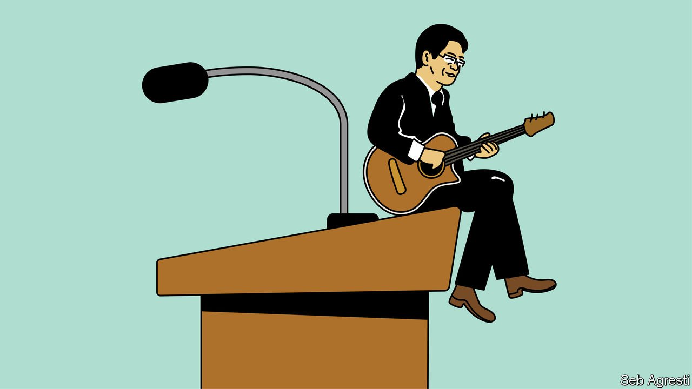

###### Banyan

# Lawrence Wong is Singapore’s presumptive next prime minister 

##### The ruling party’s new leader-in-waiting is meant to show its softer side 

 

> Apr 21st 2022 

IN MANY RESPECTS Lawrence Wong resembles the scholar-statesmen both epitomised and prized by Lee Kuan Yew, Singapore’s founding father. Like Lee, the country’s first prime minister, and his son Lee Hsien Loong, the third and current one, Mr Wong did a stint at Harvard, earning a masters in public administration. He then climbed the ranks of the civil service, ending up as principal private secretary to Lee the younger. As a politician, his ministerial portfolios have included education and national development. He is currently the finance minister and co-chair of the government’s covid-19 task force. Although Singapore is a multiracial country, Mr Wong is an ethnic-Chinese man, like all previous heads of government.

Yet he is also the kind of bloke you could drink a beer with. That, at least, is the impression one gets from Singapore’s state-owned media, which have been full of glowing reports ever since it was announced, on April 14th, that Mr Wong will take over as leader of the People’s Action Party (PAP) when its current boss, Lee junior, eventually steps down. (Mr Lee had planned to retire by February, but deferred that during the pandemic. He has yet to declare a new departure date.) Barring a historic upset at the next election, Mr Wong is on course to become the country’s fourth prime minister.


Mr Wong grew up, he has said, in an “ordinary family”. His father was a salesman and his mother a schoolteacher. Like most Singaporeans, they lived in public housing. And unlike many leading politicians, he attended his local high school rather than an elite institution. He then went to the University of Michigan—not quite Cambridge, where the two Lees studied. His private life is not picture perfect. In a socially conservative country, he is a divorcé, since remarried, and has no children. He has hobbies—he likes to play the guitar—and a softer side. When his golden retriever died in 2020, he mourned publicly on Instagram: “baby Summer has crossed the rainbow bridge… We will miss u :(“.

All this cuts against the image of the typical PAP politician. The man with whom the party is most closely associated is Lee senior. Unabashedly elitist, he possessed immense intellect, ruthlessness and a penchant for telling Singaporeans what was best for them. A colossus who transformed the city, he saw no need to be liked. Over the course of his long career—he retired from politics only in 2011—he moulded the party in his image.

The man first selected to succeed Lee Jr, Heng Swee Keat, resigned from the post last year citing his age—he is 61—rather than his many gaffes. But he was widely perceived as dull and distant. By the same token, the two other main candidates for the job are considered arrogant (Chan Chun Sing, the education minister) and stern (Ong Ye Kung, the health minister).

The 49-year-old Mr Wong is a bit more personable. Perhaps the first time the public took notice of him was in 2020 when, while giving a speech in Parliament about the sacrifices made by front-line workers at the height of the pandemic, he broke down in tears. His sniffles endeared him to the public, who think of the party’s elite as cold and calculating.

Mr Wong is not considered a charismatic visionary, says Linda Lim, a professor at the University of Michigan who has known him since his student days. But he is “a decent guy” who is comfortable showing emotion. If the men in white, as PAP stalwarts are known, are supermen, Mr Wong is everyman.

Mr Wong’s more human bearing may have won him the job, but he is unlikely to take the country in a different direction, reckons Michael Barr of Flinders University in Australia. Instead, his elevation, in an opaque process involving the PAP’s so-called “fourth generation”, or “4G”, is a sign of the party’s adaptability. Even though the PAP commanded 61.2% of the vote in the most recent election, in 2020—a landslide anywhere else—it won the smallest share of seats in its history.

The opposition remains small and structurally disadvantaged. Yet the PAP’s election post-mortem revealed that many Singaporeans found their rivals more empathetic and wanted them to act as a check on the ruling party’s power. The PAP is therefore preparing for a future in which politics will be more contested. As Mr Wong said recently, echoing the prime minister, “We do not assume that the PAP will win the next general election.” Its leaders seem to hope that they can hold on to power by climbing down from their pedestals and showing that they, too, are only human.

Read more from Banyan, our columnist on Asia: (Apr 16th) (Apr 9th) (Apr 2nd)

