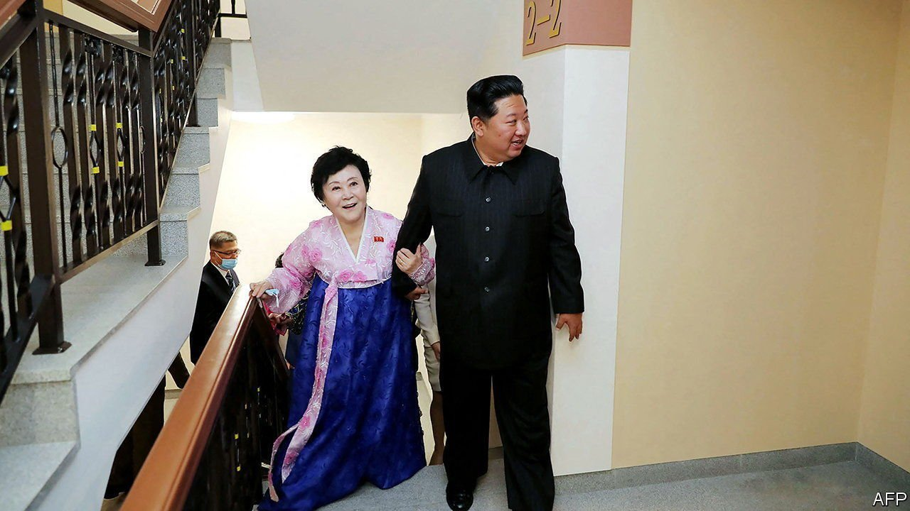

###### Sung and dance

# North Korea’s day of celebration reveals little to celebrate 

##### Kim Jong Un unveils luxury apartments as his people confront food shortages 

 

> Apr 21st 2022 

THE ANNIVERSARY of Kim Il Sung’s birth, on April 15th, is often an exuberant affair in North Korea. This year’s tribute to the country’s founder was no exception. Civilians, many dressed in traditional costume, danced in choreographed crowds in the centre of Pyongyang, the capital. Fireworks lit up the night sky. Sculptures of tanks and missiles, made of multicoloured lights, decorated the streets. And all the while spectators cheered, swelling with patriotism and pride.

North Koreans could do with something to celebrate. Mr Kim’s decision to seal the border at the onset of the covid-19 pandemic has taken a harsh toll on the economy. Trade with China is slowly returning but remains far below the level of 2019. Many imports are stuck in quarantine. A shortage of food—bad enough for the state to acknowledge its existence—is getting worse. The price of corn, a staple, has risen almost a quarter since the start of the year. A winter drought threatens a poor harvest of wheat and barley. Remittances from people who have escaped to South Korea have plummeted as it becomes harder to contact relatives.


Little wonder then that Kim Jong Un, the country’s dictator and Kim Il Sung’s grandson, is keen to focus instead on his regime’s successes. In the week before the anniversary he inaugurated two housing projects in Pyongyang. The day after the celebrations, he watched the successful launch of what state media called a “guided weapon” that would improve the efficacy of North Korea’s “tactical nukes”.

There is less to these achievements than meets the eye. The smaller of the housing complexes, along the capital’s Pothong river, has been dubbed a “socialist fairyland”. But its 800 flats will go only to those the regime deems “patriots and persons of merit”, such as Ri Chun Hi, an octogenarian newsreader known for her vitriolic tone and pink attire. On April 13th Mr Kim personally showed her to her new luxury apartment as she beamed with joy.

The larger block is an 80-story tower in the centre of Pyongyang. It contains 20% of the 50,000 flats Mr Kim promised by 2025 to solve Pyongyang’s housing shortage. These too will go to those favoured by the party. But the lucky few allotted flats in the new complex may turn out to be less fortunate than they appear. DailyNK, a Seoul-based news outlet, reported that only the homes of the party elite and donju, a class of quasi-capitalists, are actually complete. Other residents will have to finish their homes at their own expense.

For everyone else, there are displays of military might. The weapons tests like the one seen on April 16th are designed not only to assess equipment but also to elicit pride. A dozen such tests have been conducted this year, including at least one of an intercontinental ballistic missile. A snazzy video of the launch was released for domestic consumption. Many also expected a parade of the armed forces on April 15th. One may still be in the offing, perhaps on April 25th, when the army celebrates its own anniversary. Soldiers were seen rehearsing on April 17th.

Mr Kim is also redoubling efforts to root out the “evil spirits of anti-socialism and non-socialism infesting the heads of the people”. He has waged a long campaign against the distribution of USB drives packed with South Korean dramas and other nefarious foreign media, promoting more ideologically sound fare in their stead. A flurry of cultural events was held around the anniversary of his grandfather’s birth, including an art festival postponed since 2020. This month North Korea released its first new feature film in five years, telling the tale of Ra Myong Hui, a plucky nurse and war veteran who exposed an anti-party plot in 1958.

Despite his brutality and his vice-like grip on the population, Mr Kim must still command the continuing support of both the elites and ordinary citizens. Red-letter days offer him a chance to show both that their faith in him has borne fruit. Unfortunately for most North Koreans, fruit of this sort will not fill hungry bellies. ■

