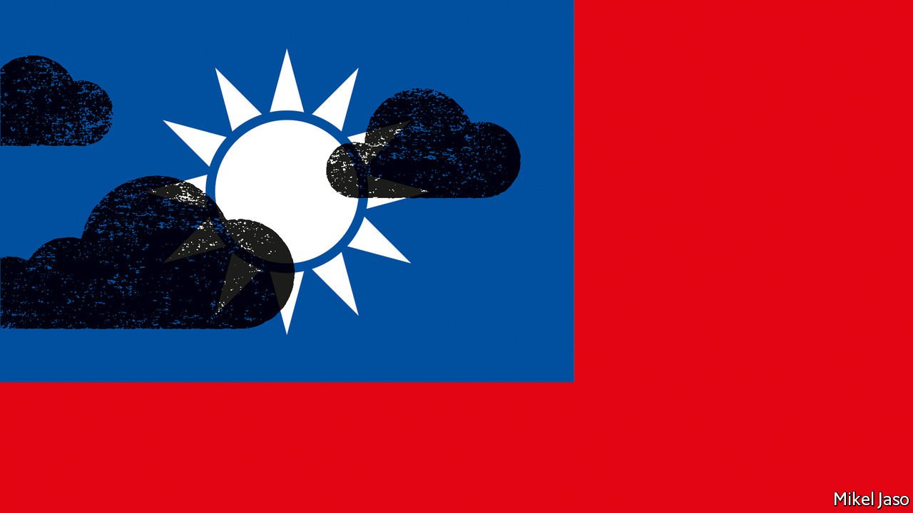
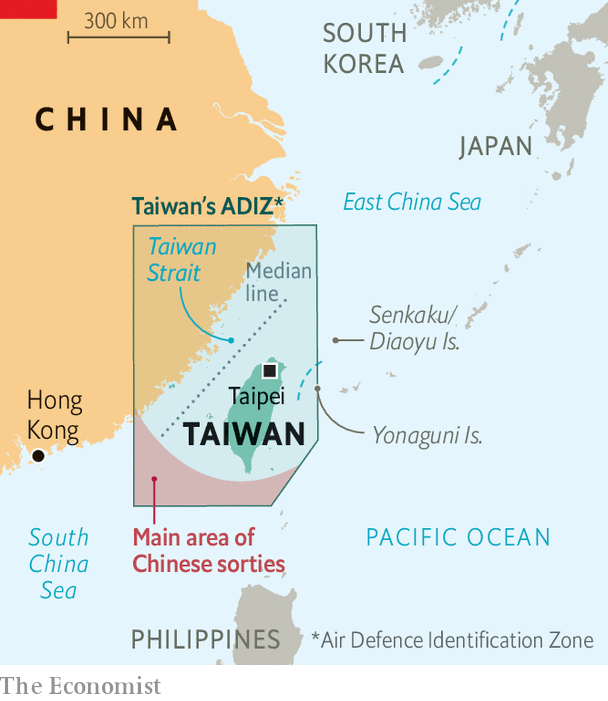
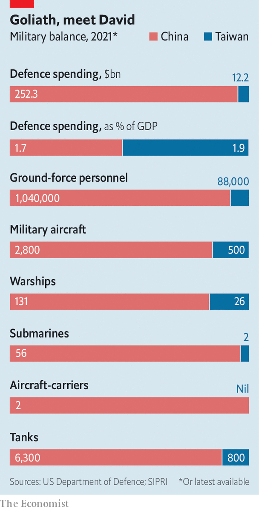

###### “War is here”

# What Taiwan can learn from Russia’s invasion of Ukraine 

##### Fighting spirit and the right Western arms may stymie a powerful foe 

 

> Apr 23rd 2022 

ON A FRIDAY night in Taipei, dozens of people gather in a bookstore to learn what to do if war comes to Taiwan. The shop window is plastered with slogans denouncing China and supporting freedom in Tibet, Xinjiang and Hong Kong. Nearby is a new protest wall: a Ukrainian flag speckled with Post-it notes in English, Mandarin and Taiwanese. “Stand with Ukraine”, says one. “Fuck Putin”, exclaims another. A third declares: “China, Russia: langbeiweijian”, ie, a wolf and a bei (a mythical beast) colluding to do evil. This refers to a traditional story of two deformed creatures—a wolf with long front legs and short hind ones, and a bei with the opposite impairment—collaborating to devour sheep.

With China and Russia declaring their friendship has “no limits”, Taiwanese fear they will be the next prey. How to survive? In the bookshop, a former naval signaller and a Krav Maga martial-arts instructor lead discussions on disaster planning, self-defence, mutual aid, treating wounds and more. Such workshops have become especially popular since the invasion of Ukraine, notes T.H. Schee, the signaller. “A year ago, most people thought we would never see war in our generation,” he explains. “Ukraine made everyone realise: war is here.” The session is a rare chance to overcome defeatism, he thinks. “We focus on protecting yourself, your family and your community first. We empower them to do something.”


Invasion from the mainland has been a worry ever since China’s nationalist rulers lost a civil war against the communists and fled to Taiwan in 1949. For a long time the two entities both claimed to be the legitimate government of China. A distinct Taiwanese identity has gradually formed, but Taiwan, which still calls itself the Republic of China (ROC), dares not declare itself independent for fear of provoking the mainland. That leaves it in limbo: a vibrant democracy and the world’s biggest purveyor of advanced semiconductors, which has diplomatic relations with just 14 countries.

Over the decades, Taiwan has swung from the delusion of reconquering the mainland to a deepening hopelessness—a sense that it can do little on its own to defeat an invasion. As a share of GDP, defence spending fell from 5.2% in 1990 to 2.7% in 2000 and 1.9% in 2020 (it may rise to 2.1% this year). The Stockholm International Peace Research Institute reckons that, in dollar terms, China’s defence budget is 20 times larger than Taiwan’s.

Defence spending has been unpopular in Taiwan, in part because of the legacy of nearly four decades of military dictatorship, which ended in 1987. The armed forces are shrinking as they give way to an all-volunteer force. What little remains of conscription—four months for men—is regarded as a waste of time and often shirked. The infantry’s strongest skills, Mr Schee quips, are “painting walls, picking grass and falsifying documents”. For a time, some Taiwanese thought trade with China might stay its hand, but the aggressive nationalism of Xi Jinping, China’s president, has dispelled that illusion. For the most part, Taiwan has sheltered behind the shield of American deterrence.


Russia’s invasion of Ukraine is causing a profound rethinking. The stout resistance by Ukrainians gives some Taiwanese hope that they, too, might be able to hold off a powerful foe. Yet the war also brings two sobering thoughts. One is that neither the threat of sanctions nor the West’s arming of Ukraine deterred Russia. The other is that Russia’s nuclear threats have deterred America from intervening directly. China, too, has nuclear weapons.

Contradictory emotions are apparent in a poll by the Taiwan Centre for International Strategic Studies, a think-tank. It showed a startling jump in the share of Taiwanese willing to fight to defend Taiwan, from 40% in December to 70% in March. A similar percentage supported extending the conscription period, a move currently under debate. But confidence that America would intervene has dropped markedly, from 55% to 43%. Scarcely a third of respondents thought Taiwan could hold off an invasion alone.

Weapons enough and time

Many in Taiwan thus watch the war in Ukraine with a mix of hope and dread. Its full lessons will depend on the outcome. But an obvious one is the importance of time: to prepare defences and international assistance before a war; and, once one starts, to hold out long enough for help from friends to arrive.

But Ukraine is a largish country in the heart of Europe; Taiwan is a smallish island-state. Taiwan is thus blessed and cursed by what John Mearsheimer of the University of Chicago calls “the stopping power of water”. Taiwan is harder for a foe to invade, but also harder for its friends to resupply. Another difference is economic heft. It will be tougher for the West to impose sanctions on China of the kind it has used to punish Russia. As the world’s second-largest economy (the largest if measured at purchasing-power parity), China is far more diversified and more integrated in global trade than Russia.

Even so, many in the West hope President Vladimir Putin’s military troubles in Ukraine will give Mr Xi pause. He will be even more conscious of the possibility of military failure—for him and for China’s Communist Party. The People’s Liberation Army (PLA) has not fought a war since its border conflict with Vietnam in 1979. Its leaders worry about “peacetime disease”. A Pentagon report notes that it is undergoing extensive reforms that could hamper its combat readiness until 2027 (but give it better options thereafter).

China’s generals will learn from Russia’s mistakes in Ukraine, as they do from any conflict with parallels to Taiwan (the Falklands war of 1982 is a favourite). “From a technical point of view, the Ukraine issue can indeed be seen as a rehearsal for a Taiwan Strait crisis,” Jin Canrong of Renmin University in Beijing told guancha.cn, a nationalist Chinese news site. “This is a very good learning opportunity. China can learn a lot from it, such as how to fight militarily, what pressure may be encountered politically, how to relieve that pressure, and so on.”

Nothing Mr Xi learns from foreign examples is likely to alter his fundamental approach. He still favours reunification without fighting, but is prepared to use force, particularly if Taiwan makes a dash for independence. The signs are that China’s leader, who is 68, wants to achieve unification within his lifetime, ahead of his stated goal of “national rejuvenation” by 2049, the centenary of the communist victory. Events in Ukraine are unlikely to change his conviction that China has a window to achieve its goals while America is divided at home and struggling to restore credibility abroad after decades of failed interventions and erratic foreign policy. And though some American alliances have been revitalised of late, Mr Xi may be heartened by the prospect of Russia preoccupying the Pentagon for years—just as wars in Afghanistan, Iraq, Libya and Syria did for much of the past two decades.

Successive Chinese leaders have built the PLA into a formidable force, designed to conquer Taiwan while fighting off American reinforcements. Its navy now counts more ships than America’s. It has developed a range of anti-aircraft and anti-ship missiles and sensors (known as anti-access/area-denial or A2/AD), intended to strike American and allied forces thousands of miles into the Pacific. The Pentagon says China’s conventional build-up is being matched by a nuclear one, with the aim of turning a minimal deterrent of a few hundred warheads into a stockpile of more than 1,000 warheads by 2030—closer to the size of America’s and Russia’s arsenals.

 


For now, the PLA will maintain its relentless testing and harassment of Taiwan, including frequent incursions into its air-defence identification zone (ADIZ). These are part of China’s “grey-zone” tactics which stop short of combat but practise for conflict and strain the island’s defences and its politics. Given China’s cyber-attacks and disinformation campaigns, many in Taiwan argue it is already under attack.

Should it come to war, the main lesson that China will draw from Ukraine is the need for speed—ideally achieving victory within days—to ensure that Taiwan’s government cannot organise concerted resistance and America cannot intervene effectively. The PLA appears to have planned primarily for three types of assault: a missile barrage, an air and naval blockade, and a full-scale invasion. None guarantees a swift outcome. Bombardment will cause heavy damage but cannot easily force a surrender. A blockade would take even longer. And the mustering of an amphibious invasion force is likely to be spotted well in advance of an attack, as Russia’s build-up was. It is anyway unclear that China has enough modern amphibious ships to move an invasion force quickly across the 180km Taiwan strait.

Some combination of these three strategies may hold more promise. Jacob Stokes of the Centre for a New American Security, a think-tank in Washington, posits one possibility: China stages a large-scale naval exercise near Taiwan, then swiftly uses the ships to blockade the island. Like Mr Putin, Mr Xi threatens nuclear escalation against anyone who challenges the quarantine. As America debates how to respond, China uses the time to gather and launch its invasion force, and perhaps to decapitate the island’s government. “It’s one of the scariest scenarios,” says Mr Stokes. “It raises the cost of intervention from the outset.”

Hard as ROC

Taiwan has for years talked about adopting its own A2/AD tactics as part of an “asymmetric” strategy, in which the weaker side uses defensive weapons, concealment and subterfuge to frustrate its foe. America has been encouraging Taiwan to develop a “porcupine” doctrine. The concept has gone by names such as “Hard ROC” and the “Overall Defence Concept”. The latter was championed by a former Taiwanese military chief, Lee Hsi-Ming. It called for Taiwan to buy “a low quantity of high-quality platforms”, eg, jet fighters, ships and submarines, to fend off China’s grey-zone attacks. And it emphasised acquiring “a large number of small things”, especially anti-ship missiles, to ward off an invasion—preferably at sea, possibly on the beaches and if necessary in the mountains of Taiwan. Mr Lee points to the Javelin anti-tank missile used by Ukrainian soldiers. “If Ukraine had only tanks, could they fight Russia? Think of 1,000 Ukrainian tanks versus 10,000 Russian tanks. Then think of 10,000 Russian tanks versus 100,000 Ukrainian Javelins. That is asymmetric warfare.”

Taiwan still espouses an asymmetric strategy, but Mr Lee’s vision appears to have been watered down through a combination of individual services’ love of expensive kit and genuine doubts. Taiwan is buying and developing mines and anti-ship, anti-tank and anti-aircraft weapons, but far too few, argues Mr Lee. He and American critics question the billions being spent on expensive systems—be they indigenous attack submarines or American M1 Abrams tanks, Apache and Black Hawk helicopters and F-16V jets. “They are buying stuff for things that won’t give them much security,” argues Evan Medeiros of Georgetown University. In a war, he suggests, many of the high-end weapons will be quickly destroyed or rendered ineffective; the American navy might tell Taiwan not to deploy its submarines lest they be mistaken for Chinese ones.

Shu Hsiao-huang of the Institute for National Defence and Security Research, a think-tank funded by the defence ministry, demurs: “We have the Taiwan Strait. So our first battle is going to be there. We need equipment to control the air and sea.” He also argues that, right now, “the threat of war is 10% but the peacetime threat of grey-zone activity is 90%.” And even in a war, he says, Taiwan must be ready to keep air corridors and sea lanes open because it has no guarantee that America will. Phil Davidson, the former commander of American forces in the Indo-Pacific, argues that Taiwan needs offensive weapons. “There’s too much discussion of an amphibious assault. China has a lot of other ways to pound Taiwan into submission, including missiles and cyber-attacks. If the Chinese don’t know their forces or points of departure are at risk, you cannot deter them. You can’t win at soccer only in defence. You have to be able to score a goal.”

The ambiguous American

It is of course easier to play catenaccio, the rigid Italian “strong chain” defence, if your teammates can hit the back of the net. The Baltic states have no jet fighters, but rely on NATO allies to protect their airspace against Russia. Can Taiwan count on America? There is no equivalent of NATO in Asia. America promises to help Taiwan with the means to defend itself but leaves unsaid whether it would go to war with China over the island. America hints at a greater readiness to fight, and risk nuclear escalation, for Taiwan than for Ukraine. Yet this falls well short of the “sacred obligation” to defend every inch of NATO, as President Joe Biden puts it. Such “strategic ambiguity” is meant to prevent both an attack by China and a declaration of independence by Taiwan. But as the balance of power shifts, the danger is that such uncertainty may fail to deter the former, and dishearten the latter.

 


In contrast with the mutual-defence commitment of NATO’s 30 allies, America’s alliances in Asia are more akin to a hub with spokes. America has separate agreements with Australia, Japan, South Korea and others—but they have no obligations to each other. That said, many of them have voiced their interest in preserving the status quo across the Taiwan strait. Ad hoc partnerships are forming for limited purposes. The “Quad”—a loose group of America, India, Japan and Australia—discusses everything from maritime security to economic co-operation and covid. Under the AUKUS partnership, America works with Australia and Britain to develop nuclear-powered submarines for Australia; this is being extended to domains such as hypersonic missiles. Some hope these networks will mesh into a whole strong enough to contain China, but mounting a coherent joint response will be difficult.

Japan’s role is important, given its powerful navy, its proximity and the American forces on Okinawa and elsewhere on its territory. On clear days, Taiwan is in sight of Yonaguni, Japan’s westernmost territory. The two countries are among each others’ top trading partners, though they have no formal ties. The shipping lanes around Taiwan are essential for Japan’s trade, in particular energy and food imports. People-to-people ties are strong, too. Taiwan is far less resentful of its time as a Japanese colony than other countries once ruled by Japan are.

For all Japan’s pacifist leanings, there is a growing realisation that it is bound to be involved in any war over Taiwan. To help Taiwan, America would rely on its bases in Japan. China may attack them, either pre-emptively or in response to intervention. It could try to seize the disputed Senkaku islands near Taiwan, which Japan controls, or otherwise violate Japanese territorial waters or airspace. The capture of Taiwan would usher in Chinese dominance in Asia, which Japan has historically resisted. Abe Shinzo, a former Japanese prime minister, summed it up last December: “A Taiwan contingency is a Japanese contingency, and therefore a contingency for the Japan- US alliance. Beijing, President Xi Jinping in particular, should not have any misunderstanding in recognising this.”

Grey-zone scenarios put Japan in a trickier position. Following changes to the interpretation of the constitution in 2015, Japan’s self-defence forces (SDF) can be deployed for combat even if Japan is not attacked, so long as the situation is deemed to be of “existential” importance. Yet that is a fundamentally political assessment. The public might balk; so too might Komeito, the pacifist coalition partner of the dominant Liberal Democratic Party. Japanese war games often end with participants tying themselves up in legal knots.

Precisely how Japan might help is unclear, not least because American and Japanese forces lack a NATO-style integrated military command. Neither has much experience of operating with Taiwan. Broadly speaking, the Japanese would focus on defending Japanese territory, including American bases; securing strategic choke-points around Japan; and providing rear-area logistical support, such as supplying fuel and ammunition and treating wounded soldiers. “Without Japan, the US cannot mobilise and surge,” says Koda Yoji, a former commander of Japan’s naval forces.

In Washington, meanwhile, calls are growing for America to do more to defend Taiwan. Republicans, in particular, urge the Biden administration to provide better weapons and military aid, abandon strategic ambiguity and even station American troops on the island. But for the foreseeable future Taiwan is likely to remain in the twilight zone: a country whose status is undefined and whose vital partnership with America is unclear.

The invasion of Ukraine shows that war can clear away ambiguities and hesitations. Taiwan’s best hope of survival is to deny China a quick victory. It will probably have to fight alone for a time. The longer it can hold out, the likelier it is to win sympathy, admiration and military support. Even now, time may well be Taiwan’s most important military asset. “Every day, when Xi Jinping draws back the curtain, he should see the capability that Taiwan, America and the other allies have deployed and tell himself: ‘Today is not the day for an invasion,’” muses Mr Davidson. “We had to run a deterrence strategy for 40 years during the cold war. That may be what winning looks like.” The struggles of the Russian wolf show how the Chinese bei might be kept at bay. ■

Read more of our recent coverage of the 

