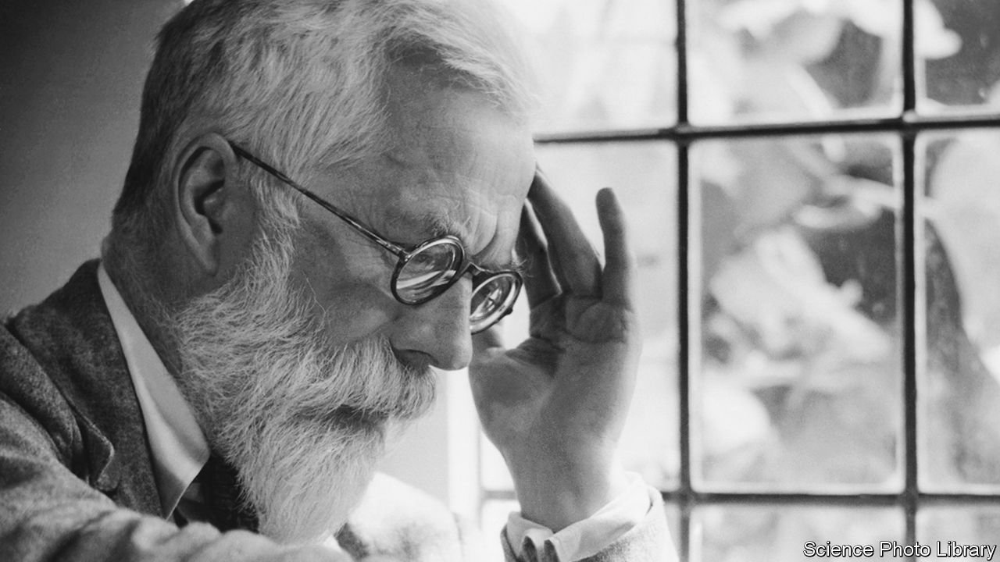

###### Window pains

# A Cambridge college reflects on the controversy over Ronald Fisher 

##### The defenestration of a statistician and eugenicist 

 

> Apr 23rd 2022 

STEP INSIDE the dining hall of Gonville &amp; Caius College, Cambridge, and within its cool, wood-panelled walls are memorials to great scholars of Caius and their work. There are windows to John Venn and his diagram; to Francis Crick and the DNA double helix; there is a painting of Stephen Hawking. And—until two years ago—there was a window to the work of a statistician called Ronald Fisher. It has now gone.

Fisher is one of the most famous statisticians ever, which is another way of saying he is not very famous at all. Venn and Crick and Hawking are all household names. Few have heard of Fisher. Yet, says Sir David Spiegelhalter, professor of statistics at the university, he was a giant. “Everything from the Higgs boson to the statins that I take every morning are evaluated using Fisher’s innovations.” It is less that Fisher is important to 20th-century statistics, says Sir David, than that “he essentially established my subject.”


People have learned a little more about him of late. Because he was also, like many statisticians of the time, a eugenicist. In 2020 protesting graffiti (“Fisher must fall”) was sprayed onto an aged Caius door; a petition was raised. “Not publicly acknowledging the racism of Fisher is ahistorical,” it declared. “Remove the commemorating window to R.A. Fisher, Caius. You must do better.” Almost 1,500 signed the petition. That summer saw what Professor Sir Alan Fersht, a former master of Caius, calls the “defenestration” of Fisher. “Victory!” celebrated the students.

The college seems a little less certain that this was a triumph. This week it is holding a two-day conference, organised by Sir Alan, on the topic of “Fisher in the 21st Century”. The event is not, he says, aimed at “putting Fisher on trial” or resurrecting the window debate. But the probability that the subject won’t arise seems low. Sir Alan himself—somewhat appositely for a row about a window—says that he “can see both sides”.

Iconoclastic debates over racism and memorials arise regularly in British universities. A “Rhodes Must Fall” campaign has smouldered for years over a statue of the Victorian imperialist at Oriel College, Oxford. In March, Jesus College in Cambridge went to court to try to remove a memorial to a man who made money from the slave trade. In 2020 Edinburgh University renamed “David Hume Tower” for the philosopher’s “comments on matters of race”.

Iconoclasm, as Cambridge knows well, has a long history: in 1643 a Puritan iconoclast destroyed 120 images—or “monuments of superstition”—in Jesus College in a single day. Always the intention is improvement; always the focus is narrowly on the controversies of the day. Few iconoclasts morally multitask. Which is a shame, as they’d have ample material if they did: opposite where the Fisher window in Caius used to be hangs a portrait of a former master who was an avid enthusiast for Mao Zedong.

One thing is not in dispute: Fisher, who died in 1962, was brilliant. One of his greatest intellectual leaps came when taking tea in a Cambridge garden. A woman claimed that merely by tasting tea she could tell “whether the milk or the tea infusion was first added”. His companions scoffed; Fisher wondered how you could be sure what was going on. The answer led to one of the most important statistical ideas of all: the “null hypothesis”, the idea that what you see—an apparent ability to distinguish tea-making techniques, say—could be due to chance alone. Every drug tested, every vaccine trialled draws on this insight of his.

In other ways Fisher was unremarkable. A belief in eugenics—a word to cause an intake of breath today—was then standard: fellow-eugenicists included John Maynard Keynes, H.G. Wells and Beatrice Webb. Eugenicists were fired by idealistic zeal for doing better. As the first issue of “The Eugenics Review” (a publication that started in 1909 and only saw fit to change its title in 1968) explained, its purpose was “the noblest that can be imagined—the betterment of the Human Race”. Humans could become better, brighter.

The history of the 20th century leads most to elide eugenics and racism but Fisher’s interest was within races, not between them. He thought abilities might differ between races since their genes differed—but offered no particular view on which might be better. A recent article in Heredity, a journal, concluded that his eugenics work “provides no support for the view that he was a racist in the stronger sense of supporting racial discrimination”. His worry was the ever-breeding poor and the “defective”, where his views, to modern eyes, were extreme. At one point he advocated voluntary sterilisation of the feeble-minded. “I could understand,” says Sir David, “why people would want to remove memorials to Fisher as a person.”

But those were not the reasons that the petition focused on. Somewhat ironically for a document so keen on historical precision, it was riddled with errors. It attributed quotations to him that he never said; it quoted from a blog that confused Fisher with another eugenicist. The author of that blog admits that the post in question contained infelicities but says that it had been written six years ago: “It’s clearly a product of the time.”

Indeed. The past is another country; they do things differently there. And in the hall in Caius, the light—a better, brighter light—now shines through the window where the Fisher memorial once was, onto the painting of a man who was a fervent supporter of Mao. ■

