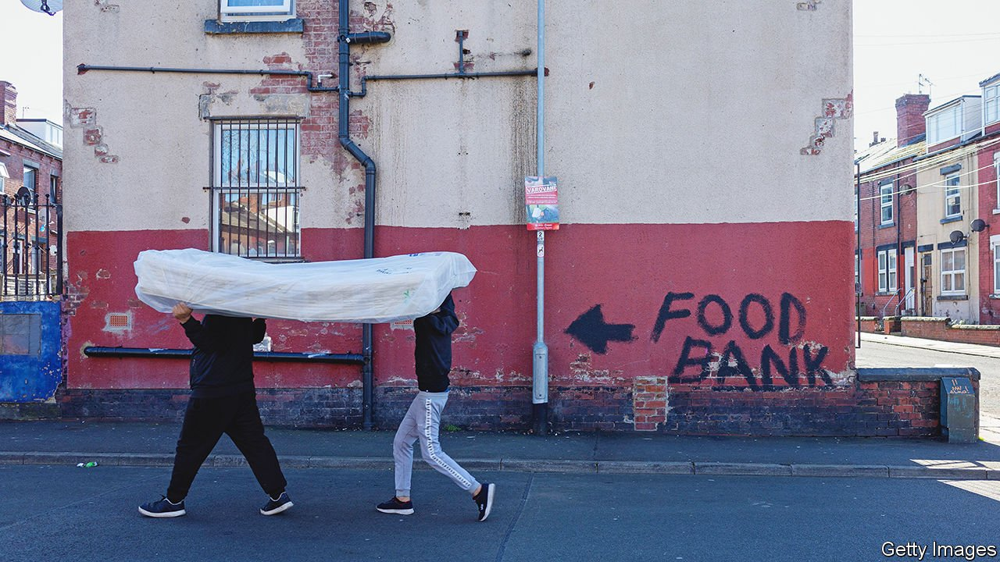
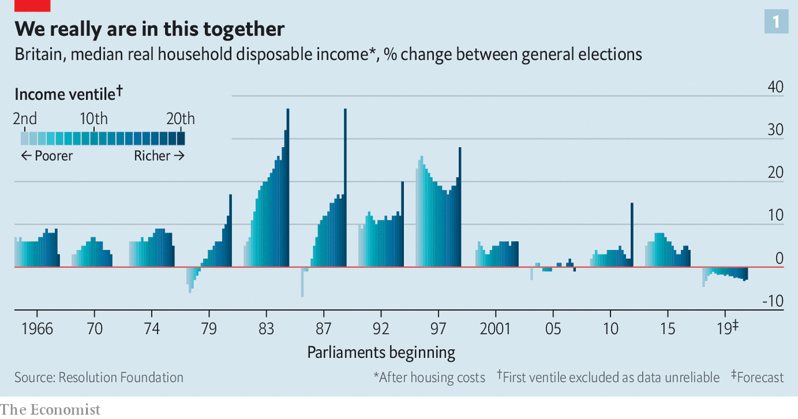
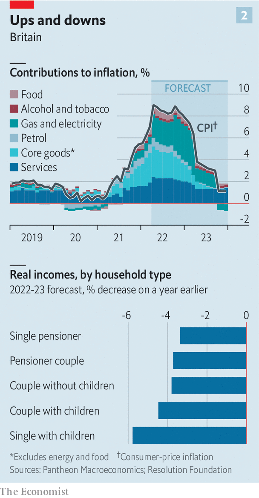

###### The big squeeze

# A guide to Britain’s cost-of-living crunch 

##### Incomes in Britain will not keep up with inflation over the coming months 

 

> Apr 21st 2022 

THE SIGNS are there. Richard Walker, the boss of Iceland, a discount supermarket, reports that his customers are switching towards frozen food, as a way to reduce waste, and buying fewer items as they try to manage their cash. Although Iceland is gaining new customers as people trade down, it is losing others to charity. Charlotte White, who runs a food bank in south London, reports a dramatic increase in demand for its services, and a drop in donations that she attributes to squeezed incomes. And Kantar, a research firm, reckons that British households cancelled some 1.5m video-streaming accounts in the first three months of the year, up from 1m in the final quarter of 2021.

Belts are tightening in response to rising prices. In March the rate of annual inflation in Britain reached 7%, the biggest such increase in 30 years. Energy bills are rising most sharply, but price increases are occurring across the board. The consequence will be a fall in living standards over the coming fiscal year of 2.2%, a drop not seen since records began in the 1950s. Whether that counts as a crisis depends on your income. For the very poorest the choice is already between heating or food; for the more affluent, the dilemma is picking Netflix or Disney+. But what is clear is that the rising cost of living will be unusual in affecting people across the income distribution (see chart 1)—and that the worst is yet to come.


Start with the cost pressures that are already visible. Energy prices have been rising dramatically for many months, but after Russia’s invasion of Ukraine some types saw a particular surge. The cost of heating oil, used by around 3% of Britons to heat their homes in winter, soared by 44% in March compared with the prior month. Motorists paid around 30% more to fill up at the pumps in March than they did in the corresponding month in 2021.

 


Household energy bills are also spiralling. The government limits the amount that energy suppliers can charge households; the cap jumped by 54% in April, to an average annual charge of around £2,000 ($2,610). Customers on prepayment plans, who pay for their gas and electricity before they can use it, get bills that fluctuate with the seasons. The Fuel Bank Foundation, a charity, says that average prepayment bills will rise from around £107 in March to £131 in April. Bills for the majority who pay in smooth increments via direct debit will see a bigger rise, of closer to £60 this month.

Eating has also become pricier. In March food was 6% more expensive than the year before. There are shortages of workers in fields and factories, as well as of specific commodities—over 70% of sunflower oil, for example, comes from Russia and Ukraine. The prices of inputs such as fertiliser and energy have soared (the cap for households does not apply to firms).

Although food- and energy-price increases have garnered most attention, they are part of a broader trend. Several major mobile-phone networks yanked up their prices by as much as 11.7% at the beginning of April. The expiry of a lower rate of value-added tax on restaurants and hotels means higher prices in the hospitality industry. Rising national-insurance contributions, a payroll tax, will add to the pinch on budgets from this month.

If that sounds like Britain must already be suffering a cost-of-living crunch, the reality for many is closer to an inexorably tightening squeeze. Energy use is highly seasonal: it tends to fall between March and April as the weather warms, and will continue to do so as summer approaches. For many cash incomes will increase this month, as wages and benefits rise at the start of the fiscal year. Consumer credit offers a way for customers to make the sums add up, at least for a while. And around 80% of households will get £150 of emergency support from the government this month in the form of a one-off discount on council-tax bills.

 


But over the coming months rising prices will keep eating away at people’s spending power. Economists expect higher inflation to persist until next year. Pantheon Macroeconomics, a consultancy, predicts that, after rising to around 9% in April, it will only be a year from now when inflation falls back below 6% (see chart 2). Trends in producer prices suggest that food will become even more expensive over the next few months. But energy is again the biggest threat.

The price cap can be raised once more in October, and another big jump is expected. The Fuel Bank Foundation reckons that average monthly energy bills will climb by a further £23 at that point for those paying by direct debit. It estimates that people paying for energy as they use it will get a monthly bill in January 2023 which will be £138, or 76%, higher than a year earlier.

Incomes are set to lag behind prices. Median pay awards in the three months to March 2022, as measured by Incomes Data Research, a data firm, were just 3%. An early look at a sample of pay awards for April, which is typically when around two-fifths of the annual total are decided, suggests that the median award this month may only be around 3.5%. Although the government has proposed that teachers’ starting salaries be raised by 9%, starting from this September, it is arguing for an increase of just 3% for experienced educators on the “upper pay scale”, who represent over half of the total.

Retirees will probably see a fall in the real value of their pension income, too, at least in the short term. The state pension rose by just 3.1% in April, in line with September’s inflation rate. Most private pensions offer some protection against inflation, but analysis by the Pensions Policy Institute, a think-tank, suggests that a majority of such schemes cap rises, often at 5%. (Many also increase payments according to a lagged measure of inflation, which means that as inflation rises, income will take a while to catch up.)

The poor, who tend to spend the biggest share of their budgets on household energy bills, face the greatest pain. Economists at the Institute for Fiscal Studies (IFS), a think-tank, predict that in June, even before the next leap in the energy-price cap, the poorest 10% of British households will endure an inflation rate 3.5 percentage points higher than that experienced by the richest decile.

Although the national minimum wage increased by 6.6% in April, those on benefits have fared much worse. During the pandemic the government propped up the incomes of the working-age poor—among other things, by raising the value of universal credit, a welfare payment, by £20 a week. That increase was taken away again in October, and a 3.1% rise in universal credit this month was much too low to prevent another drop in the real value of benefits. The expected increase in domestic energy bills in the autumn will prompt a further plunge. According to Robert Joyce of the IFS, by the first quarter of next year monthly benefits for a single homeowner who has two children and is out of work will be worth 9% less than they were before the covid-19 pandemic.

Matt Copeland of National Energy Action, a fuel-poverty charity, warns that people have not understood how bad this coming winter could be. Cold homes can be deadly for the elderly and disabled people whose medical conditions require them to stay warm. In testimony to Parliament this week, the boss of one energy supplier warned that things were going to get “truly horrific”. The Resolution Foundation, a think-tank, predicts that over half of the poorest third of households will be pushed into fuel stress, which is defined as devoting at least 10% of their non-housing spending on gas and electricity. More will be pushed towards tactics like staying in bed to keep warm, eating cold meals or putting newspapers over windows for extra insulation.

Winter is still coming

Other coping mechanisms are less useful than they once were. Charities including Age UK, which serves the elderly, Gingerbread, which helps single-parent families, and Citizens Advice, which helps people with problems including debt, each report increases in the number of people calling to ask for help. Those doling out advice would normally suggest searching around for a better energy deal, but that is no longer helpful when capped prices are the cheapest option.

“We’ve reached the limits of what can be done through salami-slicing budgets,” warns Morgan Wild, head of policy at Citizens Advice. “There has to be some substantial government intervention.” So far help has been rationed. Rishi Sunak, the chancellor of the exchequer, has already announced that £200 will be taken off energy bills in October, to be repaid over the following five years in instalments of £40. But for the poorest households, this assistance will not be enough for them to cope. Mr Sunak has a bit of time left to decide what else he should do, but not much. What is beyond doubt is that he will have to do something. ■

