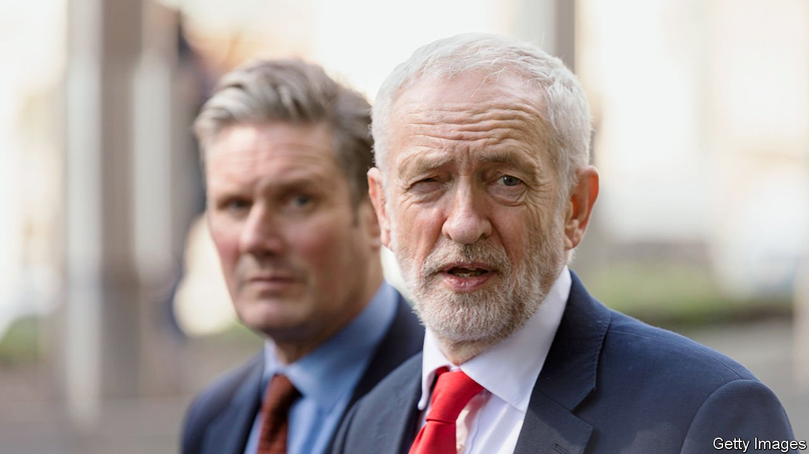

###### Red and buried

# Sir Keir Starmer’s transformation of the Labour Party 

##### The grip of the hard left has been broken 

 

> Apr 21st 2022 

THREE YEARS AGO Momentum seemed to be riding high. The left-wing activist group had been formed to support Jeremy Corbyn, the radical leader of the Labour Party. Mr Corbyn’s allies controlled the party’s most important offices; his opponents had been scattered; and he enjoyed the support of Unite, a big trade union. The prospect of forming a socialist government seemed tantalisingly close.

These days the meetings of Momentum’s national committee are downbeat affairs. Officials lament the rightward slide of the Labour Party on crime, immigration and defence. They complain of shrinking influence and the “vilification” of its socialist MPs. There is, recent minutes note, “extreme demoralisation amongst the left”. Momentum urges its supporters to “stay and fight”; many have quit.


Such gloom reflects the dramatic transformation that Sir Keir Starmer has wrought on the Labour Party since becoming its leader in April 2020. Mr Corbyn’s personal unpopularity goes a fair way to explaining Labour’s heavy defeat in late 2019, its worst electoral showing since 1935. Boris Johnson would like to portray the party as still under Mr Corbyn’s spell. On April 19th, delivering yet another apology for his failure to obey pandemic-era restrictions, the prime minister dubbed Sir Keir a “nodding dog” to his predecessor.

Which is why Sir Keir is often urged to deliver a “Kinnock moment”, a reprise of Neil Kinnock’s forceful denunciation of Trotskyite factions at the Labour conference of 1985. No such moment of theatre has arrived; Sir Keir’s speeches are forgettable affairs, and his clipped speech no match for Lord Kinnock’s Welsh roar. And yet the current Labour leader has already moved against the left just as effectively, ousting them from the critical decision-making bodies in the party.

Whereas for the left, seizing the party was an end in itself, Sir Keir is said to be fixated on becoming prime minister. His circle saw the party bequeathed by Mr Corbyn as turned inside-out—one which had come to think of itself as an expression of virtue rather than an instrument of power, and in which the desires of its card-carrying members were elevated over those of the electorate. Some doubted that it could be salvaged at all, given the depth of the far left’s penetration. Although Sir Keir had campaigned for the leadership as a unifier, he moved with speed to reshape the party before Mr Corbyn’s crowd could regroup.

Jennie Formby, the pro-Corbyn general secretary of the party, quit in May 2020. By that November Sir Keir’s supporters had a working majority on the National Executive Committee (NEC), which makes the major decisions over the party’s management and policy. Richard Leonard, the party’s leader in Scotland, was squeezed out. The composition of local Constituency Labour Parties (CLPs) appears to have shifted, too. A tally of delegates’ votes at the party’s annual conference in 2018 suggested that Mr Corbyn had the backing of 80% of CLPs, whereas by 2021 Sir Keir had the support of just over half, reckons Luke Akehurst, an NEC member and organiser for the party’s moderate faction.

The art of mobilising moderate members to win back control of the party is a painstaking one, ground out one vote at a time. “This all had to be done 30 years ago under Kinnock,” says another organiser. “It’s getting the right people in the right Zoom at the right time.” The composition of the party’s membership has changed in Sir Keir’s favour, too: perhaps a quarter used to be dogmatic Corbynistas, tens of thousands of whom have left to be supplanted by new members loyal to him.

All of which has allowed Sir Keir to make some big changes. Mr Corbyn has been suspended from the parliamentary party over his response to revelations of anti-Semitism on his watch. (His followers are split over whether to support him as an independent candidate at the next election, and have not found a successor to rally around.) A string of revolutionary-left organisations have been proscribed from the party, and their members expelled.

Reforms passed narrowly by the party’s conference last September are intended to prevent a repeat of Mr Corbyn’s storming of the leadership in 2015 on the back of an influx of new members, and to shift power from the party’s rank and file back to its parliamentarians. The changes strengthen the power of MPs to pick future leaders, and reduce members’ ability to deselect MPs who displease them.

The next front in the struggle for the Labour Party will be over the selection of candidates for Parliament. Mr Corbyn’s faction in the House of Commons, the Socialist Campaign Group, is isolated and numbers a few dozen out of Labour’s 199 MPs. Momentum has made it a priority to increase this number. Moderates complain that Mr Corbyn’s tenure produced too many low-wattage MPs unqualified for ministerial office. Sir Keir’s reforms ought to raise the bar here too. There will be tougher central vetting to weed out cranks; spending caps and shorter campaigns will tip power away from the unions. Sir Keir has squeezed the hard left out of the party apparatus. The next test of his overhaul is whether he can remake the ranks behind him on the green benches of the House of Commons. ■

