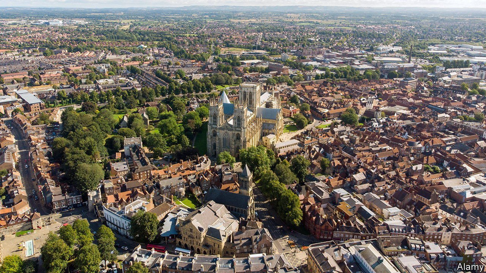
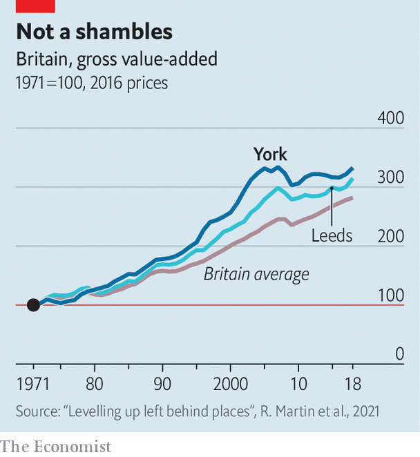

###### Really not new York

# The NIMBY city 

##### The parable of York, a place that does not want to grow 

 

> Apr 21st 2022 

LAST DECEMBER York City Council considered a proposal to demolish a Mecca bingo hall and replace it with student housing. The building was acknowledged to be architecturally undistinguished. It was also unused—it had closed during the covid-19 pandemic and never reopened. Still, some councillors objected. One argued that the bingo hall was “clearly a cultural facility, if not institution” and called on the chairman to resign.

The council eventually approved the plans. But the eruption of controversy over the redevelopment of an ugly, defunct building is pure York. “It’s quite a backward-looking city—it’s very nostalgic,” says Helen Heraty, co-owner of the Grays Court Hotel, which unlike the bingo hall is both old and beautiful. And nostalgia is a problem, for York and for Britain.


When politicians talk about “levelling up” Britain, they tend to imply that northern England, the Midlands and Wales are hungry for development and growth. This is certainly true of prominent northern politicians such as Andy Burnham and Ben Houchen, respectively the mayors of Greater Manchester and the Tees Valley. But the north also contains places that are as NIMBY as any other in the country.

York is a small city of 211,000 inhabitants with a lovely, largely medieval centre. Over the past few decades it has fared well economically, although like many places it has slipped a little since the financial crisis (see chart). York University churns out more graduates every year. Taking an average of the past five years, 50% of residents are estimated to have a post-secondary qualification, compared with 41% in Britain as a whole. The city could be a powerful engine of the northern English economy. But it does not want to be.

 


British cities are supposed to have local plans, agreed with the government, which explain where they will build new homes and offices. The last time York managed to do this was in 1956. That is not an oversight. York has simply not wanted to turn into a bigger city like Leeds or Manchester, says Neil Ferris, the corporate director of place at York City Council: “Do you need all those big sheds, do you need all those factories to have a good quality of life?”

York has surrounded itself with an enormous green belt, eight times as large as the built-up area of the city, which prevents suburban sprawl. It cannot grow upwards, partly because planners do not want to block views of the cathedral. And apart from some railway yards, which will be redeveloped in a plan known as York Central, it lacks the large blocks of post-industrial wasteland that have allowed cities such as London and Manchester to build rapidly in their centres.

As a result it adds homes and people only slowly. Between 2015 and 2020 York’s population grew by 2.5%, or an average of just over 1,000 people a year. That is slower growth than the United Kingdom as a whole. Students seem to account for nearly all of the increase: full-time enrolments in the University of York alone have risen by 4,785 over the past five years.

York is hardly better at creating commercial buildings. A new office development known as Hudson Quarter claims to be the first of its kind in the city for at least ten years. The amount of office space in the centre of York fell after the national government made it easier to convert offices into homes. “We have a lot of people looking at York and then going elsewhere,” says Laurence Beardmore, president of the chamber of commerce.

York might well be a richer city if it allowed itself to grow faster. The council does worry that York loses too many graduates, who push off because they cannot find entry-level homes or highly skilled work. It is generally the case that bigger cities are more productive than smaller ones, although this is less true in Britain than elsewhere. And as Mr Beardmore points out, even sprawling cities can have beautiful centres. Just look at Paris.

But the truth is that the established residents of York are doing fine. Desirability and limited construction help explain a ratio of median home prices to earnings of 8.8, above the 6.4 average for the Yorkshire and Humber region. “Your average person in York who owns a house is quids in,” says Philip McCann of the University of Sheffield. York’s refusal to grow harms its residents less than the people who cannot afford to move there. ■

