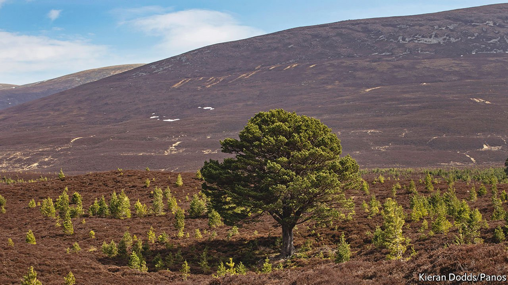

###### Less shooting, more sequestering

# The carbon market drives land sales in Scotland 

##### Environmentalists are buying up estates in the Highlands 

 

> Apr 21st 2022 

WHEN PRINCE ALBERT purchased the 20,000-hectare (50,000-acre) Balmoral estate in 1852, he did so for his family and for the views, the grouse and the deer. Owners of estates in the Scottish Highlands have conventionally had similar motives. But a new breed of landowner is drawn to something else entirely: the estates’ ability to suck in carbon from the atmosphere.

Individuals, companies and trusts have been buying up properties for their environmental potential for about two years, says Robert McCulloch of Strutt and Parker, an estate agent. Estates in the Highlands are often not fertile enough for profitable farming and the properties are large, making it easier to do tree-planting or peatland restoration that sequesters carbon at scale.


In 2021 46% of estate transactions in Scotland involved companies, investment funds or charitable trusts; Mr McCulloch estimates the proportion was less than 20% in previous years. Their interest has driven prices up. In 2021 the sale price of an average Scottish estate was £8.8m ($11.5m), almost double the amount of a year before. Between 2020 and 2021 the total spent on buying estates increased by 119%.

In Britain the amount of carbon dioxide a landowner is sequestering counts as credits that can be used to offset emissions. Firms and funds mostly set their land holdings against emissions from their own businesses. In 2020 BrewDog, a beermaker, bought 3,800 hectares in the Highlands; it now claims that its carbon offsets are double its emissions. Aviva Investors snapped up 6,300 hectares in Aberdeenshire for similar reasons.

Individual buyers tend to have their sights on making money. Jeremy Leggett, an environmentalist who founded and sold a solar company, bought a 511-hectare estate along the shores of Loch Ness in 2020. He is gambling that its woodlands, peatlands and plants will yield carbon credits that can be sold to firms looking to offset their emissions. (If a market forms, he hopes to sell biodiversity credits, too.)

The influx of green buyers is positive in many ways. Scotland has ambitious climate goals, including to reach net-zero carbon emissions by 2045. Most of those cuts in emissions will come from phasing out fossil fuels, but native woodland and healthier peatlands help. The Scottish government has a target of planting 18,000 hectares of woodland every year, beginning in 2024, and restoring 250,000 hectares of peatland by 2030. The government will not meet those targets without changes on the country’s private estates, which make up more than half the countryside.

But the new landowners bring controversy, too. The tenant farmers and gamekeepers who rely on traditional use of the estates could find work harder to come by. And land ownership is a touchy subject in Scotland: 400-odd people own half of the country’s area. Lawmakers have taken note of the possibility that rising prices risk making land even less accessible to local communities. On March 31st the government published a set of non-binding principles which, among other things, encourages would-be buyers to consider leasing land to generate carbon offsets. Legislation may follow. Green landowners may be good for the planet, but they don’t do much for equality. ■

For more coverage of climate change, register for , our fortnightly newsletter, or visit our 

