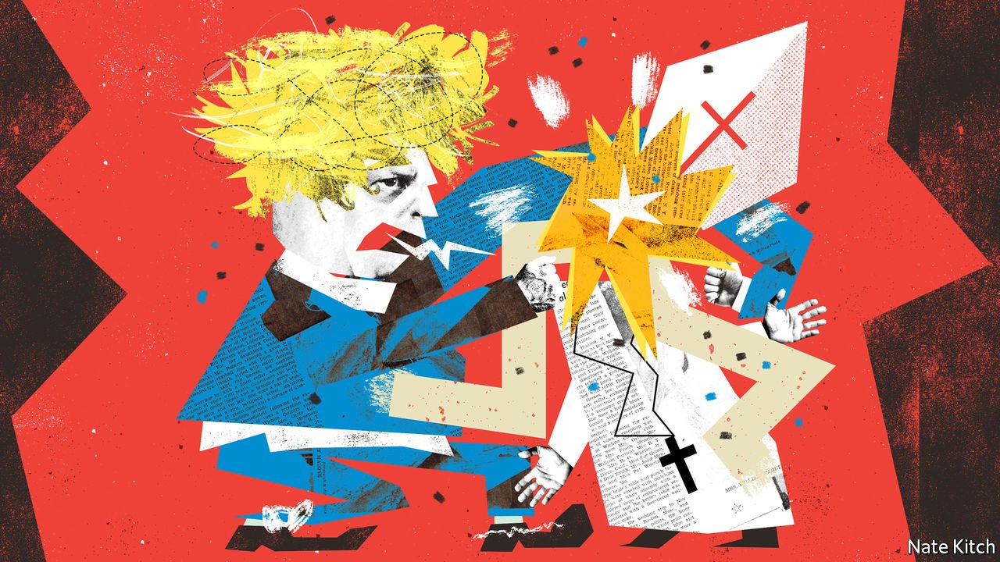

###### Bagehot

# Why Boris bashes the archbishop 

##### Fighting institutions trumps actually governing for the Conservatives 

 

> Apr 23rd 2022 

ARGUMENTS BETWEEN the government of the day and the Archbishop of Canterbury have a long, bloody pedigree. In the 12th century Thomas Becket ended up with his brain splattered across the floor of Canterbury Cathedral after clashing with Henry II. In the 16th century Thomas Cranmer was chained to a stake and burned to death for heresy and treason.

When Justin Welby, the current Archbishop of Canterbury, attacked a new government plan to deport asylum-seekers to Rwanda, the response was less violent. MPs reacted with hammed-up anger rather than bloodshed. In an ingenious if wholly inaccurate analysis of Britain’s constitution, Ben Bradley, the MP for Mansfield, declared: “We separated the church from the state a long time ago.” One commentator accused the cleric of “virtue-signalling”, which is a decent summary of an archbishop’s job. Boris Johnson grumbled to Conservative MPs that Archbishop Welby had not been as critical of Vladimir Putin’s invasion of Ukraine.


Spending Easter weekend scrapping with bishops is no way to introduce a policy. For this government, however, it was the perfect launch. Political spectacle trumps substance. Coming up with a scheme to deport people to Rwanda does take aim at a real voter concern about the rising numbers of asylum-seekers crossing the Channel. But it is also an excellent way for the government to engage in its primary purpose: fighting Britain’s institutions.

The Church of England makes a fine opponent because Britain does have meddlesome priests. The country is, after all, a form of theocracy. Bishops sit in the House of Lords (and the queen sits just below Christ in the church’s pecking order). The Lords Spiritual play an active role in legislation, turning a corner of Westminster into Tehran-on-Thames. Even before the Rwanda scheme was announced, bishops were all over the Nationality and Borders bill, which aims to make it harder to claim asylum in Britain. Unelected peers, particularly ones in fetching hats, can do little to thwart a determined government. But they make a useful enemy.

So do civil servants. The top official at the Home Office demanded a “ministerial direction”, in effect putting on record an objection to the Rwanda plan. The scheme would be expensive—the African country is getting £120m ($157m) in exchange for taking in asylum-seekers—and probably not work, he wrote. Officials in the Home Office tend not to be wet liberals. Bishops may believe in the best of humanity, but the Home Office focuses on its worst. Theirs is a world full of paedophiles, terrorists and drug-smugglers; deporting people is the day job. Objections from Whitehall are practical rather than moral. Yet the government can still cast civil servants as obstinate ideologues standing in the way of their democratic masters.

Whether Britain can deport people to Rwanda will ultimately be settled in the courts. The broad international conventions that dictate Britain’s asylum policy, such as the Refugee Convention and the European Convention on Human Rights, have been left untouched by the scheme. Judges will decide whether the new proposal violates them. In a taste of things to come, Mr Johnson this week took aim at “politically motivated lawyers”, who, he argued, made the policy necessary in the first place. A clash between the government and the judiciary is inevitable. Having a proposal struck down by a court was once an inconvenience. For this government, however, it would be a virtue.

All governments fight those who appear to thwart them. Usually, however, there is a reason to have the tussle. The Church of England was a vociferous opponent of Margaret Thatcher’s welfare reforms in the 1980s. Likewise, she had a low regard for chunks of the civil service. (Her favourite television show was “Yes, Minister”, where scheming officials try to defy their minister’s wishes.) Whereas the current Conservative government chunters about the BBC, Thatcher went to war with it, easing out a director-general of whom she did not approve. Yet this was not a campaign of casual vandalism. Thatcher was in the middle of an economic revolution; those opposed to it had to be crushed. Shaking the system was necessary in order to change it.

In contrast, the current government launches fights for the sake of it. Such an attitude extends beyond illegal immigration. Brexit policy has gone from being the existential goal of Mr Johnson’s government to a pantomime. Jacob Rees-Mogg, part-cartoon character, part-cabinet minister, has been given the task of winkling out Brexit opportunities. But geeing up friendly newspaper headlines has supplanted the boring and complex task of actually improving post-Brexit regulation. Politics is no longer the art of the possible but performance art.

What miserable drones and traitors have I nurtured

The government exists in a realm in which it is eternally 2016, opting for a constant campaign over a programme of actual reform. In the referendum, Vote Leave’s strategy was one of picking fights they wanted to have, on everything from half-truths over the cost of the EU to Turkey’s prospective membership of the club. Opponents were engulfed by outrage. Vote Leave’s alumni are now in office, but their tactics have not changed.

When Britain’s political system ground to a halt after the Brexit referendum, pugilistic rhetoric had appeal. In 2019 Mr Johnson’s pledge to bulldoze through anyone who stood in his way won him a fat electoral majority. But things are calmer now. Competent governance, rather than picking fights, is what is needed. At a time when living standards are set to fall sharply, scrapping with the civil service or judges provides little hope of electoral salvation. The Conservatives have a large majority, and Britain has the least-constrained executive of almost any European democracy. It is within the government’s gift to change Britain radically, yet they are signally failing to do so. Accepting that is hard. Far better to blame a bishop. ■

Read more from Bagehot, our columnist on British politics: (Apr 16th) (Apr 7th) (Mar 26th)

