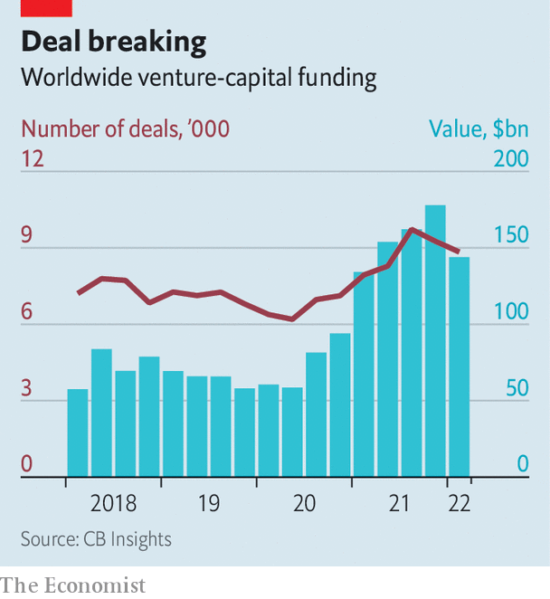

###### Hungry, hungry unicorns

# After a fat year, tech startups are bracing for lean times 

##### Which are most at risk? 

 

> Apr 23rd 2022 

AFTER A STUNNING run during the pandemic, which put a premium on all things digital, tech stocks have hit a rough patch. The NASDAQ, a technology-heavy index, has fallen by 15% from its peak in November, weighed down by a new outbreak of covid-19 in China and the Russia-Ukraine war, which are gumming up supply chains, and inflation, which erodes the value of future cashflows, making risky growth stocks less attractive to investors. On April 20th the market value of Netflix crashed by a third, or $54bn, after the video-streaming titan reported the first quarterly net loss of subscribers in more than a decade.

The bloodletting in public markets has left many wondering about private technology startups. Like their listed peers, they have enjoyed a covid-fuelled bonanza. Thanks in part to new types of investor, such as hedge funds and corporations, ploughing more cash into the sector, last year was a bumper one for venture-capital (VC) deals. According to CB Insights, a research firm, global tech startups raised $628bn in 2021, more than double the previous year’s tally. In the same period the number of deals jumped by a third, to more than 34,000. Fully 528 private firms became “unicorns”, valued at $1bn or more. Are these rich valuations now also about to take a tumble?


The short answer: almost certainly. Dealmaking has already slowed. The number of transactions sealed between January and March fell by 5% compared with the previous quarter. The amount invested dropped by 19%, the biggest quarterly decline since 2012. Some of the factors behind the slowdown are those unsettling the public markets, supply-chain snags and inflation chief among them. Another cause is the public markets themselves.

 


An index of stocks that have floated via an initial public offering (IPO) within the past two years, compiled by Renaissance Capital, a hedge fund, is down by around a third in the past 12 months. This has discouraged many startups from going public. In the last three months of 2021, 296 firms listed. In the first three months of 2022, just 164 did—mostly in Asia. Worried that they will be unable to monetise their stakes soon, venture capitalists have tightened their purse strings.

Private valuations are beginning to be affected. Last month Instacart, a grocery-delivery firm, took the unusual step of announcing its own devaluation, from $39bn in March last year to $24bn, even without an accompanying “down round” of fund raising at a lower price. Valuations are falling in secondary markets, too. Phil Haslett, co-founder of EquityZen, which helps tech employees sell their pre-IPO stock options, says that the prices of some of those stocks have fallen by 30-40% since the second half of last year.

Falling valuations in turn make it harder to raise capital. New projects may be put on hold and new hires may have to stop. Some companies could go out of business altogether. On April 5th Fast, a maker of checkout software for online merchants, announced that it was shutting down because of fundraising problems. Many investors predict that more startups will go bust or see their valuations decline in the coming months.

To see which startups are most at risk, The Economist looked at the annual revenue growth and valuation-to-sales ratios for 500-odd unicorns around the world, for which PitchBook, a data firm, had information. For the whole lot, the median revenue growth was 63% and the value-to-revenue ratio was 22. Three sectors looked particularly vulnerable.

One is hardware companies, such as JUUL, an e-cigarette firm, and Royole, a Chinese maker of smart devices. This group has a median revenue growth of 32% and valuations 25 times their annual sales. Another category is fintech firms, including Britain’s Checkout.com and America’s Plaid. Such firms’ median valuation is about 33 times their sales, the highest among the 11 broad sectors we examined, but their median sales growth is only middling, at 70% per year. Business-software firms, such as Miro and Talkdesk, are also looking shaky. These firms have a median valuation of 28 times their sales and revenue growth of 33%.

Some startups will be insulated from the shock. Software firms, for example, tend to boast large gross margins, often around 70% for smaller companies. This can provide a buffer against a downturn. Thanks to last year’s bumper fundraising, many startups of all sorts have healthy balance-sheets and may not need to raise capital for several years. “I have so much money I don’t know what to do with it,” the boss of one told The Economist earlier this year after a multibillion-dollar round.

Magical thinking

And superstar companies, such as Stripe, a payments unicorn valued last year at $95bn, are so adored by venture capitalists that they will probably be able to raise money even in harsh environments. Indeed, VC firms insist that falling valuations across the industry do not affect their returns, precisely because these ultimately come from a small number of big hits, not a big number of small ones.

Perhaps. Some investors are nonetheless rethinking their strategies. Younger firms, which are further from listing and so are less likely to be hurt by the turbulence in public markets, are in favour. In the past quarter deal size has continued to grow for striplings, while the median deal for late-stage firms has shrunk from $50m last year to $40m. Startups, too, are adapting. Mr Haslett reports a surge of chief financial officers asking for help in arranging the sale of employees’ shares in secondary markets. These shares may fetch less than if their owners had waited for their employer to go public. But that may be a long wait. ■


