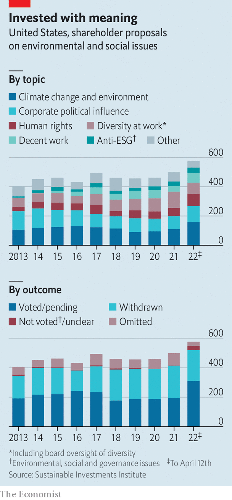

###### Proxy power

# Annual meetings are the new frontline in the battle over corporate purpose 

##### Climate, race and inequality are on the agenda 

 

> Apr 23rd 2022 

COMPANIES HAVE always had to answer to their investors. But these days shareholders have new questions—lots of them. On April 28th shareholders in three big drug companies, Johnson &amp; Johnson (J&amp;J), Moderna and Pfizer, are set to vote on resolutions filed by Oxfam, a charity, that seek to widen access to covid-19 vaccines. In May Amazon’s shareholders are due to vote on a proposal from New York state’s pension fund, asking for an audit of the e-commerce giant’s policies on racial equity. Carl Icahn, a notoriously fierce corporate inquisitor, has broadened his attention from profits to pigs. He has filed proposals at McDonald’s and Kroger, a grocer, in a quest to end the confinement of pregnant sows.

These proposals are a small selection of the onslaught of shareholder resolutions that American companies face in proxy season, the time when most publicly traded companies hold annual meetings, which runs from April to June. Emboldened by successes last year and newly favourable regulations, by April 12th investors had filed a record 576 proposals on environmental and social measures, up from 499 in 2021, according to the Sustainable Investments Institute, a research group (see chart). This barrage points to the next phase of America’s fight over corporate purpose. Executives who have endorsed “stakeholder value”, a much broader measure of corporate worth than profits and cashflow, are now seeing their declarations put to the test.


Shareholder activism used to be a much simpler affair. Investors such as Mr Icahn would buy a stake in a firm, then press for changes to strategy or the board to boost the company’s performance. Activists occasionally had broader goals. In 1971, for example, the Episcopal church demanded that General Motors cease making cars in apartheid South Africa. Such campaigns were rarely successful. Often companies and regulators deemed the issues raised not to meet the legal definition of being “material” to the company’s business. Even if a proposal went to a vote, shareholders usually sided with management.

 


What is today considered material, by some shareholders at least, looks considerably broader than in the past. Proposals on climate are up by 42% this year compared with 2021. Other new resolutions push companies to square political donations with their stated corporate values. Most proposals seeking social and environmental changes still fail. However, they are gaining more backing. Last year support for the 185 such proposals that went to a vote won over 34% of the voting shares, up from less than 19% a decade ago. Average support for climate proposals exceeded 50%. This is because the nature of proxy battles has changed—and looks set to evolve faster still.

For one thing, the distribution of voting power has shifted, and so has willingness to wield that power in new ways. BlackRock, Vanguard and State Street, three giant asset managers, last year owned 22% of the average company in the S&amp;P 500 index of big American firms, up from 13.5% in 2008, according to Bloomberg, a data firm. After the financial crisis, managers of big, passive indices faced pressure to improve their understanding of systemic risks, the type that investors cannot adequately control by diversifying their portfolio. They began hiring more staff to understand these threats and urging companies to mitigate them.

Although many investors rely on proxy advisory firms such as Glass Lewis and Institutional Shareholder Services, which publish guidelines on shareholder voting, the biggest asset managers now have their own stewardship staff and extensive voting policies. The team at BlackRock has over 70 people, five times more than in 2009. In the 12 months to last July, the firm had about 3,600 meetings with some 2,300 companies around the world.

These large investors are particularly concerned about the threats from climate change—including physical impacts, energy shocks and the consequences of regulation. State Street this year expects all companies in major indices in America, Australia, Britain, Canada and Europe to disclose both direct and indirect greenhouse-gas emissions and targets for reducing them. But the asset managers’ interests do not stop at the climate. State Street has said that, for firms in the S&amp;P 500, it will vote against a company’s directors if the board does not include a person of colour. Larry Fink, boss of BlackRock, defended stakeholder capitalism in his annual letter to chief executives this year. “It is not ‘woke’,” he wrote. “It is capitalism, driven by mutually beneficial relationships between you and the employees, customers, suppliers, and communities your company relies on to prosper.” Passive investors have become, if not exactly activist, undeniably more active.

The growing clout of big asset managers, and their newfound cuddliness, has meanwhile simplified the task of smaller investors in winning majority support for new resolutions. “The number of investors that it takes to get to 50% has greatly shrunk,” says John Coffee of Columbia University in New York. “It has become much easier, simpler and cheaper to contact a powerful block.” Smaller investors have also got cleverer in designing their resolutions. “The targeting of those proposals continues to improve, but so has the materiality of the risks that shareholders are bringing up,” says Benjamin Colton, State Street’s head of asset stewardship. Last year Engine No.1, a hedge fund that owned less than 1% of ExxonMobil, succeeded in ousting three of the oil giant’s directors by winning the support of BlackRock, State Street and Vanguard.

Some smaller investors are hoping to win support for a broader set of issues. Arjuna Capital has filed proposals on insurance for police involved in racist acts. Rhia Ventures has weighed in on business activities in states that are limiting access to abortion. “It’s really hard to get anything through Congress,” says Heidi Welsh of the Sustainable Investments Institute, “so people that want things to change are looking outside of government and they are looking at the capital markets.”

Crucially, this year’s proxy season is also the first with new rules from Gary Gensler, appointed a year ago as head of the Securities and Exchange Commission (SEC), which oversees proxy voting. Some regulations remain a muddle. Litigation continues over a measure from 2020 that makes it harder for investors to resubmit failed proposals. Mr Gensler has proposed changes that may complicate small dissidents’ courtship of big asset managers. A proposal to require companies to disclose their risks from climate change, outlined in March, is likely to end up in court.

In other ways, though, Mr Gensler has already made it easier for activists to operate. In November the SEC made it tougher for companies to block shareholder proposals that deal with “broad societal impact”. Almost anything linked with environmental, social and governance (ESG) issues can now go through, even if it is not directly economically relevant to the company. The result is that by April 12th companies had succeeded in blocking only 16% of proposals from their proxy statements, compared with about half last year. This presents a problem for managements. “The SEC is trying to stretch the definition of materiality,” says Evan Williams of the US Chamber of Commerce, America’s biggest business lobby. “They are looking to galvanise the activist investor, the investor focused on ESG topics as opposed to enabling corporations to continue to make good governance decisions as they see fit.”

As the sway of activists grows, many firms have tried to pre-empt shareholder action, for example by publishing lengthy reports on their environmental policies, or devoting more time to meeting investors. Some placate investors by agreeing to a proposal before it is put to a vote. This year As You Sow, a foundation, has withdrawn proposals at Dominion Energy and Duke Energy, two big utilities, after each revised its policies for reducing emissions.

This new shareholder activism is beginning to provoke a backlash. Bosses grumble that the activists seem uninterested in compromise. “What we are seeing right now is advocacy groups just interested in picking fights with large companies for the sake of building public attention and momentum,” says an executive at a big tech firm. Sceptics argue that ESG proposals are more about values than actual value.

Groups seeking to thwart the ESG crusaders are filing their own resolutions. The National Centre on Public Policy Research, a conservative think-tank in Washington, DC, has put forward a proposal with CVS Health and J&amp;Jon seeking disclosure of racial-justice policies and non-discrimination training (which it dislikes). Texas has barred state investments or contracts with firms that shun fossil fuels. On April 6th the American Legislative Exchange Council, another conservative group, published a template for states seeking to “protect pensioners from politically driven investment strategies”.

Counter-Reformation

Such groups do not yet appear to be speaking for a silent majority. Of the right-leaning shareholder proposals that made it to a vote in the past two years, average support was about 3%. But those who fret about the influence of the big asset managers may be comforted that the distribution of voting power could change yet again. By next year’s proxy season new SEC rules will allow all investors to vote to appoint individual directors of a company in contested elections. Currently investors voting by proxy must still choose either all the company’s candidates or all those of a dissident. “We have never ever had a corporate board election that has been democratic,” says Andrew Behar of As You Sow.

BlackRock is starting to make it easier for clients to vote as they choose, too. Beginning this year, the firm will allow a segment of institutional clients invested in index strategies to have more choice in their voting. That includes selecting either to vote themselves or to choose from a menu of proxy policies, such as one that is “faith-based”. “It is very difficult for a large asset manager to satisfy the competing expectations of their upstream investors, some of whom want to move very quickly on ESG and others who don’t,” says Paul Washington of the Conference Board, a research group. “For BlackRock to step out of the way as an intermediary relieves some of the pressure.”

Smaller tech firms are seeking to democratise voting, too. Robinhood, a platform for day-traders, last year bought Say Technologies, a firm that helps individual investors raise questions to management. Tulipshare designs proxy resolutions before soliciting investments from retail investors until they have a large enough stake to file a proposal. Broadridge, a big fintech company, has developed an app to make it easier for these investors to vote in shareholder battles. In the new age of proxy power, companies’ owners may at last act the boss. ■

For more expert analysis of the biggest stories in economics, business and markets, , our weekly newsletter.

