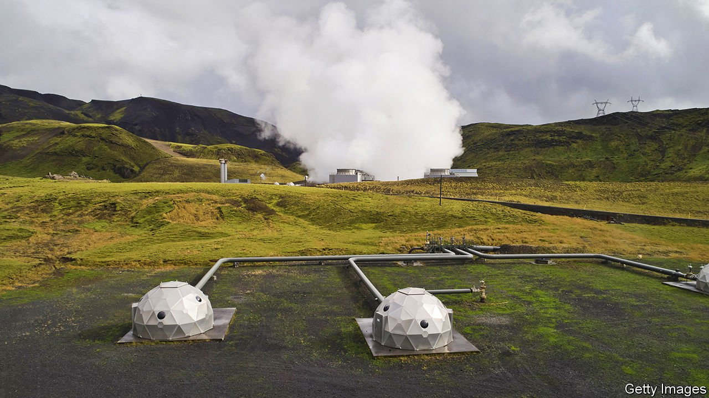

###### Take this, sucker

# Big tech wants to bootstrap carbon removal into a big business 

##### A consortium of technology firms is ploughing nearly $1bn into a clever market mechanism 

 

> Apr 23rd 2022 

A GROUP OF rich do-gooders tried a bold experiment 15 years ago. The Gates Foundation, a charity, and five countries put $1.5bn into a pilot project aimed at encouraging research and development in a previously neglected area. The “advanced market commitment” (AMC) they created promised rewards to drugmakers that came up with an effective vaccine against pneumococcus, a disease which killed many children in poor countries. Defying sceptics, three vaccines have since been developed. More than 150m children have been immunised, saving 700,000 lives.

Now several initiatives aim to apply the same approach to a different scourge. This month four big tech companies—Alphabet, Meta, Shopify and Stripe—and the sustainability practice of McKinsey, a management consultancy, pledged $925m over nine years to bootstrap technology to remove carbon dioxide from the atmosphere in an effort to arrest global warming. A similar AMC-esque project is expected to be unveiled in May at the annual plutocrat retreat in Davos hosted by the World Economic Forum (WEF). That project’s instigators in the First Movers Coalition, which was forged last November and unites the WEF, America’s State Department and dozens of big global firms, have already made purchasing commitments aimed at helping to decarbonise the aviation, shipping, trucking and steel industries.


Experts reckon the world must remove about 6bn tonnes of CO a year from the atmosphere by 2050 to avert the worst impacts of climate change. Less than 10,000 tonnes have so far been permanently extracted in this way. Closing the gap thus requires heavy-duty bootstraps.

To be eligible for the tech companies’ scheme, known as the Frontier Fund, carbon-removal technologies have to pass several tests (besides obvious ones like being safe and legal). One is permanence: the technologies must be able to store the stuff sucked from the air for at least 1,000 years. Another is scalability: they must not have land-use requirements that are in conflict with food security. A third is cost: they must have a path towards a price tag of less than $100 per tonne of carbon dioxide removed (down from hundreds of dollars or more per tonne for existing techniques). These are “absolutely foundational to getting anything close to net-zero”, says Mark Patel of McKinsey.

The goal is not to invest in carbon-tech startups, explains Nan Ransohoff of Stripe, which controls the Frontier Fund and will chip in more than a quarter of the kitty. Rather, the idea is to be early customers for the nascent carbon-removal techniques, which can help meet the buyers’ own decarbonisation targets. For early-stage carbon-suckers, the fund will offer low-volume pre-purchase agreements. For bigger firms scaling up proven methods, it will offer larger contracts that pay providers for tonnes of carbon once these are delivered to the agreed specifications. Suppliers can then use these commitments to secure financing and expand capacity.

“A billion dollars is a big number but not even close to big enough,” concedes Peter Freed, who leads the project at Meta. But, he hopes, it may “start a snowball rolling down the hill”. And, if all goes well, it will keep some snow from melting, too. ■

or more coverage of climate change, register for , our fortnightly newsletter, or visit our 

