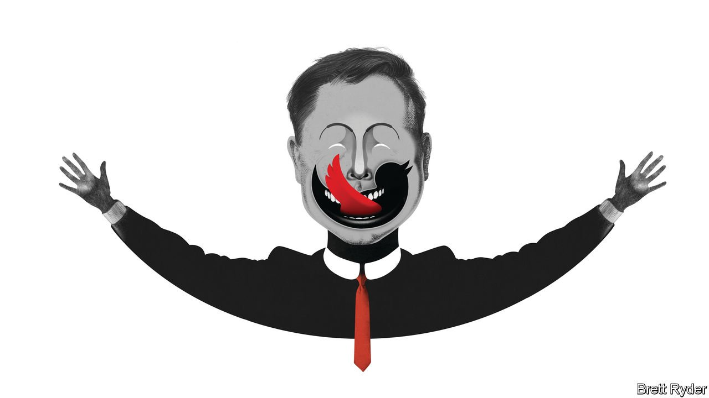

###### Schumpeter

# Elon Musk’s Twitter saga is capitalism gone rogue 

##### The world’s richest man is playing with the rules of the game 

 

> Apr 23rd 2022 

 After this article was published, Elon Musk said he has received funding to finance a takeover of Twitter, and that he is exploring whether to launch a tender offer to all Twitter shareholders.

IDA TARBELL, author of an exposé of the Standard Oil Company in 1904, described its founder, John D. Rockefeller, as “the most successful man in the world”. By that she meant “the man who has got the most of what men most want”. These days Elon Musk fits that description to a tee. Not only is he worth more than God. He invents things that are changing the world, from electric cars to space rockets. A word from him—on anything from crypto to meme stocks—turns retail investors into slobbering Pavlovians. With millions of adoring fans, he is an idol of modern capitalism.

He is also a shaper of capitalist trends, and that is where the problem lies. His fetish for Twitter—first as a megaphone to promote himself and his companies and now as a plaything that he has offered $43bn to buy—is taking the world of business in a reckless new direction. Call it GameStop for gazillionaires. Like last year’s craze for the American games retailer (“Gamestonk!!” as Mr Musk called it), he promotes the idea that the normal rules of investment do not apply. He paints stewards of fair play—regulators and boards—as pettifogging enemies of progress. And he idealises surreal narratives over economic facts. Such mischief-making has hitherto mostly been confined to the fringes of finance. In his pursuit of Twitter, Mr Musk is taking it into the mainstream.


He has brought the whiff of the meme stock to Twitter, not your usual microcap candidate for meme-ification. Before Mr Musk revealed a stake in excess of 9% on April 4th, the social-media platform was the sort of business attractive only to true believers or contrarians. Its advertising revenue has never come close to its potential. Despite its name recognition, it has been a lacklustre investment. Now Mr Musk has cast his bid to take it private as a move to protect free speech, rather than to make money. Presumably, that appeals to his fan base. Day-traders are already piling in on his coat-tails; their share of Twitter’s float has risen from 8% to 13.3%, according to Vanda Research, an investment adviser. Option trading has spiked, as has discussion of Twitter on forums like Reddit’s WallStreetBets. It could just be harmless fun. However, it could also play into Mr Musk’s hands. Individual investors are likelier to support his tactics than the institutional old guard.

Such tactics reek of populism. In effect, they seek to diminish institutions while elevating Mr Musk’s own stature as Twitter’s saviour. That includes bating those tasked with ensuring that such takeovers are done fairly and transparently, chiefly the Securities and Exchange Commission (SEC), America’s market regulator, and Twitter’s board. Mr Musk still publicly berates the SEC over a $40m settlement that he and Tesla agreed to pay in 2018 regarding a tweet he sent saying he could take the electric-car company private. In his recent Twitter investment, a class-action lawsuit alleges that he violated an SEC rule by not revealing the stake within ten days of it exceeding 5%. As for the board, since it introduced a “poison pill” on April 15th, setting penalties if he lifts his stake above 15%, he has hit back. He has tweeted a poll that purports to show his followers are heavily in favour of shareholders deciding whether Twitter should be taken private, not the board. He has also noted how few Twitter shares board members own.

For all this impishness, his tactics also trample on the principle that markets need reliable information to function correctly. Fuelling the ongoing guessing game about his intentions, he has tweeted a reference to Elvis Presley’s “Love Me Tender”, implying—at least to those blessed with meme-stock intuition—that he may try to sidestep the board by launching a tender offer to all shareholders. Then again, he may not be serious about buying Twitter. ”I’m not sure if I will actually be able to acquire it,” he said in a TED interview recorded shortly after he had made his bid on April 14th. For any other suitors circling Twitter, reportedly including two private-equity groups, Thoma Bravo and Apollo Global, this could be a stumbling block. While Mr Musk remains a shareholder, his unpredictability makes him a poison pill of his own.

The impression that if you are the world’s richest man you can have fun with the rules of the game is one thing. As problematic is the idea that Mr Musk might end up controlling one of the world’s most powerful means of communication at a time when fortunes are won and lost on “story stocks”—those driven by narratives discussed on forums like Twitter. Mr Musk knows all about the power of the platform. No CEO has the Twitter presence that he does. He has an army of 82.6m followers, many of whom have helped amplify his tweets promoting Tesla, making the site in effect the main marketing department for the $1trn company. Tesla, which on April 20th reported record sales in the first quarter, goes from strength to strength. Twitter helped fuel its rise.

It may not be just his Twitter “fanboys” who have bolstered the Tesla narrative. According to David Kirsch of the Robert H. Smith School of Business at the University of Maryland, tweets generated by “fanbots”, or what he claims are pro-Tesla algorithms, accounted for 23% of all messages on Twitter containing the hashtag #TSLA between 2010 and 2020, or 36,000 tweets. The findings are still under review, and do not include comparisons with other firms’ fanbots over the same period. But widespread use of fanbots could suggest that Twitter has even greater power to blare out corporate propaganda than previously assumed.

Citizen Musk

Propaganda is not a word widely associated with business. The world has plenty of reasons to worry about politicians buying media assets to peddle ideologies. Less so tech titans. Amazon’s Jeff Bezos, for instance, is thought to be an arm’s-length owner of the Washington Post. Mr Musk is more complicated. What he builds is the work of genius. But when it comes to Twitter, he is often childish and capricious. Imagine if Rockefeller had bought himself the Twitter of his era. He, too, would have had fanboys. And Tarbell’s exposé might have been trolled out of existence. ■


Read more from Schumpeter, our columnist on global business: (Apr 16th) (Apr 9th) (Apr 2nd)

