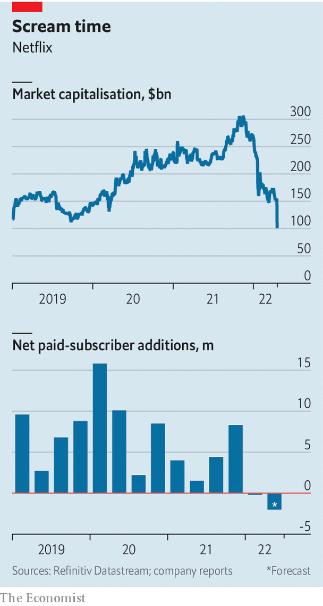

###### Commercial brake

# Netflix sheds subscribers—and $170bn in market value 

##### Can it tempt viewers back with advertising? 

 

> Apr 23rd 2022 

IN JANUARY NETFLIX warned investors that it expected to add only 2.5m subscribers in the quarter ahead, causing a sell-off that knocked nearly 30% off its share price. On April 19th the video-streamer admitted that the reality was worse: Netflix lost 200,000 customers in the period, its first net drop in more than a decade. The firm expects to lose another 2m between April and June. By April 20th it was worth 35% less than the day before—and 63% less than at the start of the year, wiping out nearly $170bn in market value and making it the worst-performing stock in the S&amp;P 500 index.

Subscribers in America drifted away after price rises that made Netflix the dearest big streaming service, at $15.49 a month. Another 700,000 accounts were lost when Netflix pulled out of Russia. Even in Latin America, where it had been growing fast, it shed members. And although it gained 1.1m new ones in Asia, that is fewer than in the same period last year.


 


Peaky economic conditions don’t help. Inflation is eating into households’ budgets; this week Kantar, a research firm, reported that overall streaming penetration in Britain fell in the latest quarter. Consumers also have more options. Hollywood is piling into streaming along with Silicon Valley, increasing competition for both customers and content.

Most worrying for Netflix is that the number of potential streaming customers may be lower than it thought. The firm has long said it is eyeing the world’s 1bn homes with broadband. It now acknowledges that factors such as slow take-up of smart TVs and expensive data are obstacles to reaching many of them. MoffettNathanson, a firm of analysts, puts the real potential streaming market at more like 400m homes. With 222m subscribers, plus 100m or so households using others’ passwords, Netflix is about 80% of the way there.

Reed Hastings, Netflix’s boss, promises a crackdown on password-sharing to make some free-riders cough up. To protect margins, Netflix will rein in content spending. Most dramatically, “over the next year or two” it will launch a cheaper tier with ads, to attract customers on lower budgets. It has long rejected advertising, which risks limiting creative freedom and cannibalising existing subscriptions. The ad industry’s giants, Alphabet, Amazon and Meta, are “tremendously powerful”, so “long term, there’s not easy money there”. Who says? Mr Hastings, two years ago. ■


