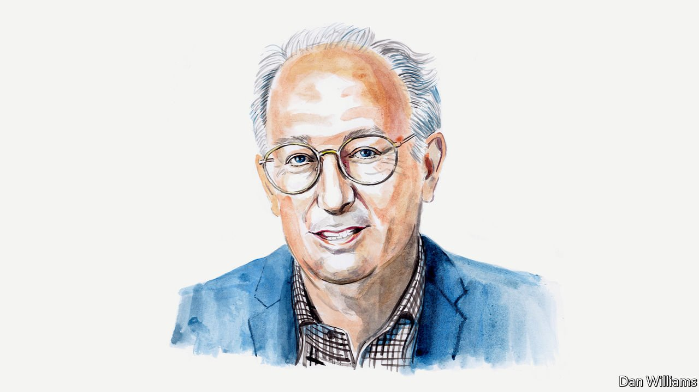

###### Russia and Ukraine

# Dominic Lieven says empires eventually end amid blood and dishonour 

##### The academic argues that Russia’s invasion of Ukraine is a case in point 

 

> Apr 23rd 2022 

EMPIRES ARE great powers. Their demise is usually accompanied by geopolitical convulsions and wars. They are also multinational polities with peoples living cheek by jowl. Turning an empire into nation states with sharply defined sovereign peoples and borders seldom comes without great conflict. Russia’s invasion of Ukraine is a case in point.

In the 1880s the chief legal adviser to the Russian foreign ministry wrote that if the national principle—to every people its own state—was ever applied in the vast region then ruled by the Romanovs, Habsburgs and Ottomans the result would be mayhem. He was correct. It took two world wars, many lesser conflicts, genocide and ethnic cleansing on a vast scale to turn the imperial map of central and eastern Europe into the post-1945 national map. Much of the Middle East is still living with the consequences of the demise of the Ottoman empire and of the British and French empires that briefly filled part of the void the Ottomans left behind. European-style ethno-linguistic and democratic nation-states had great difficulty putting down roots in a world where allegiance was traditionally defined by local community, religion, dynasty and region.


The consequences of imperial collapse often take a generation or more to emerge. Bangladesh’s secession from Pakistan happened 24 years after the end of British India. Although the end of the British empire was managed better than most, post-imperial conflicts still rage today all the way from Ireland, across the Middle East (Cyprus, Iraq, Palestine) to Fiji. The worst of these is the confrontation between India and Pakistan over the disputed border region of Kashmir.

The most frightening example of the delayed impact of an empire’s collapse is interwar Germany. Like Russia in 1991, Germany in 1919 was on its knees but remained by far the most latently powerful country in the region. A combination of post-imperial resentment and regained power led it to challenge the territorial settlement agreed in the Treaty of Versailles, facilitating another world war. This is not to make comparisons between Adolf Hitler and Vladimir Putin. With or without Hitler, Germany would probably in time have challenged the post-war order in east-central Europe.

After 1945, the Soviet Union was the surviving empire. Now we are living with the consequences of its collapse. It was a miracle that this empire, with its bloodstained history and its massive security apparatus, disintegrated between 1985 and 1991 with barely a shot fired in its defence. The invasion of Ukraine is the belated revenge of the old Soviet security apparatus for what it sees as 30 years of humiliation, retreat and defeat.

From a Western perspective, the near-bloodless demise of Soviet communism was almost a fairy tale. It fed the belief—terrifyingly reminiscent of Europeans before 1914—that contemporary Western civilisation marked the end of history and the final triumph of liberal values. But for the Russians, the 1990s were anything but a fairy tale. The economy and political institutions disintegrated. Life expectancy plummeted. Some 25m ethnic Russians suddenly found themselves outside Russia’s borders. Russia was demoted from superpower to beggar. It is unsurprising that many Russians love Mr Putin (with much less provocation, Americans elected Donald Trump under the slogan “Make America great again”).

As always, the loss of Russia’s empire meant most to its elites. It deeply wounded their sense of status, self-esteem and world-historical significance. The loss of Ukraine specifically has hurt Russians more than that of the other Soviet republics. Possession of Ukraine has long been essential to Russia’s existence as a great empire; its secession in 1991 sealed the Soviet Union’s fate. Crimea's loss hit Russians especially hard. The great naval base in Sevastopol was vital to Russian power in the Black Sea region and had a unique place in Russia’s historical memory (owed above all to the great sieges during the Crimean and second world wars).

Both because of its importance to Russia, and owing to internal divisions between the Russian-speaking east and the rest of the country, I always believed that an independent Ukraine could only survive if Russia’s relations with the West remained good. Ukraine could act as a bridge between the two. When Ukraine was forced to choose between Russia and the West—as happened definitively in 2014—disaster followed.

Mr Putin’s initial strategy has failed. He will probably now attempt to conquer all the Donbas region and the land bridge between it and Crimea. If this succeeds, Ukraine will never accept this new border as a basis for long-term peace. The brave war of independence against the invading Russian ogre will become a central—and unifying—core of the Ukrainian national myth. Even after Mr Putin departs, any future Russian government will find it hard to retreat from Donbas (let alone Crimea) and retain legitimacy. If other borderland wars, such as in Kashmir, in former empires are a guide, the Russo-Ukrainian conflict could last in a semi-frozen state for decades, threatening international stability and periodically bursting into renewed fighting. It might even escalate into nuclear confrontation.

_______________

Dominic Lieven is an author and academic. His forthcoming book, “In the Shadow of the Gods: The Emperor in World History,” will be published in May.

Read more of our recent coverage of the 

