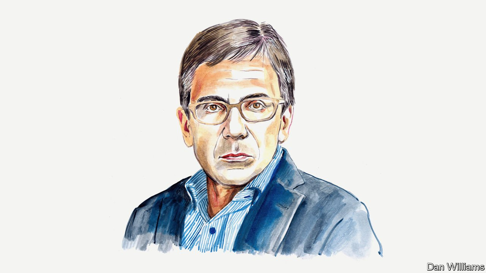

###### Russia and Ukraine

# Ian Bremmer counts the cost of the war to Vladimir Putin 

##### The political scientist predicts that an ugly conflict is about to get uglier 

 

> Apr 23rd 2022 

THE OUTCOME of Russia’s war in Ukraine remains in doubt. But there is no question that Vladimir Putin’s decision to launch a large-scale invasion is one of the worst strategic decisions any leader of a powerful country has made in decades. There is no plausible outcome in Ukraine that won’t leave Mr Putin and Russia far worse off than before February 24th, when the war began.

Mr Putin has cost his country the lives of thousands of young soldiers, some of them conscripts. He claims that Russians and Ukrainians are “one people,” but his war has given Ukraine a stronger sense of national identity than it’s ever had before and transformed it into Russia’s bitter enemy. He has shown the world that his army is ineffectual, and that billions of dollars spent on modernising Russia’s military has been wasted. He has given NATO a sense of unity and purpose it hasn’t had in decades and non-members like Finland and Sweden new reasons to join. His actions have driven members including Germany to boost defence spending. Others have dispatched troops close to Russia’s border. Mr Putin has convinced Europe that it must stop buying Russia’s most valuable exports. He has brought sanctions and export controls on his country that will inflict generational damage. For Europe and America he has crossed the Rubicon. Most grievously, he failed to prepare the Russian public for the true human, financial and material costs of his “special military operation.”


Jokes about Russian vaccines and long tables aside, a primary cause of Mr Putin’s miscalculation must surely be his personal isolation. He appears no longer to listen to opposing points of view. How else could he have believed his army could capture Kyiv in two weeks? (The former president of the European Commission, José Manuel Barroso, says Mr Putin bragged as much to him in 2014.) How could Mr Putin have thought that Ukrainians would quickly surrender once the invasion began? In response to Ukraine’s invasion, threats to cut off European energy supplies and other “consequences you have never seen”, Mr Putin appears to have expected the West to do little more than it did when Russia seized Crimea eight years ago. He did not anticipate that America would so quickly render a large portion of his foreign-exchange reserves functionally useless.

By refusing to brook dissent inside Russia, Mr Putin has turned a deaf ear to important warnings and persuaded those around him that their personal security and prosperity depend on loyalty to him and his version of the truth. One small but important example: Mr Putin said during the early days of the conflict that “conscripted soldiers are not and will not be involved in combat operations.” That assertion was quickly proven false. There are three possible explanations for this, and all would damage Russia’s president. The first is that Mr Putin lied to the Russian people about something he should have known that he wouldn’t be able to hide. Second, Russia’s generals lied to him. Third and, frankly, most likely: misinformation has reached every level of Russia’s military, and senior officers are not aware of what’s happening down the chain of command. But whatever the case, all of these explanations undermine Mr Putin’s credibility, both at home and abroad, and compromise the effectiveness of Russia’s armed forces for years to come.

There is no reason to believe that Russia’s failed “phase 1” effort to capture Kyiv will lead to significant improvements in the flow of information up and down the flow of military command. Incentive structures remain too warped. And if Russia’s armed forces aren’t producing accurate information about what’s happening in the field, or about the resources needed to achieve military objectives, and if Mr Putin and his generals continue to hold unrealistic ideas about what is achievable, the next phase of the war—focused on securing Russian control of the Donbas region—won’t proceed much more smoothly than the first phase. Ukraine’s soldiers in that region are battle-tested by eight years of combat. Underestimating the skill and determination of Ukrainians to fight, and the willingness of Western governments to supply them with weapons and training, has already cost Mr Putin dearly.

For the Russian president, the stakes for military failure could hardly be higher. If his appeals to national pride and his pledges to end a (fictional) genocide of ethnic Russians in Donbas fall flat, the Russian president will probably take steps he would surely prefer to avoid. These might include the use of chemical weapons to turn the military tide as Ukrainians cannot defend against them, nor can they return attacks in kind (which will allow Russia to advance). He doesn’t have much more to lose. Russia already faces a transatlantic political and military alliance that has imposed historically harsh sanctions on his country. Western governments continue to support Ukraine, to accuse Russia of war crimes and genocide, and to treat Mr Putin like a pariah. A scorched-earth approach would probably win him a limited military victory. And he knows that almost everything the West could do to him is already in process—short of a ban on Russian energy imports that Mr Putin surely believes is coming soon anyway.

Western hopes that Russia’s generals, its security forces, its oligarchs or its people will soon remove Mr Putin from power are likely to be in vain. Sky-high oil prices will keep the Russian economy afloat for some time, even as the long-term damage to Russia’s economy done by sanctions and export controls will be severe. Given the political climate, it’s impossible to know the true state of Russian public opinion, but there is no evidence that Mr Putin faces any serious domestic challenge. Russia’s people see the images of war their government wants them to see, and they are now being fed a steady diet of Ukrainian atrocities, Western plans to humiliate Russia and the determination of their president and soldiers to defend their motherland.

In short, Mr Putin, Russian and Ukrainian soldiers, and Western leaders should not expect the kind of clean victory that any of them desires. Instead, an ugly war is about to get much uglier.

_______________

Ian Bremmer is the founder and president of Eurasia Group.

Read more of our recent coverage of the 

