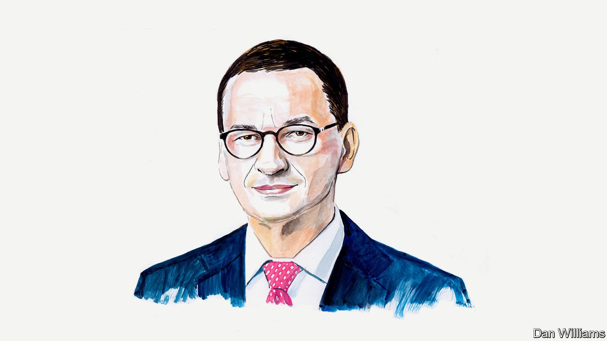

###### Russia and Ukraine

# Poland’s prime minister says the West’s appeasement of Vladimir Putin must stop 

##### Mateusz Morawiecki wants more support from the European Union 

 

> Apr 23rd 2022 

THE WAR IN Ukraine makes us realise that, though history is a good teacher, it has some poor students. Several Western European politicians have forgotten the lesson offered by the Munich agreement of 1938. The analogies with the present situation are striking. The policy of appeasement, spearheaded by Britain’s prime minister at the time, Neville Chamberlain, was followed by the outbreak of the second world war within a year.

In February 2007, almost 70 years after the infamous Munich conference, Vladimir Putin openly announced his desire to dismantle the post-cold war order in Europe. The following year, he attacked Georgia. Six years after that, he occupied Crimea and set Donbas in eastern Ukraine ablaze. And, another eight years on, he began the bloodiest stage of his plan so far. The demons of history have returned. We are witnessing genocide again.


In this environment the West has acted like a frog in water brought gently to the boil. It has not reacted even as Russia has added heat. In 1999 when Russian troops razed Grozny to the ground and murdered tens of thousands of Chechens on Mr Putin’s orders, the West turned a blind eye saying that it was Russia’s internal business. When Russian troops entered Georgia, the West remained passive again. 

This new version of appeasement could not have resulted in anything other than conflict. That is because the mechanisms of totalitarianism remain the same now as they were seven decades ago. And the mechanisms of appeasement remain the same, too. Russia has committed atrocities and, unless it is stopped, images such as those seen in Bucha, Irpin and Mariupol will appear more often.

We in Poland have warned for more than a decade against a policy of appeasement towards Mr Putin's resurgent imperialistic aspirations but we have been met with suspicion and even contempt. Many European politicians, when they left politics, have been more interested in getting jobs with Russian energy companies than in helping us. But now the situation in Ukraine is a horror story, and the fate of the Ukrainian people and the future of the whole of Europe depend on our actions.

European countries have provided some economic aid to Ukraine, as well as weaponry. But there is so much more that could be done. Confiscation of any Russian assets and foreign reserves abroad would be a good place to start, with the proceeds used as a resource to help Ukraine. More weapons should also be sent to support the Ukrainian armed forces. Poland would like to supply, with NATO’s consent, all kinds of arms to its neighbour. In addition, all of Europe should also be coming together to make plans for rebuilding Ukraine after the war. 

At the heart of the approach, however, must be sanctions. I have consistently and unceasingly appealed for maximum economic sanctions against Russia. But Europe, despite imposing some sanctions, is moving too slowly. Meanwhile, the Kremlin has put all its efforts into trying to defend the rouble. Partly as a result of European energy purchases, Russia has a current account surplus, and the rouble is stronger now than before the war. Weak sanctions, instead of strangling Russia’s economy, seem to be making it more resilient, as oil and gas prices have risen. 

If we really want to stop Mr Putin, we have no choice but to deliver an economic shock. The EU must impose an embargo on Russian energy resources and exclude all Russian banks from the SWIFT system that enables the transfer of money. In addition, the international community must start collecting evidence of Russian war crimes in Ukraine. Only the toughest sanctions and the supplying of weapons to Ukraine will be able to stop the Russian army and defend Ukraine’s democracy and freedom. It will come at a cost to the people of Europe as the cost of energy would be likely to surge, but it is a small price to pay. The sooner we do this, the sooner the war will end. 

The other thing that Ukraine’s neighbours need is direct economic help from the EU. It is time to follow the example of the individual volunteers who have come from all over Europe to Poland, Slovakia and Romania, contributing their time and their money to bring help and hope. 

Ukrainians, who have found refuge in Poland since 2014, already constitute at least 7%, and perhaps 10%, of our country's population of 38m. Pictures of refugees around the world often show depressing images of people crammed into large makeshift camps. You do not see that in Poland, even though we have received around 2.8m people in less than two months. 

The whole country is helping. Aid is being organised by the government, by NGOs and by millions of ordinary citizens. No one needed to be asked to contribute. Perhaps that is why the EU officials who have given €6bn ($6.5bn) to Turkey since 2016, as part of its deal to help handle refugees, do not feel the need to help Poland now. But such help is becoming more important by the week. So far we have received nothing but declarations. 

Reallocating unused funds does not change anything. What is needed is a serious systemic solution. And the only way to achieve that is if the EU lives up to its values. The choice could hardly be simpler: either you support Ukraine or you support Russia. There is no middle ground. Those responsible for torture and war crimes should be cut off. Those who have not learned from the history of appeasement are doomed to repeat it._______________

Mateusz Morawiecki is Poland’s prime minister.

Read more of our recent coverage of the 

