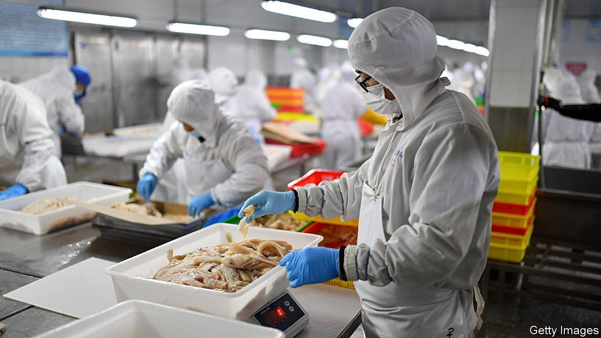

###### The blame game

# China says imports are causing outbreaks of covid-19 

##### Alleged vectors include everything from pork knuckles to clothing 

 

> Apr 21st 2022 

IT STARTED WITH Norwegian salmon. Chinese officials blamed the frozen fish for a surge of covid-19 cases in Beijing in 2020. Later they claimed to have found the virus on crabs from Chile and shrimp from Ecuador. A smorgasbord of other delicacies, from pork knuckles to bananas, have also been labelled as hosts by China. So have South Korean clothing and packages arriving from abroad.

Most experts—even some Chinese ones—think this is hogwash. The World Health Organisation says there is no evidence that people can catch covid from food or food packaging. The virus rarely spreads through surfaces. Most transmissions occur when an infected person breathes out tiny droplets that are inhaled by someone close by. When China claims to find covid on an imported banana, say, it is probably just finding harmless fragments of the virus.


But imported products make for good scapegoats. Under China’s “zero-covid” policy local officials are punished when an outbreak occurs on their watch. It probably helps if they can blame foreigners. Indeed, Chinese officials and media have pushed an unfounded conspiracy theory that the virus originated in America and was brought to Wuhan, the Chinese city where the pandemic started, by American soldiers.

This leads to paranoia. A video shows health officials in a Shanghai market swabbing the lips of a live carp. Last year the National Health Commission published advice on imported cherries. “Since the virus is running rampant in foreign countries, cherries cannot come out of the mud unsullied,” said an expert on its website. Some goods come with a QR code that a Chinese buyer can scan in order to check its covid test results.

The testing and quarantining of imports adds costs for businesses. When a good tests positive, trade in it may be halted. “China has never shared any scientific justification for having adopted such restrictive and unjustified measures,” says the European Union’s delegation to China. Joerg Wuttke, president of the EU Chamber of Commerce in China, blames “voodoo science” for the way imports are treated. According to him, “The hysteria is still sky-high.”

Dig deeper

All our stories relating to the pandemic can be found on our . You can also find trackers showing ,  and the virus’s spread across .

