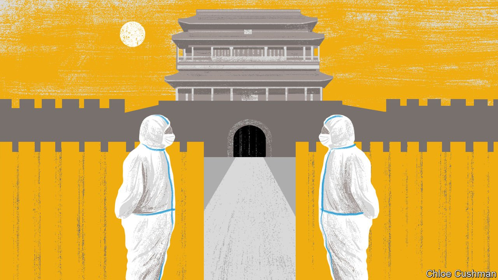

###### Chaguan

# China’s harsh and elitist covid rules 

##### The pandemic revives old fears about migrants from humble places 

 

> Apr 21st 2022 

IN TIMES OF disease, revolution or famine, Beijing’s city gates offered China’s imperial rulers more than mere security. These hulking towers of grey brick and stone were symbols of a system that strove to keep death itself far from the seat of supreme power. When smallpox swept the arid plains and mountains of north-east China, the sick were quarantined miles outside Beijing and even imperial family members banished, if they lacked immunity from a previous infection. During some bubonic plagues, burials were banned in Beijing and detailed records kept of each coffin exiting its gates. In the heyday of China’s final, revolution-haunted dynasty, the Qing, the city maintained a garrison of 33,000 paramilitary police—or about one guard for every 20 Beijingers—with orders to track and register every stranger who entered its walls, whether domestic or foreign. When famines stalked the countryside, a gruel of millet and rice was served at temples just outside the city gates, to keep refugees from storming Beijing.

Under the Communist Party most of Beijing’s walls and gates have been torn down, but its privileges endure. Until the late 1970s all outsiders, especially from the countryside, had to register on arrival in the capital. To migrate to the city required something few newcomers could obtain: a Beijing hukou, the household registration papers needed to access housing, jobs, schooling and other public services. When famines killed millions in the era of Mao Zedong, Beijing was kept supplied with food to preserve political stability. Even today, provincial Chinese cannot easily buy property or raise school-age children in the capital without a Beijing hukou. Yet for some years outsiders, notably well-educated youngsters, could work and live in Beijing and feel almost equal to natives. The covid-19 pandemic shows that they are wrong to.


The Baimiaobei police checkpoint, straddling a four-lane road linking Beijing to the next-door province of Hebei, lacks the battlemented grandeur of an imperial gate. This open-sided, blue and white shed, one of over 160 checkpoints around Beijing, resembles a motorway toll station. Before covid it barely slowed buses and cars bringing commuters from Sanhe, a dormitory town separated by a river from Beijing. In normal times, Sanhe offers cheaper housing and shorter commuting times than many outlying districts of Beijing, with the added lure of easy-to-obtain Hebei hukou. Then in early March three covid cases were found in Langfang, a sprawling city of 5.5m people of which Sanhe is a part. Within hours authorities in Langfang banned non-essential travel to Beijing, pledging to make their region of Hebei a “political moat” for the capital. As more cases were confirmed, the city locked down for more than 30 days. Now that it has reopened, residents who work in Beijing need “commuter passes” issued by local officials. Obtaining a pass requires a declaration stamped by employers in the capital. That is impossible for some day labourers, self-employed cleaners and the like, leaving them out of work. Even students studying in Beijing have struggled to obtain the “Langfang exit certificates” needed for one-off trips.

Chaguan headed to the Baimiaobei checkpoint just after dawn on a recent weekday. With cross-border buses suspended, a stream of inbound commuters crossed from Langfang on foot. The smoggy air rang with the cries of touts promoting express coaches to central Beijing, and hawkers selling hot soybean milk and fried dough-sticks for breakfast. A smartphone salesman from Sanhe reported missing weeks of work in the capital, taking some of it as unpaid leave. He is sure that Langfang residents will find it harder to land jobs in Beijing in the future. Asked if he fears another border closure, he sighed: “There is nothing you can do.”

A defence of Beijing’s strict border controls might stress the importance of shielding the central government from outbreaks. But that does not explain why pandemic rules inside the capital have been strikingly lenient, compared with those imposed on humbler places like Langfang. For instance, more than half a dozen covid cases were found in April in Jiuxianqiao, a district of Beijing near modern-art galleries and posh apartment blocks. A compact “high-risk zone” was drawn around that outbreak as if with a scalpel. Nearby schools, shops and restaurants stayed open.

Some lives are more equal than others

To be sure, Shanghai, the only Chinese city to rival Beijing in importance, has suffered ferocious pandemic controls since the end of March. Residents of several districts went without food for days and hundreds of thousands of Shanghainese have been sent to grim mass-quarantine sites. Even so, Shanghai is receiving special treatment. On April 20th the city was home to 18,495 new cases, or over 95% of China’s total. But officials are imposing lockdowns as precisely as possible while opening individual neighbourhoods. It is even possible to leave Shanghai and travel to Beijing—at least for those who can afford at-home covid tests, covid-exempt taxis to the airport and 14 days of home quarantine in Beijing.

In contrast, tens of millions of people in dozens of little-known cities are currently under sweeping lockdowns and “static management” orders banning travel, some triggered by a single case. Some border cities in China’s far north and south have repeatedly quarantined residents and closed schools and businesses over the past two years, plunging locals into debt and despair. Beijing bans arrivals from all such places. Controls are especially tough on migrant workers, lorry drivers and others who move for a living. Their suffering attracts a fraction of the attention paid to Shanghainese, whose woes have made headlines for weeks.

Party bosses call strict covid rules proof that China cares about the lives and interests of the majority, unlike the decadent, freedom-obsessed West. Harsh controls have prevented many deaths, for China has lots of unvaccinated old people and a weak health system. But fast-spreading Omicron is testing that strategy. It is also exposing inequalities with ancient roots. ■

Read more from Chaguan, our columnist on China: (Apr 16th) (Apr 9th) (Apr 2nd)

All our stories relating to the pandemic can be found on our . You can also find trackers showing ,  and the virus’s spread across .

