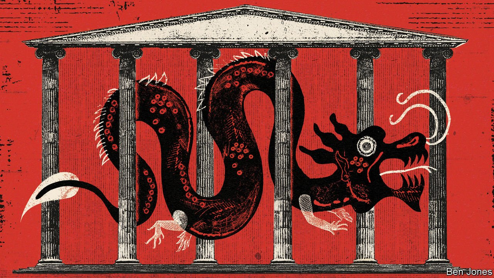

###### Democracies and the dragon

# Chinese political interference has Western spooks worried 

##### With money and support, China hopes to bend foreign politicians to its will 

 

> Apr 21st 2022 

CHRISTINE LEE once mingled easily with members of Britain’s elite. The Hong Kong-born British solicitor frequently visited Parliament, where legislators supported her work helping ethnic Chinese get more involved in politics. She even received an award for her efforts from Theresa May, who was then prime minister. The two were photographed together at Downing Street in 2019.

In January that award was rescinded—because, according to MI5, a British spy agency, Ms Lee has been covertly working for China. In a security notice issued to parliamentarians that month, the agency warned them about her “political interference activities”. It was the first of its kind naming China, though not a complete surprise. “You might think in terms of the Russian intelligence services providing bursts of bad weather,” said Ken McCallum in 2020, shortly after becoming MI5’s chief. “China is changing the climate.”


Britain is not the only Western country sensing a change in atmosphere. American officials also warn of covert attempts by China to bend local politicians to its will. The alarms grew louder during the presidency of Donald Trump. “China is expanding its influence efforts to shape the policy environment in the United States, pressure political figures it views as opposed to China’s interests, and counter criticism of China,” noted William Evanina, then the director of the National Counterintelligence and Security Centre, in 2020.

In a report last year the Canadian Security Intelligence Service (CSIS) said it had observed “persistent and sophisticated state-sponsored threat activity targeting elections for many years now” with “a rise in its frequency and sophistication”. It did not name the countries involved, but earlier in the year David Vigneault, the chief of CSIS, said his agency was most concerned about actions by “countries like Russia and China”. In January the Globe and Mail, a newspaper, said Canada’s spies had been briefing selected parliamentarians about influence operations by China, as well as other countries.

“Espionage and foreign interference has supplanted terrorism as our principal security concern,” said Mike Burgess, the head of the Australian Security Intelligence Organisation (ASIO), in February. He says his agency recently thwarted an attempt by a person nicknamed “the puppeteer”, working on behalf of a foreign government, to interfere in an Australian election. Using an offshore account, the puppeteer planned to support candidates who either backed the interests of the foreign government or who were deemed vulnerable to inducements and cultivation. “It was like a foreign-interference startup,” said Mr Burgess.

The spy chief did not identify the government or the puppeteer. An Australian senator (who died last month of a suspected heart attack) said she had been “reliably informed” who the person was: she named a prominent ethnic-Chinese Australian businessman. ASIO has not confirmed this, and the person has denied the allegations. But the country referred to by Mr Burgess was undoubtedly China.

It is believed that a common factor in these allegations of political interference is a branch of the Chinese Communist Party called the United Front Work Department (UFWD). MI5’s notice about Ms Lee says the organisation “identifies and cultivates individuals” with the goal of promoting the party’s agenda and “challenging those that do not subscribe to its policies”.

Ms Lee’s connections with the UFWD are hardly a secret. She has acknowledged her work as a “legal adviser” to the Overseas Chinese Affairs Office, a division of the UFWD. She has served as a director of the China Overseas Friendship Association, a body under the UFWD’s control. Her website in China, now closed, described a meeting in Beijing of the association’s directors in 2019. “I should do a good job as a communicator of China’s voice,” she told the gathering. “I should also keep firmly in mind General Secretary Xi Jinping’s instructions,” she said, referring to China’s leader. “I should turn them into guidance for my own actions and firmly implement them.” State television showed a grinning Ms Lee shaking Mr Xi’s hand at the gathering (the UFWD’s chief was also there).

It had also long been known that Ms Lee had been providing money for staff in the office of a prominent opposition politician in Britain, Barry Gardiner of the Labour Party: a total of more than £500,000 ($650,000) over several years. Mr Gardiner says that this funding ended in 2020, that Ms Lee had no role in the appointment or management of his team members, that he did not profit personally and that Ms Lee’s son, who was working as his diary manager, resigned after MI5 issued its warning.

From China with love

MI5, it appears, is now more certain that Ms Lee obtained funds from China to hand out to a wide range of recipients, from political parties and legislators to aspiring politicians. Mr Gardiner says security officials told him they had no evidence that the money his office received came from China, and no evidence of any complicity in Ms Lee’s alleged activities by her son.

Little has come to light publicly that shows China has gained much from its overseas influence operations. Only one case has been reported so far of a senior Western politician receiving money from a source linked to the Chinese campaign and then siding with China in a way clearly at odds with mainstream opinion. It involved Sam Dastyari, an opposition legislator in Australia who, in 2017, urged his government to “respect” China’s territorial claims in the South China Sea. Amid a furore over this, he resigned from parliament.

What worries the spooks, however, is something subtler than securing support for China’s building of bases on contested reefs. The UFWD, they believe, often wants politicians to help China just by keeping silent: avoiding criticism of Chinese policy and refraining from supporting action, such as sanctions, that might cause difficulties for China’s government. The UFWD is not a spy service, but its targets are sometimes of interest to China’s espionage outfits, too. It facilitates their work.

Much of the UFWD’s effort is directed at people inside China: influential citizens such as businessmen, academics, religious leaders, ethnic minorities and people from Hong Kong and Taiwan. Abroad, it mainly focuses on winning over ethnic Chinese, and through them, creating bonds between the party and Western elites, including politicians. Like his predecessors, Mr Xi calls political-influence efforts one of the party’s fabao (talismans). In 2015 he set up a “leading small group” to supervise them, bringing such operations closer to the heart of the party’s decision-making.

China’s official media have highlighted Ms Lee’s work as leader of the British Chinese Project (in February she applied for its dissolution). The aim of this organisation was to encourage ethnic Chinese to play a bigger role in British politics. On the face of it, this was a noble cause. Historically, voter-turnout rates have been low within this community; it was not until 2015 that Britain elected its first ethnic-Chinese MP. But the promotion of huaren canzheng (ethnic-Chinese participation in politics) is also one of the stated missions of the UFWD in the West. Ms Lee took ethnic-Chinese candidates on trips to China, where UFWD officials preached to them about the virtues of China’s political system.

Again, there is no evidence that such tactics work. China’s prestige in the West has taken a battering from the horrors Mr Xi has unleashed in Xinjiang, his gutting of freedoms in Hong Kong and, most recently, from his tacit backing of Russia’s invasion of Ukraine. It would take a brave politician to stand up in any Western legislature and defend such a record. Support for Chinese investment in the West’s critical infrastructure has all but evaporated in recent years because of security concerns. Western spies warn of the danger of overreaction. ASIO’s Mr Burgess said it was critical not to let fear of foreign interference “stoke community division”. In February America’s Department of Justice ended a Trump-era campaign against Chinese theft of intellectual property amid claims that the effort, called the “China Initiative”, was encouraging ethnic profiling.

There is a clear danger, however, when China’s real spooks get involved. Their work abroad—apart from gathering secrets—includes intimidating political enemies such as exiles from Xinjiang and other dissidents. A recent case involves Yan Xiong, a student leader during the Tiananmen Square protests of 1989 who became an American citizen and served as a chaplain in the US Army. Mr Xiong is now making a bid for Congress as a Democratic candidate in New York. A primary election is due to be held in June. His Tiananmen background makes him the kind of ethnic Chinese whom the party definitely does not want elected.

In March the FBI alleged that an operative of China’s spy service, the Ministry of State Security, had asked a private investigator in America to try to thwart Mr Xiong’s campaign by finding something that might discredit him, such as a tax violation or contact with a prostitute. Failing that, the FBI quoted the spy as saying in a voice message, “violence would be fine, too”, including a “car accident”.

Although the FBI did not name Mr Xiong, the candidate confirmed that he was the target. “I was a soldier, I have the Lord in my heart,” he insists. “I have no fear.” But Mr Xiong says that now he drives even more cautiously and is on guard when he is out at night. ■

