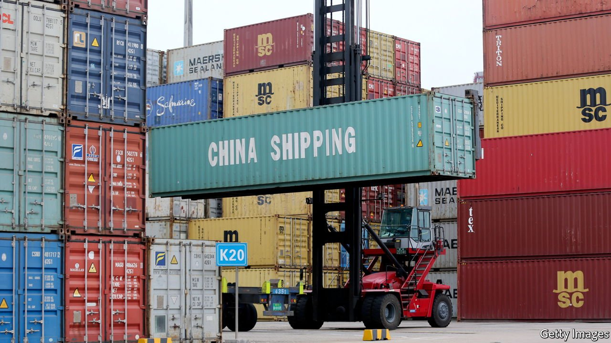
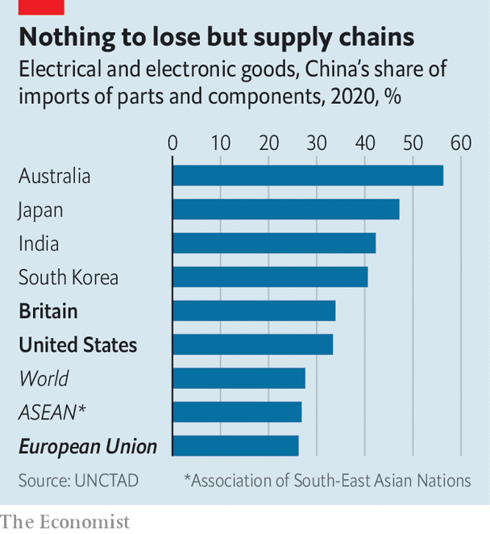

###### The Russian treatment

# Could the West punish China the way it has punished Russia? 

##### New economic weapons are double-edged swords 

 

> Apr 23rd 2022 

“WOULD THE US really dare to freeze or confiscate China’s reserve assets?” asked Wang Yongli, a former director of Bank of China, in an article last month. Good question. After Russia invaded Ukraine, America and its allies imposed crippling sanctions on Russia’s central bank, removing from its reach about half of its foreign-exchange reserves. They also cut off some of Russia’s biggest banks from the Western financial system and banned many high-tech exports to the country. If China were to do something geopolitically rash, such as , could the West do to China what it has done to Russia?

America and its allies certainly have the means. “The locus of financial power still sits firmly in the West,” says Eswar Prasad of Cornell University. China probably keeps about two-thirds of its $3.2trn of foreign-exchange reserves in Western government bonds and the like. Because of the size of its holdings, it has few viable alternative stores of wealth. If America and Europe instruct their financial institutions not to deal with Chinese banks, they would lose access to the dollar, euro and pound.


But would the West really dare? “Freezing” China’s reserves might not be too destabilising. Even if China wanted to dump its holdings to spite the West, the sanctions would prevent it from doing so. China would be unable to buy more of these securities. But the bond markets would not miss it much. China has not been a big buyer of late. And by invading Taiwan it would create panic, triggering a stampede into highly rated bonds from private investors.

China could find other ways to punch back, though. In particular, it could seize the sizeable assets that Westerners hold in China. At the end of last year, foreigners owned $3.6trn in direct investments, including immovable factories, and $2.2trn in shares, bonds and other “portfolio” investments, notes Gerard DiPippo of the Centre for Strategic and International Studies, a think-tank in Washington. The combined total is over six times the size of the equivalent foreign holdings in Russia.

What if the West also imposed sanctions on other Chinese financial institutions, beyond the central bank? That could expose Western institutions to financial “blowback”. Four of the world’s 30 “systemically important” banks are Chinese, according to the Financial Stability Board, a group of regulators. Crippling these banks could also damage Western institutions that have lent to them or hold accounts with them. Could Western countries be confident that cutting off Chinese banks would leave their own financial stability undisturbed? “No,” says Clay Lowery of the Institute of International Finance, a bankers’ group. “I’m not confident of that.”

Such measures would also wreak havoc with trade. Less than a fifth of China’s trade last year was settled in its own currency. Much of the rest was conducted in dollars. “If you can’t get insurance and trade credit, a lot of economic activity dries up,” says Martin Chorzempa of the Peterson Institute for International Economics, a research organisation. Since China is the leading trade partner of over 120 countries, the disruption might turn the rest of the world against America and its allies.

 


Western countries would suffer, too, which could erode their unity and resolve. China accounts for about 18% of America’s imports and over 22% of the EU’s, including many parts and components used in domestic manufacturing (see chart). For this reason, obstructing trade with China can damage a country’s own production, including its exports. If America and its allies were to cut Chinese imports by over 90%, their own exports would fall by almost 10%, according to simulations by Gabriel Felbermayr of the Vienna University of Economics and Business and his co-authors.

China’s biggest source of leverage is its own vast market. America might, for example, wish to deprive it of certain high-tech inputs, such as semiconductors. But a complete ban would cost American semiconductor firms 37% of their revenues, according to Boston Consulting Group, and jeopardise over 120,000 jobs.

China, for its part, might curb exports of the “rare earths” used in many electronic goods. It could disrupt the supply chain for electric-vehicle batteries and other manufacturing niches. And it could squeeze adversaries out of markets they might not want to forfeit. European sanctions, for example, initially spared Russia’s $2.4bn market for luxury goods: the so-called “Gucci exemption”. The same market in China is worth over $50bn a year, according to Statista, a data provider.

The West can hit Russia with a harder economic punch any time it tries to hit back. The same is not necessarily true with China, says Eddie Fishman of the Centre for a New American Security, a think-tank. That in turn makes it more likely that China would indeed hit back. America and its allies could, then, suffer considerable pain if they imposed on China the same sanctions they have inflicted on Russia. For that reason, they would probably not dare go that far. But they must hope that China does not dare to find out. ■

Read more of our recent coverage of the 

