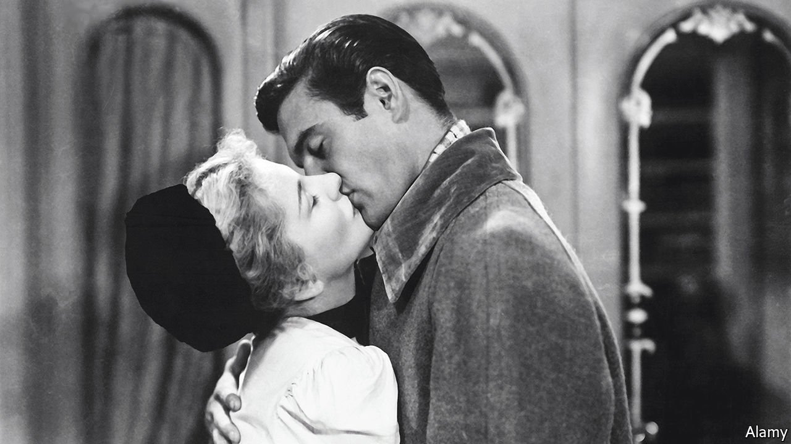

###### Home Entertainment

# Love and exile in “Letter from an Unknown Woman” 

##### Stefan Zweig’s book, and Max Ophüls’s film, evoke thwarted passion and a lost world 

 

> Apr 21st 2022 

THE ART conceived in Sigmund Freud’s Vienna has stood the test of time better than some of his debatable theories. For the Austrian writer Stefan Zweig, for instance, Freud—whom Zweig knew and revered—meant not so much a set of clinical doctrines as a climate of feeling.

A century ago, in 1922, Zweig published his novella “Letter from an Unknown Woman”. Drenched in a feverish mood of doom-laden eroticism, it takes the form of a dying woman’s testament sent to the oblivious philanderer “whom I have always loved”. Her obsessive, unrequited passion has consumed a life that the Spanish flu will soon end. Flu has already killed their son, born after the three nights the couple spent together a decade previously.


On one level, this is a fanciful, masochistic melodrama. A woman sacrifices her whole existence to the fantasy version of a forgetful narcissist who “never recognised me”, even when the pair sleep together again after an encounter at a louche café. Yet Zweig’s grasp of the dynamics of romantic infatuation and its childhood roots—the “unknown woman” falls for her beloved, a writer, as a moonstruck 13-year-old—lent his story a mesmeric allure. Somehow, the woman’s narrative turns the tables on her lover. This self-abasing stalker grabs the power to define the meaning of the man’s life and so rescue their liaison from “the smoke of oblivion”.

A quarter-century later, the book found a matchless interpreter in Max Ophüls. Born in Germany, the director made his name in the 1920s at the Burgtheater in Vienna and put out several German comedy films in the early 1930s. Like Zweig, he was Jewish, and like him Ophüls fled Europe as the Nazi menace intensified. The author and his wife, Lotte, committed suicide in Brazil in 1942. In Hollywood, his fellow-exile Ophüls endured seven lean years before Zweig’s tale gave him a chance to shine. Although Ophüls sumptuously recreated the fin-de-siècle sensuality of the city both men had lost, his nostalgia had limits. He never felt at home there: “Fate had put me into a wonderfully golden Rococo carriage,” he said of Vienna, “but I much rather wanted to ride a motorcycle.”

Washed in mysterious twilight tints thanks to Franz Planer’s black-and-white cinematography, the film of 1948 showcases the sinuous pans and tracking shots that were Ophüls’s hallmark. His ever-roving camera dissolves fixed points of view into a Freudian shadow-play of perspectives and illusions. Howard Koch’s screenplay alters plot details: the man (played by Louis Jourdan) becomes a pianist; after her son’s birth the woman—a superb Joan Fontaine—marries respectably rather than working as a high-class courtesan. Still, the essence of Zweig’s vision endures.

Written in the aftermath of world war and pandemic, gorgeously filmed by central-European exiles in the wake of a second, genocidal conflict, “Letter from an Unknown Woman” shows how the “child’s magic realm” of romantic illusion can overshadow, and curse, a life. For later viewers and readers, it conjures another lost, enchanted kingdom too: the bittersweet Vienna of its birth. ■

