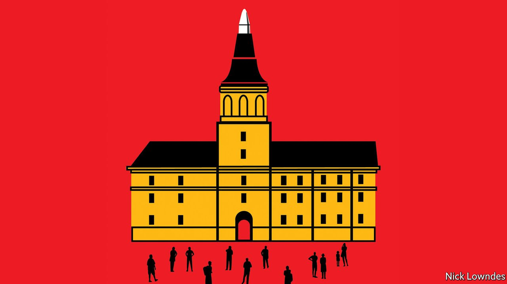

###### Johnson

# On the origin of languages 

##### It is tempting to think that they have clear beginnings. They don’t 

 

> Apr 23rd 2022 

IN A CHURCH hewn out of a mountainside, just over a thousand years or so ago, a monk was struggling with a passage in Latin. He did what others like him have done, writing the tricky bits in his own language between the lines of text and at the edges. What makes these marginalia more than marginal is that they are considered the first words ever written in Spanish.

The “Emilian glosses” were written at the monastery of Suso, which was founded by St Aemilianus (Millán, in Spanish) in the La Rioja region of Spain. Known as la cuna del castellano, “the cradle of Castilian”, it is a UNESCO world heritage site and a great tourist draw. In 1977 Spain celebrated 1,000 years of the Spanish language there.


Everyone loves a superhero origin story. Spanish is now the world’s third-biggest language, with over 500m speakers, and it all began with a monk scrawling on his homework. But as with the radioactive bite that put the Spider into Spider-Man, there is more than a little mythmaking going on here.

First, while “Castilian” and “Spanish” are synonymous for most Spanish-speakers, philologists argue that what the anonymous monk wrote is closer to the Aragonese than to the Castilian variety of Romance (the name for the range of dialects that continued their wayward development when Rome retreated from most of Europe after the fifth century AD). In any case, the Suso monk’s scribblings have been pipped by the discovery in nearby Burgos province of writings that may be two centuries older.

Even those are not the origin of Spanish. The very idea treats languages like a person, with a name, birth date and birthplace. But languages are not like an individual. They are much more like a species, gradually diverging from another over many years. It would be as accurate to describe such jottings as degenerate Latin as it is to call them early Spanish—but that would probably not draw as many tourists.

Most accurate would be to call the monk’s prose an intermediate form: words like sieculos (centuries) in the text are almost perfectly halfway between Latin’s saecula and modern Spanish’s sieglos. In its way, the church in which the glosses were written is a mirror of such evolution. It includes arches in Visigothic, Mozarabic (Moorish-influenced) and more recent styles, added as it was expanded. As many visitors to an ancient site find, it can be hard to date buildings in use for centuries. Little of the original remains; all is layers upon layers.

The desire to create heroic origins of languages is an urge to impose order on chaos. Students of other European languages are offered “Beowulf” or “La Chanson de Roland” as the earliest exemplars of English or French, which gives the grand story a comprehensible beginning. But literature, by its nature, requires the language to exist before poems and epics could be written. Imagining that a piece of writing represents the beginning of a language is like thinking the first picture of a baby is the beginning of its life.

A better analogy is that the first written records of a language are like the first fossil traces of a distinct species. But even this should not be mistaken for the moment at which the species emerged. After all, the neat nodes on a palaeobiologist’s tree of life are just simplifications of a messy continuum.

The urge to put dates on the founding of languages seems universal. Google “Basque Europe’s oldest language” to see how many people think this language (which evolved gradually from some now-unknown ancestor) is somehow older than Spanish, though Basque has no clear birthday, either. By quite a coincidence, the first known words written in Old Basque—just six of them—also appear in the Emilian glosses, though the site makes much less of this fact. Or to take a more modern example, a book on American English called “The Forgotten Founding Father” aims to give Noah Webster’s modest early-19th-century reforms, such as respelling “center”, the heroic role humans seem destined to seek in the birth of their cultures.

Legal entities like the United States of America really do have a birth date. But languages do not. American English, Castilian Spanish and all other products of slow, disorderly change do not lend themselves to neat origin stories. Remembering this is a good thing, reminding people of their membership in a common family. The need for stories of a glorious past is part of human nature, too. But like “Beowulf” or “La Chanson de Roland”, these are often best seen as literature, not history.

Read more from Johnson, our columnist on language: (Apr 9th) (Mar 26th)

 (Mar 12th)

