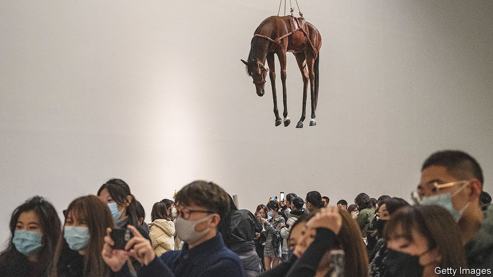

###### Wanghong art

# Social media are changing the way art is seen and presented 

##### The marriage of art and apps is especially conspicuous in China 

 

> Apr 23rd 2022 

ON A WINTRY weekend, young couples wander through “ LOVELOVELOVE”, an exhibition at the Today Art Museum in Beijing. Some of the items on display are tenuously related to the theme, but the visitors seem not to mind, intent as they are on snapping a striking selfie amid the mirrors and neon lights. A young woman poses on a white staircase, peeking over her shoulder at her friend’s camera.

Elsewhere in the museum “Bord de Mer”, a film by Agnès Varda, a late French director, plays on a loop. The floor of the gallery has been covered in sand; deckchairs are set up in front of a screen showing gently lapping waves. Viewers discuss the best angle for a picture. Each has around ten seconds to rush into a chair, simulate a relaxing beach scene and get out of the way. Experiencing love, or Varda’s sea view, seems less important than showing others that you have experienced it.


Galleries across the world are attracting snap-happy youngsters eager to impress their online followers. Immersive exhibitions of the art of Yayoi Kusama and Vincent van Gogh have drawn camera-wielding crowds from Melbourne to New York. But in China the marriage of art and social media is especially conspicuous. The country’s private museums have long been subject to oversight by local bureaucrats. Increasingly, however, curators are as beholden to the whims of online taste makers and fads as they are to the censors. Old assumptions about power in the art world are being overturned. More and more it is the crowd, not the experts, who determine the status of artworks.

Young at art

The word wanghong roughly means “viral” or “internet famous”, with a hint of tackiness. As a noun, it can refer to China’s social-media influencers, otherwise known as “key opinion leaders” (KOLs). As an adjective, it describes hotspots to which young Chinese flock to take selfies, urging their followers to “ da ka”, or check in, at the same place: the phrase basically means “been there, done that”, says Cathy Cao, a 22-year-old KOL. “It validates that you are on the trend and that you aren’t left behind.” The wanghong location might be a café, a tree—or, quite often, an art gallery.

The wanghong effect can be mutually beneficial. Reliant on ticket sales as they are, many private art museums welcome it. Galleries often hike their prices in anticipation of wanghong-inspired demand. Philip Tinari, director of the UCCA Centre for Contemporary Art in Beijing, says his institution “has evolved to embrace” KOLs, who are invited to private views. A partnership with Douyin—the inside-China version of TikTok—means UCCA’s shows are promoted to its 600m daily users.

As marketing, it works. Mr Tinari says UCCA has seen a boost in visitor numbers since it began thinking hard about social media. A recent exhibition on Maurizio Cattelan, an Italian artist, was crammed with wanghong devotees, thanks to a promotional push that included social-media competitions, KOLs and Chinese pop idols. Search for the show on Xiaohongshu, a photo-sharing app, and you find posts advising visitors to sport dark colours to complement its neutral palette. In their pictures they lie languidly beside a stuffed horse, a sign reading “ INRI” (the Latin abbreviation for “Jesus of Nazareth, the King of the Jews”) jutting out of its flank.

Much more than in Western galleries, these visitors tend to be young—and, says Mr Tinari, they “don’t have this accumulated austerity” in their approach to art. Many private contemporary-art galleries and museums in China are young too, and attitudes in and towards them are different; the Western etiquette of hushed tones and awed deference is absent. Although many visitors want to explore and learn, these are also places to hang out and have fun.

These technological and demographic shifts are opening up old debates about the role and value of art. What is it for, diversion or edification—and who has the authority to say? For centuries, museums, curators and collectors have judged what is enduring and what is schlock. They sought to interpret the intentions, influences and contexts of each piece. On social media, that hierarchy is upended and scholarly exposition discarded. Here, says Mr Tinari, “everyone has a perspective, and that perspective has some degree of validity.”

Some internet celebrities seem to care about art for art’s sake. Ms Cao’s feed on Weibo, a microblogging service on which she has over 267,000 fans, is a mix of museum selfies and photos of the works. She does not post lengthy captions about the artists or canvases, but strives to “take pictures that can really show the glamour and the beauty of the artwork”, and to dress in “harmony” with the exhibits. But detractors of the wanghong trend argue that paintings and sculptures are being relegated to a mere backdrop for marketing. The art itself is receding from view.

Concern, or snobbery, about seriousness and expertise is not the only objection to the rise of wanghong art. Curators dislike it when KOLs paid to promote clothing or perfumes stage photoshoots in their museums. A few are discouraging the practice, banning visitors from taking pictures with people in them, or asking KOLs to delete them when they do.

But dissenters are in a shrinking minority. Mr Tinari says shows that prioritise photo opportunities are being put on “all over the place” (though not by UCCA, he insists). The curators of an exhibition of Man Ray’s photography at the M Woods museum in Beijing installed artificial grass and a tree as aids to posing. The Fosun Foundation in Shanghai posted an article on WeChat, another app, encouraging visitors to exploit the interplay of light and shadow in certain rooms. The Museum of Art Pudong, also in Shanghai, has publicised the top selfie spots in and around the building.

In China and beyond, apps with hundreds of millions of users will increasingly shape the ways visual art is displayed and consumed—and ultimately, because artists want their work to be seen and bought, how it is created. When Ms Cao promoted an exhibition of Raphael’s work in Beijing, the vast majority of comments remarked on her appearance rather than the art. Piggybacking on her post, the organisers promised that visitors to the show “may come across beautiful people like her”. ■

