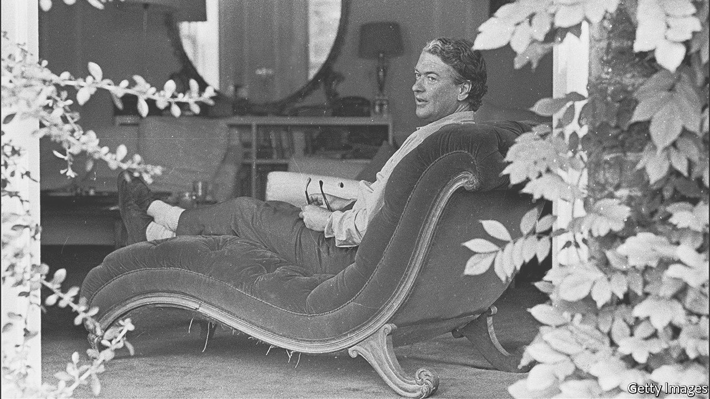

###### Centennial tributes

# The comic genius of Kingsley Amis 

##### In his life and writing, the author of “Lucky Jim” relied on his friends 

 

> Apr 23rd 2022 

HIS BIGGEST fear was loneliness. Kingsley Amis could sit in his study all day, with just his flamboyant characters for company, but when the sun set he collapsed into panic if he was alone. The solution? Parties, lovers, dinners. His was a life of constant company, punctuated by hard work. This routine began early. As an only child, he took up writing as a form of “self-entertainment”. The two states, writing and socialising, were linked. It was his affability that made Amis, born in London 100 years ago this month, the greatest comic novelist of his generation.

His oeuvre is varied. He excelled in many forms—campus novels to murder mysteries, grammar guides to historical counterfactuals. (What if the Reformation hadn’t happened? Answer: Luther would have become the pope.) Nearly all his more than 30 books are laugh-out-loud funny.


Amis’s brilliance in print was matched in person. It is sometimes said that writers can afford to be everyday bores—saving the excitement for the typewriter—but Amis thrilled off the page, too. He was a gifted joker, drinker and seducer. The antics in his novels drew on this life of mischief. He couldn’t have written the outrageous climax of his debut, “Lucky Jim” (published in 1954), in which the protagonist gives a lecture while drunk, if not for his sprees at Swansea University, his first employer. “Few writers have written as perceptively about bad behaviour as Amis or been as consistently accused of it,” notes Zachary Leader in his authorised biography.

Sociability was also key to his commercial success. Though his years as a student at Oxford had disappointments—an unpublished novel and a postgraduate thesis flopped—he gained something more useful: friendship. His most important was with Philip Larkin, already a published novelist and a gifted poet. They exchanged ideas in intimate, jokey correspondence; Larkin advised Amis on his second go at fiction, which would become “Lucky Jim”.

Another friend proffered his mother, a publisher, as an early reader. She told Amis to create more conflict and expand the female roles. Casting around for a book deal, Amis called in a favour from a television-producer friend, who organised a reading from the novel on the BBC. The chosen extract—in which Jim burns the bedsheets after drunkenly falling asleep with a lit cigarette, then cuts up the linen to conceal the accident—had viewers in stitches. Within days, editors came calling.

His irreverence was as captivating as his humour. A morally questionable hero, Jim is callous to his girlfriend, exploits his friends and disdains his elders. “She permanently resembled a horse,” he thinks of a professor’s wife, “he only when he laughed.” He did little to hide his inspiration. The fuddy-duddy in the story was recognisably modelled on his father-in-law. It was one of the first novels to tap into the youthful rebelliousness that came to define much of post-war culture in the West.

Amis followed “Lucky Jim” with a string of hits. None eclipsed it, but he settled into the role of a respected (and rich) author. His lifestyle, encompassing American lecture tours and the purchase of a large country house, was extravagant. He left his first wife, Hilly, for Elizabeth Jane Howard, a fellow novelist. He became, perhaps, too comfortable. Drinking took up more of his time. Youthful iconoclasm gave way to blimpish politics that bled into the novels. Amis began hectoring younger talents and calling himself a “senior writer”.

As he approached 60 in the late 1970s, his comforts fell away. Howard moved out with a stinging note: “You are not going to stop drinking and I cannot live with the consequences.” Heartache and a bid to quit smoking made him put on weight. The famous libido evaporated. Evenings became lonely. His son, Martin Amis, by then an established novelist too, set up a “dad-sitting” rota.

He kept writing but told Larkin he found it harder than ever. That lifelong balance between work and play had slipped. Readers found more venom than vim in the new novels. “Jake’s Thing”, a sequel of sorts to “Lucky Jim”, follows an ageing stand-in for Jim who gives up on romance and castigates women. In “Stanley and the Women”, written during the divorce from Howard, Amis and his caricatures were even more bitter. “Kingsley’s novels”, says Martin Amis in his memoir “Experience”, “seemed to me in moral retreat.”

Yet just when he had been written off, he was saved by his friends. He settled into a peculiar new living arrangement: his first wife Hilly moved in (with her new family) as a “sort of companion-housekeeper”. After a rough start, this put an end to “dad-sitting” and revitalised his creativity. Amis wrote a surprising comeback, “The Old Devils”, a charming tale of “piss-artistry” among a group of pensioners. The characters’ bitingly funny reminiscences, and their willingness to forgive past betrayals, hint at the breakfast-table conversation in the reconstructed Amis household. Reviewers raved. When he won the Booker, seeing off Margaret Atwood’s “The Handmaid’s Tale”, no one was more surprised than Amis. “Until just now I had thought the Booker prize a rather trivial, showbizzy caper,” he said in an acceptance speech that brought the house down.

It is not just one-liners for which Amis is remembered. His technique, with its spring-loaded comic sequences tightening over pages and erupting into hilarity, is much imitated. It puts him in the pantheon of England’s funniest writers, stretching from Jane Austen to P.G. Wodehouse. In his happier last years, he wasn’t so fussed about being a “senior writer”. Not long before he died in 1995, he said he would “like to be remembered as somebody who made people laugh”. They are still laughing. ■

