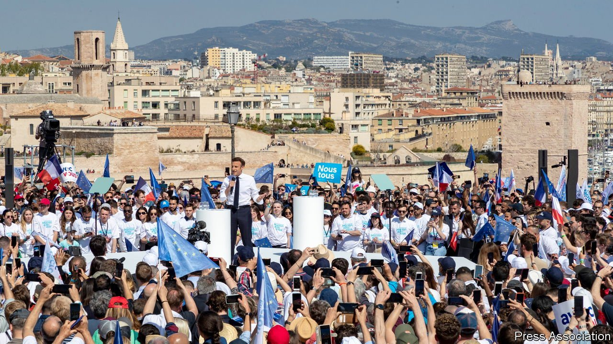
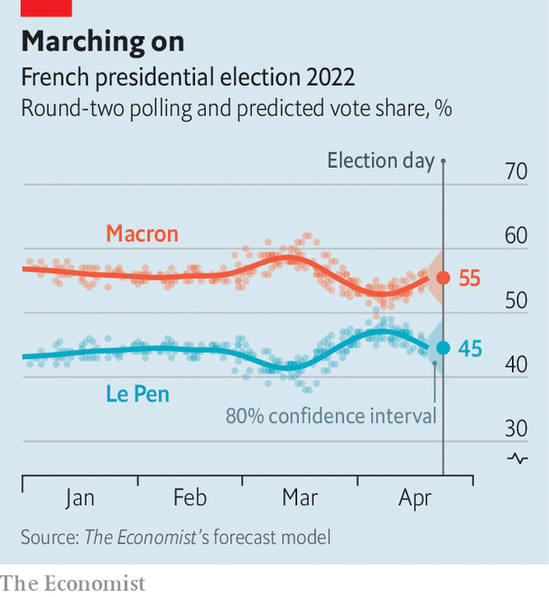

###### The final choice

# Emmanuel Macron remains the strong favourite to win France’s presidency 

##### He outclassed Marine Le Pen in their only televised debate 

 

> Apr 23rd 2022 

SEVEN MONTHS ago Emmanuel Macron stood in the gardens of the Palais du Pharo in Marseille, before the sunlit backdrop of the old port, and declared: “If we can’t succeed in Marseille, we can’t make a success of France.” On April 16th the sitting president was back in the same majestic setting for his first rally before the final vote at the , on April 24th. The Mediterranean city did not vote for Mr Macron in the , preferring the radical-left Jean-Luc Mélenchon. So the president was on hostile ground. But, by returning to the spirited, rebellious city, Mr Macron seemed to be saying: if he can win over Marseille, he can succeed in winning over France.

In the  the two finalists, the centrist Mr Macron and the populist-nationalist , were out chasing the votes of those who picked neither of them in the first round. The biggest chunk of these are the 7.7m people (22% of voters) who backed Mr Mélenchon, many of them young and green-minded. Conscious of this, Mr Macron vowed in Marseille to put the environment “at the heart” of a second term, to double the pace of France’s effort to reduce carbon emissions, and to make France the first big country to end the use of fossil fuels. The run-off, he declared, was a choice between fear and hate on the one hand; and respect, diversity and ecology on the other.


An hour north of Marseille, at the edge of the Luberon hills, a beaming Ms Le Pen was the previous day pressing the flesh in the local market. For an hour, she edged her way past stalls selling asparagus, olives and charcuterie, stooping to hug children or posing for selfies with passers-by. A few protesters chanted “go home” or “fascist”. Fatima Benmalek, a grandmother of Algerian origin, beseeched Ms Le Pen not to ban the Muslim headscarf from being worn in public, as she has promised. But the welcome Ms Le Pen got from most of those filling their shopping baskets shows how far she has broadened her appeal. “She’s calm, poised, less aggressive than before,” said Josiane, a retired florist. “She’s visiting all the villages. Macron, he’s not really close to the population.”

Though brought up in a mansion outside Paris, Ms Le Pen has successfully styled herself as a defender of “the people” against the Paris elite, embodied by a “globalist” president; and as a single mother who has struggled like anyone else. She has steered clear of the capital and criss-crossed rural France, where her vote is strongest, promising to cut VAT on heating bills, petrol and food.

 


On the back of a savvy campaign the populist leader has never looked so close to winning the highest office. Twenty years ago her father, Jean-Marie Le Pen, the co-founder of the party she rebranded from the National Front to the National Rally and has led for over a decade, scored a mere 18% in the presidential run-off. In 2017 Ms Le Pen nearly doubled this, winning 34% of the vote, to 66% for Mr Macron. On April 20th The Economist’s  put her at 45%, to 55% for Mr Macron.

But that is still a huge gap. Indeed the second-round poll dynamic has shifted in Mr Macron’s favour. The more Ms Le Pen’s manifesto has come under scrutiny, the wider Mr Macron’s lead has become. This was particularly evident during their one and only head-to-head debate on April 20th, which lasted over two-and-a-half hours. Mr Macron laid into Ms Le Pen’s links to Russia, reminding viewers of her outstanding loan from a Russian bank: “You are speaking to your banker when you speak to Russia.” Her fantasy of building an “alliance of nations” within the European Union, he said, amounted to nothing less than “taking France out” of the union. Unsurprisingly, he outclassed Ms Le Pen on technical detail and grasp of policy.

For her part, Ms Le Pen was a calmer figure than when she debated Mr Macron in 2017, offering plenty of feel-your-pain empathy for those struggling to get by, and waiting for condescension to get the better of Mr Macron, which at times it did. The pair clashed over wind turbines (which she wants to dismantle), the legal retirement age (which he wants to raise, from 62 years to 65) and her proposed ban of the Muslim headscarf in public (which he vigorously rejected). Such a ban, Mr Macron declared, would “start a civil war”.

It is unlikely that the debate will shift voting intentions much. Even before it took place, those on the left who are instinctively hostile to Mr Macron seemed to be preparing to put their feelings aside and back him, if only to keep Ms Le Pen out. The share of Mélenchon voters who said they would support Mr Macron jumped ten points over the Easter weekend to 38%; only 16% swung behind Ms Le Pen.

In Marseille there was little of the thrill that surrounded the fresh-faced Mr Macron in 2017. His supporters were measured rather than fervent. “He may not be a popular president, but he is a courageous one,” said Victor, a civil servant from Montpellier. Some mentioned approvingly Mr Macron’s rejection of Ms Le Pen’s headscarf ban; others Europe and his management of the pandemic. “He hasn’t succeeded with everything, but he’s not done badly given what’s been going on,” said Marianne, a care worker from Marseille.

On April 20th  had the probability of a Macron victory at a massive 93%. Re-election would be a feat for the 44-year-old, who had not stood in any election until he ran for the presidency in 2017. Under the Fifth Republic the French have never re-elected an incumbent president holding a majority in parliament. Yet, if he wins, Mr Macron will face a fractured, discontented country, much of which has little time for him. Victory would be quite something. But a second term would be about managing the dismay as much as the expectations.

For more coverage of the French election, visit our dedicated 

