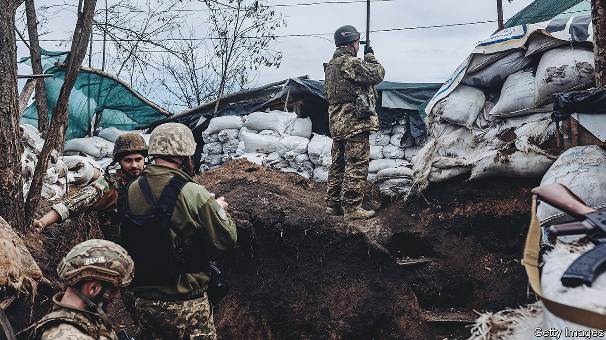
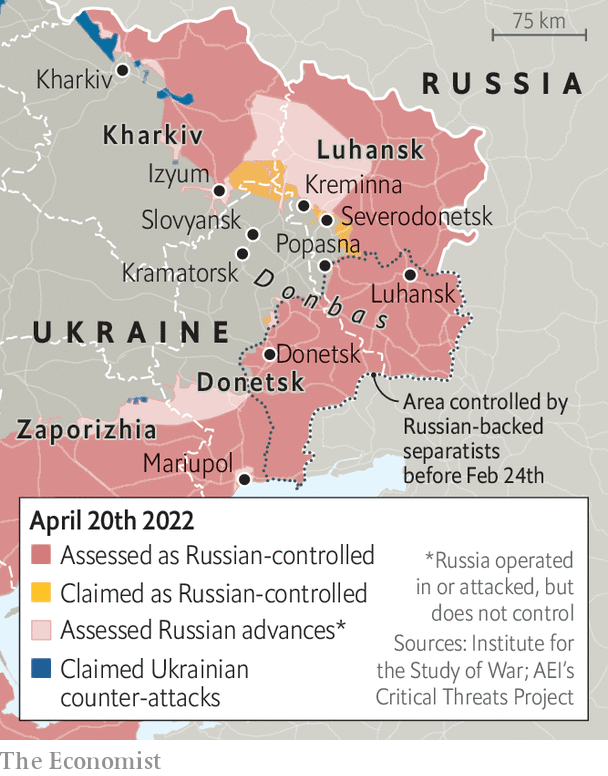

###### A new phase begins

# Fighting has intensified in the Donbas region 

##### Ukraine may find it harder to hold Russian forces back there 

 

> Apr 23rd 2022 

“IT CAN NOW be stated that Russian troops have begun the battle for Donbas,” pronounced Volodymyr Zelensky, Ukraine’s president, late on April 18th. More than three weeks have now passed since Vladimir Putin, Russia’s president, abandoned his  and retreated from northern Ukraine. Now Mr Putin is throwing a large portion of his weary army at eastern Ukraine in the hope of salvaging something from his war. The coming weeks are likely to see the bloodiest battles since Russia first invaded the  region in 2014.

The clashes that intensified on April 18th are “preludes to larger offensive operations”, according to American defence officials. They are probably a mixture of Russian reconnaissance, to establish the strength of Ukrainian defences, and shelling, to soften them up in advance of ground attacks that will follow. Oleksiy Danilov, the head of Ukraine’s security council, says that Russian attacks occurred “along almost the entire front line” in Donetsk, Luhansk and Kharkiv provinces, spanning around 400km in all.


Russia is beginning this offensive with a depleted army. American officials say that it retains only 75% of the combat power, across ground and air forces, that it had at the start of the war. Russia originally amassed 120 or so battalion tactical groups (BTGs), formations of around 700 soldiers. Dozens of these are no longer battle-worthy after suffering heavy losses of men and equipment. The Pentagon reckons that there are 78 BTGs in Ukraine presently; Ukrainian officials put the figure at 87. But a dozen or so are tied up battling e in Mariupol, a port city in the south-east. The remainder constitute a relatively modest force to throw against Ukraine’s most experienced and now well-equipped troops.

 


Notably, instead of amassing a large force and then striking, Russia has chosen to initiate the battle for Donbas even while it is still scraping together extra troops and equipment. Some American and European officials think that this curious decision may be guided by an arbitrary constraint: Mr Putin’s reported desire to see results by May 9th, Victory Day, on which Russia marks the end of the second world war in Europe. But this piecemeal and hasty commitment of forces seems sure to reduce their effectiveness.

A great deal depends on how quickly and ably , the recently appointed commander of Russian operations in Ukraine, can move and concentrate his forces to overwhelm Ukrainian defenders in crucial areas. Russia is attacking south-east of Izyum, a strategic transport hub where it has around 25,000 troops and support staff, trying to head towards Slovyansk and Kramatorsk, so far without significant success. A senior Ukrainian officer told The Economist that Russian forces were still largely probing these positions, rather than launching a full-scale offensive. A big push will probably follow in the coming days.

Elsewhere along the front lines, there have been reports of some modest Russian gains. Ruslan Leviev of the Conflict Intelligence Team, an open-source investigative outlet, says that it has verified advances in Popasna, a small town in Luhansk province that has been on the front line since 2014. Russia now controls the city council building, he notes.

Ukrainian troops look vulnerable in a salient around Severodonetsk, a city about 80km from Luhansk, which is now under pressure from three sides. Russian forces have taken Kreminna, a small town to its north-west. Battles were also raging in Zaporizhia province, an industrial region immediately to the west of Donbas and to the north of Crimea.

Ukraine, not content with merely absorbing these blows, seems to have pre-emptively mounted counter-attacks. On April 17th Oleksiy Arestovych, an adviser to Mr Zelensky, described “an interesting movement around Izyum which should make any Russian attack difficult”, calling it “manoeuvring, active defence”. That appears to refer to Ukraine’s recapture of several villages south-east of Kharkiv.

A Ukrainian counter-attack could threaten the highway between Kharkiv and Izyum, potentially cutting Russia’s supply lines. “If Ukraine can obtain some level of firepower control over the roads, it would disrupt the operation and tie down significant Russian forces,” says Mykola Bielieskov of the National Institute for Strategic Studies, a Ukrainian think-tank.

The battle for Donbas may look very different from the first phase of the war, when Russian units were unprepared, poorly led and bogged down in suburban and urban warfare. The terrain in Donbas is more open, better suited to tanks and trickier for anti-tank teams, who need cover—although the  in recent days will present tanks with a different challenge. The armoured clashes that result may be some of the largest since the Arab-Israeli war of 1973, in which thousands of tanks were destroyed.

The most important factor will be Russia’s ability to fix the many problems that doomed its offensive on Kyiv: inadequate manpower, poor command and control, woeful tactics, shaky logistics and weak air power. Russia’s air force is stronger in Donbas than in the north, and it has been ramping up sorties in recent days. But it remains “terrified of flying over Ukrainian-held positions”, according to Western officials, because of the continued threat of .

That will influence the intelligence contest, too. Ukraine, which is being fed lots of Western intelligence, says it has already downed a large number of Russia’s Orlan-10 reconnaissance drones in Donbas. The hostility of ordinary Ukrainians to the Russian invasion rules out most human reconnaissance missions. “It's not army versus army in any normal sense,” says Mr Bielieskov. “It's the Ukrainian nation against a military, and one with plenty of question marks.” ■

Read more of our recent coverage of the 

