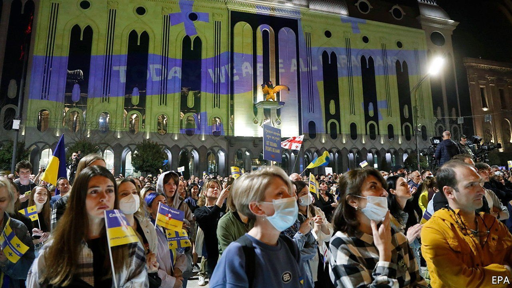
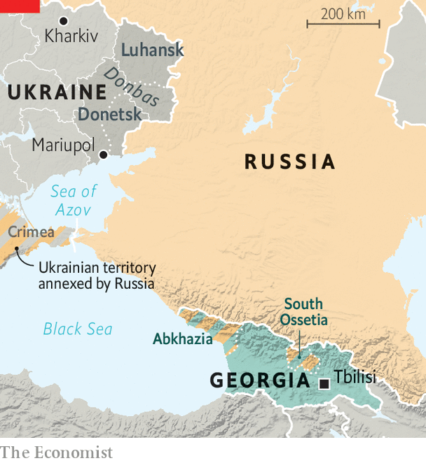

###### Finger in the wind

# Georgians back Ukraine, but their government is more hesitant 

##### The memory of Russian aggression drives both responses 

 

> Apr 23rd 2022 

IF ANYONE FEELS Ukrainians’ pain, it is Georgians. In 2008 Russia invaded Georgia and garrisoned the self-declared statelets of South Ossetia and Abkhazia, leaving a fifth of Georgia’s territory under de facto Russian occupation. When Russia invaded Ukraine in February thousands of Georgians marched in solidarity. Many worry that Vladimir Putin, Russia’s president, may target them again to compensate for his failed invasion—or “to continue the expansion started in Ukraine, depending on the outcome of the war”, warns Salome Zourabichvili, Georgia’s president.

Polls show more than 60% of Georgians believe the government should do more to help Ukraine. Georgians have welcomed thousands of Ukrainian refugees, and bristle at the larger influx of Russians fleeing Mr Putin’s regime. The national bank requires Russians wishing to open accounts to sign statements condemning “Russia’s aggression in Georgia and in Ukraine”.


Yet the government’s response has been more muted. It has not joined Western sanctions; Irakli Garibashvili, the prime minister, said doing so would harm the country’s interests. Georgia has refused entry to some prominent Russian opposition figures and stopped some of its own citizens from flying to Ukraine to join the fight. The deference to Russia has not gone unnoticed on either side: Ukraine recalled its ambassador, while Russia left Georgia off its list of “unfriendly countries”.

 


The ruling party, Georgian Dream (GD), explains its stance as strategic caution. Since coming to power in 2012, GD has sought to normalise relations with Russia. Travel restrictions eased and trade grew; Russia is now Georgia’s second-largest trading partner. Sanctions, GD argues, would do little damage to Russia’s economy while devastating Georgia’s, and could provoke further aggression.

Yet that is only a partial explanation. Bidzina Ivanishvili, the shadowy oligarch who backed GD and once served as prime minister, made his fortune in Russia. He no longer has a formal role in GD, which denies any Russian influence, but speculation is rife. “He is a Russian oligarch, he came from there,” says Kornely Kakachia, director of the Georgian Institute of Politics, a think-tank in Tbilisi, the capital. GD’s feud with Mikheil Saakashvili, a former Georgian president who relaunched his political career in Ukraine after being forced out of Georgia, complicates things further. “They are taking this personal relationship, the Saakashvili factor, into state relations between Ukraine and Georgia,” Mr Kakachia argues. Mr Saakashvili was arrested on returning to Georgia last year.

Ms Zourabichvili, who was born in France and served as a French diplomat, strongly backs Ukraine. That puts her at odds with GD, which supported her candidacy. She has travelled to Europe to reassure leaders of Georgia’s Western orientation. GD accused her of violating limits on presidential powers by conducting her own diplomacy. But her trips helped facilitate Georgia’s application for EU membership, filed together with Moldova’s in March. “We see a new window of opportunity,” says Ms Zourabichvili.

The government’s caution on Ukraine may make things trickier. Western governments are scratching their heads over Georgia’s response, Mr Kakachia says. It also carries security risks. If Russia threatened military action on its border, Georgia would “need weapons and support” from the West, says Olesya Vartanyan of the International Crisis Group. “Let’s hope that by then there [is] no question about which side Georgia is on.” ■

Read more of our recent coverage of the 

