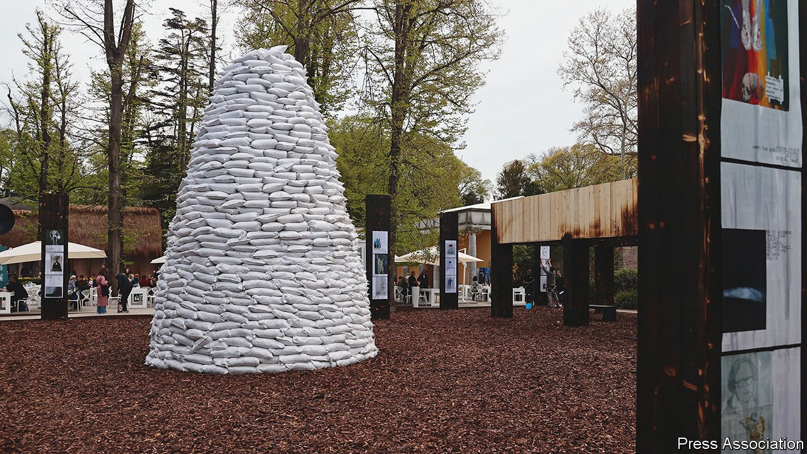

###### Art and the war

# Protests and politics will dominate this year’s Biennale 

##### An empty Russian pavilion will be an eloquent statement 

 

> Apr 23rd 2022 

NO NATIONAL PAVILION in the latest Venice Biennale, which opens on April 23rd, will make such a brave and unambiguous statement as Russia’s. Its airy spaces will be empty, the curator and two artists chosen to represent Russia having withdrawn on February 28th in protest at the invasion of Ukraine.

Politics is seldom distant from the world’s most prominent showcase for contemporary art. But this year it was not intended to be central. The Italian curator of the main show, Cecilia Alemani, had chosen to build it around shifting concepts of what it means to be human, and called it The Milk of Dreams after the title of a children’s book by a late Surrealist artist, Leonora Carrington. Yet there is every chance the Biennale, including 80 smaller, national exhibitions, will be dominated by the war.


Demonstrations are expected outside the shuttered Russian pavilion. And the exhibition authorities have agreed to the creation nearby of an open-air space around a monument covered by sandbags in which to display work created by Ukrainian artists since the invasion in February. Ukraine was initially going to pull out of the event, but that changed after one of the co-curators of its show, Maria Lanko, drove the main elements of its central exhibit more than 2,000 kilometres from Kyiv to Venice. The journey, which in normal circumstances would have taken her a matter of days, lasted three harrowing weeks.

“In times of brutal wars,” said Ms Alemani, “it seems almost impossible to think about art.” But in a statement, the Ukrainian curators of the open-air show argued their wartime art might even chime with her chosen themes. “For months,” they wrote, “human bodies have been shaking along with the walls of their homes and cities. Every day, technologies kill and protect also. Every day, human relationships with plants, animals, earth and non-humans change or strengthen, and this is not a dream.”

Read more of our recent coverage of the 

