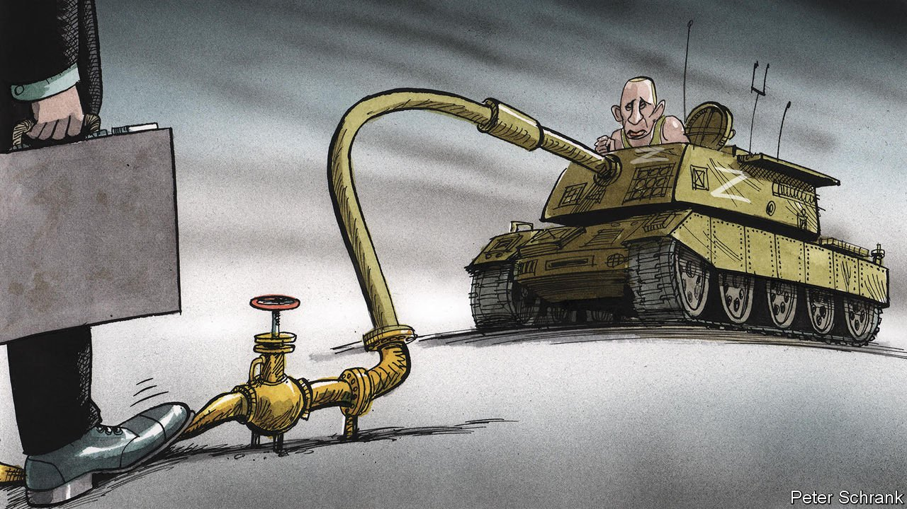

###### Charlemagne

# Tariffs on Russian energy are a smart way to hobble Vladimir Putin 

##### If Europe can’t agree to ban Russian oil and gas, it should tax it instead 

 

> Apr 23rd 2022 

THE INDUSTRIAL outskirts of Lubmin, a town on the windswept Baltic coast of what was once East Germany, feature in no tourist guide. Nor is the port of Rotterdam, the grittiest part of a city already struggling for charm, much of an attraction. Certainly neither has the appeal of Notre Dame or Venice, as Luis Garicano, an MEP, economics professor and recent day-tripper to both can attest. Yet few places could help a vacationer to Europe better make sense of what is actually happening there today. In the Dutch port, ships from Russia discreetly unload lakes of crude oil each worth up to $80m, to be processed in European refineries. Even further from the public gaze, the Nord Stream pipeline makes landfall at Lubmin, pumping Siberian gas for which customers in Germany and beyond send back over €160m ($174m) every day. This is the dark economic underbelly of Europe, a continent that congratulates itself on aiding Ukraine while having paid nearly €40bn for Russian energy since the war started eight weeks ago.

Banners in demonstrations from Paris to Prague have advocated simply shutting off the pipeline and turning away tankers carrying Russian crude. Yet wave upon wave of European sanctions have all but ignored oil and gas, even as drastic measures targeting other bits of the Russian economy have been adopted. Politicians wish they could stop payments to the Kremlin’s coffers; Germany’s have prevented the opening of a new pipeline, a twin to Nord Stream. At the same time they worry that going cold turkey on Russian gas might result in cold citizens come winter. Voters are already feeling the pinch of high heating and petrol bills. Firms are struggling, too, not least in Germany where reliance on Russian energy is acute. Estimates of how much an embargo on energy imports from the east would harm Europe’s economy vary wildly, but are high enough to derail consensus within the EU beyond mulling partial restrictions on oil imports in future.


If sanctions are off the table, Europe might consider stiff tariffs on Russian energy instead. Taxing imports of oil and gas would not stop them from flowing west entirely. It would, however, crimp demand for Russian hydrocarbons as surely as levies on booze and cigarettes deter drinking and smoking. An analogous “sin” tax on Russian oil would recognise that buying Russian energy is a form of commercial turpitude, given the remitted funds will fuel President Vladimir Putin’s war machine. Firms that belch greenhouse gases into the atmosphere have to compensate the wider public by purchasing carbon permits. Today Putinism is to geopolitics what climate change is to the planet: a problem that needs to be dealt with, and fast.

The aim of any sanctions regime is to impose crippling costs on the enemy while suffering little inconvenience yourself. Some economists reckon tariffs would even help the EU turn a profit at Russia’s expense. Ricardo Hausmann, a former Venezuelan planning minister now at Harvard, points out that if a punitive import tax—of perhaps 90%—were to be added to the price of Russian oil, European refineries would source crude from elsewhere unless they were granted a sizeable discount. Russia makes such vast profits on its oil—extracted for less than $6 a barrel and sold for ten times that—that it would still make sense for it to export it at the global price minus the tariff imposed by Europe (and indeed Russian crude is already being sold at a steep discount to benchmark rates). Since Russia’s pipelines and ports are arranged mainly to cater to Europe, re-routing the oil and gas to other customers would be complicated and costly. The new tariff would become a source of income for Europe, at the expense of the Kremlin.

Real life would be messier than economic models. But the broader point, says Guntram Wolff of Bruegel, a think-tank in Brussels, is that Europe has more options to substitute Russian oil than Russia has options to replace European customers. Things are different with gas, given that it is delivered through pipelines which tie producers and consumers together. Europe cannot quickly replace much of what Russia delivers, though to some extent it can switch to gas from other places or other forms of energy entirely. A levy on gas would thus be less likely to force Russian prices down in the short term; but as Europe diversifies its sources of supply, for instance by building more LNG terminals, it will become more viable. The money raised by a levy could be used to compensate users of Russian gas unable to switch away from it.

Mario Draghi, another economist, who is currently moonlighting as Italy’s prime minister, also wants to hobble Russian energy, but by capping the price paid by Europe for its imported gas instead. In many ways that is similar to a tariff: you limit the flow of money headed to Moscow, and force Russia to adapt. But this approach would do nothing to stymie the demand for Russian energy—on the contrary. It would encourage industry to crave more, not less, of Mr Putin’s now-even-cheaper gas. In contrast a bump in prices of some Russian energy would send a signal that those who currently use it should cut back. Politicians are demanding this: Europe is aiming for a two-thirds cut in Russian gas imports this year, though partly based on optimistic assumptions. A higher Russian gas price, while painful, would provide an incentive for those who use the stuff to wean themselves off it.

The levy was high

The likeliest outcome, says Mr Garicano, is the current approach: doing nothing. A levy on imports is at least a step in the right direction, and politically feasible. It could be adjusted depending on circumstances, unlike an all-or-nothing embargo. In normal times taxing imports is frowned upon for fear of irking trading partners. But vexing the Kremlin would be a plus in this case. Russia might respond by reducing supplies, but it is already threatening this anyway. The EU has the right idea when it comes to wanting to free itself from the shackles of dependence on Russian energy. Now it needs the right approach. ■

Read more from Charlemagne, our columnist on European politics: (Apr 16th) (Apr 9th) (Apr 2nd)

