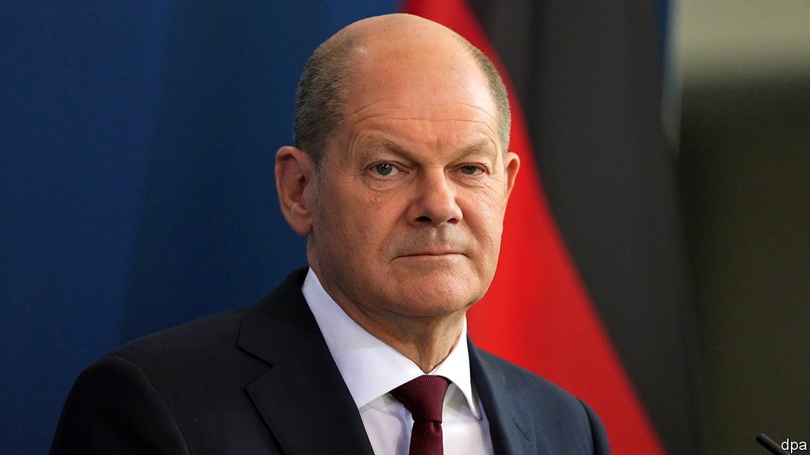

###### The reticent Mr Scholz

# Why Olaf Scholz hesitates to send Ukraine heavy weapons 

##### Germany has changed its defence and foreign policies, but not its mentality 

 

> Apr 23rd 2022 

ON FEBRUARY 27th, three days after Russia invaded Ukraine, Olaf Scholz delivered a speech to Germany’s parliament that astonished even his close political allies. Calling the moment a Zeitenwende (“turning point”), the German chancellor outlined the biggest strategic shift in German security, foreign and energy policy in the federal republic’s history. Earlier he had refused operating permission for Nord Stream 2, an $11bn pipeline to carry natural gas from Russia to Germany which has taken many years to build, but which allies had long warned would reinforce Germany’s dependence on the Kremlin. Now the understated chancellor, who during his first two months in office seemed to have gone into hiding, announced a startling plan. It included an increase in Germany’s defence spending from 1.5% of GDP to the NATO target of 2%, the establishment of a €100bn ($110bn) special fund for the Bundeswehr (the German armed forces), and the construction of two liquefied natural gas (LNG) terminals to reduce Germany’s dependence on Russian energy.

Mr Scholz’s new strategy raised high hopes in the western world. Yet eight weeks into the war in Ukraine these hopes are being dashed, bit by bit. Mr Scholz refuses to support calls for a German or European embargo or tariff on Russian oil and gas. Every day Germany pays Russia tens of millions of euros for fossil fuels, even as the war grinds on.


Still more damaging has been his refusal to give Ukraine heavy weapons such as tanks. Ukraine needs them more than ever thanks to the new Russian offensive in the east. Other Europeans are exasperated by German dithering. “This is costing Germany lots of political capital in the European Union and NATO,” says Rafael Loss of the European Council on Foreign Relations.

Germany’s allies fear that the country is wavering in its commitment to the Zeitenwende. Such fears are exaggerated; Mr Scholz is following through on important parts of his new policies with impressive speed. His government has already said it will buy 35 American-made F-35 fighter jets to replace its ageing Tornados. It is buying 140 armed drones from Israel, and is mulling the acquisition of an Israeli anti-missile system. A draft law is in the works that will anchor the €100bn special fund in Germany’s constitution.

“I would have never expected an SPD politician to do this against [the will of] his own party,” says Thomas Kleine-Brockhoff of the German Marshall Fund of the United States. The Social Democratic Party (SPD) has typically preferred engagement with Russia to confrontation. That attitude harks back to Ostpolitik, the policy of rapprochement with Germany’s eastern neighbours (including Russia), which was launched in 1969 by Willy Brandt, a celebrated SPD chancellor.

Mr Scholz is also honouring his promise to reduce Germany’s dependence on Russian energy as fast as possible. In March Robert Habeck, his economy minister, swallowed his distaste for autocracies and travelled to the United Arab Emirates and to Qatar, one of the biggest exporters of LNG, to forge new gas-supply partnerships. Besides the two new permanent LNG terminals in Wilhelmshaven and Brunsbüttel, the government will spend €3bn to lease four floating ones.

Yet while Mr Scholz is charging ahead with implementing his Zeitenwende, he is neglecting to win hearts and minds. Rather than tirelessly communicating the need to break with old policies on Russia, the soft-spoken Mr Scholz seems to have retreated into his shell. In a televised speech on April 18th, he failed utterly to explain why he is not authorising the delivery of heavy weaponry to Ukraine. (Germany has sent other military kit, such as anti-aircraft and anti-tank missiles and ammunition.) Mr Scholz said the country should not “go it alone”. But other NATO allies are sending armoured vehicles, helicopters, heavy artillery and even fighter jets; Germany now stands out for its reticence.

The Greens and the Liberals, the junior partners in Mr Scholz’s governing coalition, want to do more. Anton Hofreiter, a Green MP who was part of a German delegation to Kyiv last week, insists Germany must “finally deliver what Ukraine needs, and that is heavy weapons”. He called Mr Scholz “too hesitant”. Marie-Agnes Strack-Zimmermann, an outspoken Liberal MP who also travelled to Kyiv, echoed his call.

Opponents argue that supplying heavy weapons would make Germany a party to the war. Experts in international law say this claim is simply wrong. Russia has threatened to strike NATO countries that give Ukraine heavy weapons—but that would probably draw all of NATO into the war, and seems to have been a bluff. It would take many weeks of training, argues Erich Vad, a retired Bundeswehr general, to teach Ukraine’s army to operate German-made Leopard and Marder tanks and to develop a supply chain for spare parts. Yet as the months go by, such caveats begin to look like excuses.

Christian Lindner, the finance minister, announced on Twitter on April 15th that Germany will increase its Ertüchtigungs hilfe, a fund to help allies buy weapons, by about €1bn, with the boost largely going to Ukraine. The money will surely be welcome in Kyiv. But there is an air of unreality to many Germans’ attitudes: they want to help Ukraine defend itself against Russia, but they shrink from the warlike things this implies. The concrete implementation of the Zeitenwende is proceeding, but the change in Germans’ thinking has barely begun. To convince them, the reticent Mr Scholz, too, will have to change. ■

Read more of our recent coverage of the 

