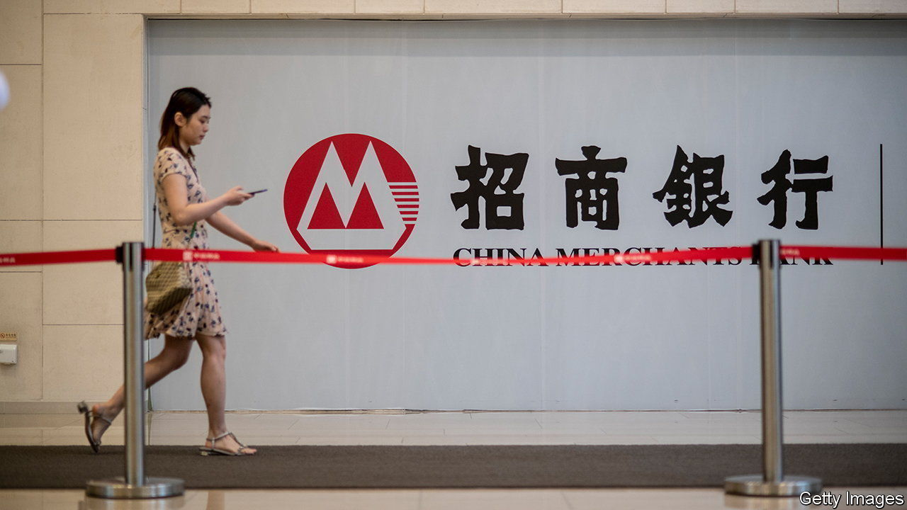

###### Executive exit

# A surprise sacking at China Merchants Bank frightens investors 

##### One of the world’s largest banks sheds tens of billions of dollars in market value 

 

> Apr 23rd 2022 

CHINA MERCHANTS BANK has always stood out from the pack. It was founded by a former communist guerrilla in 1987 as China’s first commercial lender with a corporate-shareholding structure. It is part of a group with ties to a Qing dynasty project that sought in the 19th century to build an indigenous steam-powered shipping industry in order to compete with the West. The English name “merchants’‘ is a poor rendition of the Chinese, which is better translated as “investor recruitment”.

The bank has been at the forefront of China’s economic transformation. The southern manufacturing hub of Shenzhen, where it is based, virtually sprang up around it from the late 1980s onwards. Its revolutionary founder, Yuan Geng, also launched some of China’s earliest economic reforms. It lent to private entrepreneurs, while clunky state banks preferred mainly to lend to other state entities. Although its shareholders are largely government-controlled, China Merchants Bank has operated more like a privately run group. This helped it attract better managers than the country’s four largest state lenders—Bank of China, Industrial and Commercial Bank of China (ICBC), China Construction Bank (CCB) and Agricultural Bank of China.


Such advantages were not lost on investors. China Merchants Bank’s market capitalisation soared, reaching about $230bn in May last year. At that time it was one of the largest banks in the world, behind only JPMorgan Chase and Bank of America in the West. Most big Chinese state lenders are considered inefficient allocators of capital and, as a result, trade at much lower price-to-book-value ratios. By mid-2021 China Merchants Bank had also surpassed all but one of its state rivals, ICBC, in market capitalisation. Some analysts expected it to become China’s most valuable bank.

That target now looks out of reach. China’s financial sector is in the throes of yet another corruption purge. On April 18th the bank’s board removed its president and chief executive, Tian Huiyu, without explanation. Mr Tian has not been accused of wrongdoing but local media have linked his removal to a corruption probe that has shaken the Shenzhen branch of CCB, his previous employer. Several of Mr Tian’s former colleagues have been investigated for serious breaches of the law.

The incident has rocked China Merchants Bank’s share price, which is now 29% below its peak last year. By April 21st its market capitalisation had fallen to $162bn, placing it behind three of its state-owned rivals. More worrying are the long-term implications for the bank’s operations. Mr Tian had run China Merchants Bank since 2013. Its ability to keep managers for long periods set it apart from state lenders, which often shuffle their executive teams and make appointments based on political merit. That stability had been key to the bank’s industry-beating corporate governance, Chen Shujin of Jefferies, a broker, has noted. Now it is in doubt.

China Merchants Bank had so far avoided a high-level scandal. If a graft investigation spreads through the bank, it may end up looking more like other troubled, inefficient lenders in China. Recruiting investors will be that much harder. ■


