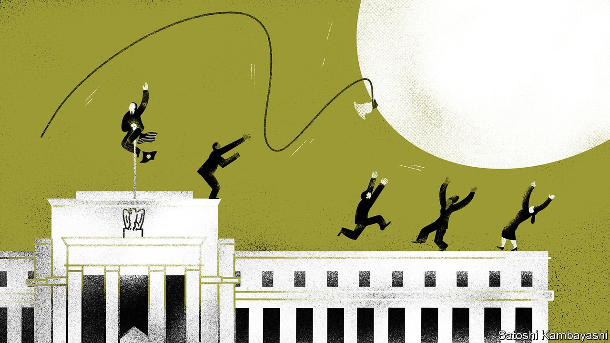
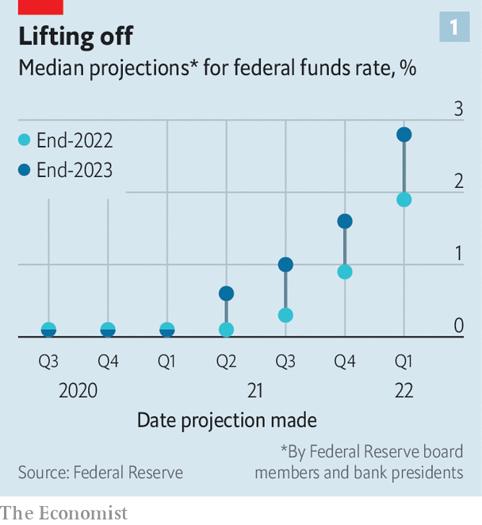

###### The Fed’s mistake

# After getting inflation so wrong, can the Fed now get it right? 

##### The hawks are taking flight 

 

> Apr 23rd 2022 

IT WAS A simple, stunning admission. “We have had price stability for a very long time and maybe come to take it for granted,” said Jerome Powell, chairman of the Federal Reserve, last month. Many factors explain the latest burst in inflation, with snarled supply chains, tight job markets, generous fiscal stimulus, loose monetary policy and, more recently, the war in Ukraine all part of the fabric. But one thread runs through them all. Investors, analysts and, crucially, central bankers believed that high inflation in America had been consigned to history, a problem more for academic studies than for current policy.

No one now doubts that inflation is a problem for today. Consumer prices rose by 8.5% in March compared with a year earlier, a four-decade high. Belatedly, the Fed has swung into action. As recently as mid-2021 most members of its rate-setting committee believed that it would not raise interest rates at all this year (see chart 1). At its meeting in March, however, Fed officials concluded that they would raise rates by nearly two percentage points in 2022, setting America up for one of its steepest tightening cycles in a quarter of a century. How did the Fed get it so wrong? And does its sharp shift mean that it is at last getting it right?


Explanations for the Fed’s mistake fit into three related categories: a failure of imagination, a technical trap and institutional inertia. In failing to see how bad things might get, the Fed was hardly alone. When inflation perked up a year ago, most analysts and investors pointed to dislocations from the pandemic. With people avoiding crowded places, demand for goods such as cars and computers had boomed just as companies were struggling to make them. As covid-19 faded away, so would inflation.

 


Not all economists were so optimistic. Notable among them was Larry Summers, a former treasury secretary. In February 2021—when prices were still quiescent—he warned that President Joe Biden’s $1.9trn covid-relief bill might “set off inflationary pressures of a kind we have not seen in a generation”. Others, including Olivier Blanchard, a former chief economist of the IMF, and Jason Furman, an economic adviser to President Barack Obama, added their concerns. “At a minimum the Fed should have been much more even-handed in assessing that inflation might come down, but that it might also stay high,” says Mr Furman. Indeed, as prices rose, interest rates fell in real terms, which only added fuel to inflation.

A common refrain of the Fed’s critics is that the central bank was caught fighting the last war. The recovery from the global financial crisis of 2007-09 was long and drawn out, with inflation staying subdued. Sonal Desai of Franklin Templeton, an asset manager, thinks this misled the Fed. “The idea was that inflation expectations were so well-anchored that a free lunch was available. You could have a massive expansion of fiscal and monetary policy, and still no impact on inflation,” she says. This time, though, the economy was not emerging from a deep financial crisis. Rather, the pandemic was more akin to a natural disaster, from which recoveries tend to be much swifter.

A more technical explanation for the Fed’s mistake was its new framework for monetary policy, unveiled in August 2020, known as “flexible average inflation targeting”. Boiled down, the idea was to let the economy run hot to make up for colder periods, so that inflation averages 2% over time. Bill Dudley, a former president of the New York Fed, argues that this framework has merit, but that its implementation was clumsy. The Fed wanted to be certain that inflation would stay above 2% for a while and that the job market was in rude health before lifting rates. “The flaw was putting yourself in a position where you tied your hands, so you almost had to be late with tightening,” says Mr Dudley.

Even for those more inclined to be forgiving, there is concern about how long it took the Fed to alter its course. “Committees have inertia,” says Adam Posen, president of the Peterson Institute for International Economics, a think-tank in Washington. “Ideally, central banks should be completely shameless about saying, ‘oops, we made a mistake. We’ve got to fix it.’ But they’re not.” Kristin Forbes of the Massachusetts Institute of Technology says the Fed made it hard for itself with its open-ended asset-buying programme, or quantitative easing (QE). The Fed was nervous about how to halt QE without upsetting markets. By contrast, the Bank of England had a fixed end point for its QE. “Everyone expected it to end on a certain date, unless there was big news in a different direction,” Ms Forbes says.

At some level the Fed has now corrected its three mistakes. It is alert to the reality of inflation; it has, in effect, shelved its average-inflation framework; and institutional momentum has moved towards tightening, so that even its erstwhile doves sound relatively hawkish. Alongside a steep path of rate increases, the Fed is expected to start shrinking its balance-sheet next month. “It is not clear that moving any faster would gain you more credibility or more inflation reduction. But it is clear that it would massively increase the likelihood of recession,” says Mr Posen. As it stands, the Fed has never before managed to reduce inflation from such lofty levels without inducing a downturn. Mr Powell himself conceded last month that a soft landing would be hard to pull off.

 


Even so, some still sense over-confidence. The median forecast of the Fed’s rate-setting committee has been branded as “immaculate disinflation”: according to its projections in March, inflation is expected to come down to 2.3% (on the Fed’s preferred gauge) in 2024, despite short-term interest rates reaching only 2.8%. Put crudely, this implies that real rates will be barely positive and yet inflation will somehow fizzle out.

Mr Dudley says the next test for the Fed may come in 2023. Given the ebbing of pandemic distortions, inflation may well tick down over the rest of this year. That, however, will not get America back to an annual inflation rate of 2%. Instead it may be closer to 4%, with companies still struggling to hire workers in an overheated economy. If the Fed lets up at that point in its tightening, America could be primed for trouble, warns Mr Dudley. “Underlying inflationary pressures will gradually drift higher, and the Fed will be forced to respond more aggressively later,” he says. “The risk for a hard landing goes up the more it procrastinates.”

Mr Furman is less worried, thinking the Fed will go further with its tightening if inflation remains uncomfortably high next year. “When reality is different from what they think, they themselves will make the necessary changes,” he says. Still, he would like the Fed to be clearer now that its tightening “has no preset stopping point”, and will keep going as long as inflation is elevated. After a year of erring on the side of optimism, and getting it wrong, it is an appeal for more humility. ■

For more expert analysis of the biggest stories in economics, business and markets, , our weekly newsletter.

