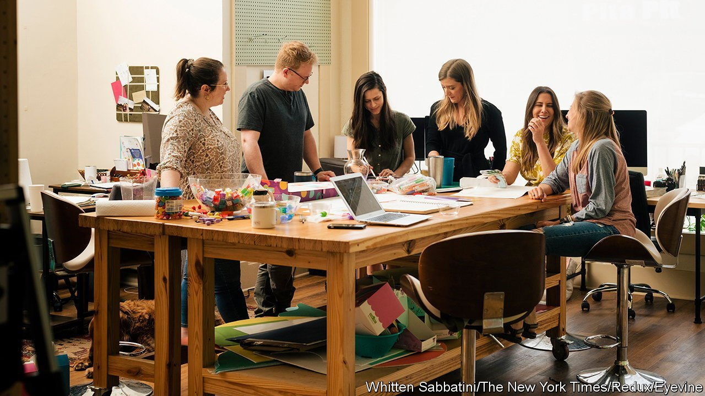
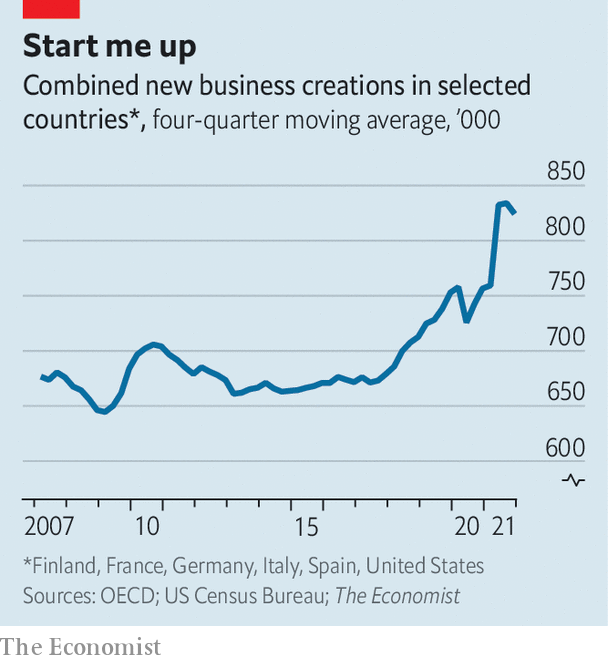

###### Get up and go

# All over the rich world, new businesses are springing to life 

##### More entrepreneurship is likely to be good for the economy 

 

> Apr 23rd 2022 

THE LASTING effects of the covid-19 pandemic on the economy are starting to become clear. Surveys suggest that Americans who can work from home are likely to do so for two or three days a week in the post-covid world, compared with hardly at all in 2019. Companies have regained their appetite for capital spending. And the pandemic appears to be provoking a shift towards higher levels of entrepreneurship around the rich world.

Economists are mainly focusing on the surge of new firms in America. But the trends are wider. Using data for a range of rich countries we estimate that in the fourth quarter of 2021 the number of “enterprise entries”—ie, newly formed companies—was 15% higher than the average before the pandemic (see chart). An extra 1m or so firms have sprung to life across the OECD group of mostly rich countries since the first lockdowns, compared with the pace of business creation before 2020.


Not everywhere is booming. In the 2000s Italians founded about 400,000 firms a year. They probably formed half that number in 2021. But most places are more vibrant. In America during the 2010s the share of people who worked for large companies (ie, those with more than 1,000 employees) was rising. In 2021 it fell, with the proportion of people working for small firms moving up. Britain is experiencing similar trends. In Germany new business creation is slightly higher than it was in 2019. And in France the number of startups is about 70% higher than was usual before the pandemic. Who said the French didn’t have a word for “entrepreneur”?

 


Some of these new firms are in glamorous industries. Caroline Girvan incorporated her fitness business in Northern Ireland in October 2020. (Her at-home videos, which your correspondent has discovered are impossibly difficult to keep up with, have racked up more than 250m views.) With global venture capital booming, startups from Triple Whale (e-commerce) in Columbus, Ohio, to Payrails (fintech) in Berlin are receiving lots of investment. Yet most of the companies set up during the pandemic have nothing to do with Silicon Valley or its pretenders. They are construction firms, consultancies and the like.

More entrepreneurship is likely to be good for the economy. New businesses try out fresh ideas and ways of doing things, while drawing capital and people away from firms that are stuck in their ways. Many economists draw links between the low rate of entrepreneurship after the financial crisis of 2007-09 and the weak productivity growth of the 2010s. In addition, a recovery with lots of startups tends to create more jobs, since young firms typically seek to expand and thus hire new staff.

Three explanations for the startup boom stand out. The first relates to family finances. From about 2017 onwards labour markets in the rich world noticeably strengthened, putting money in workers’ pockets. With a financial cushion in place, people may have felt comfortable trying something new—which might explain why business creation picked up shortly before the pandemic. Then governments plumped the cushion considerably, as they handed out vast amounts of cash via stimulus cheques or furlough schemes in 2020 and 2021. At the same time, people cut back on spending. The result was a huge rise in saving, and an acceleration in startups.

The second factor relates to economic reallocation. The pandemic has prompted profound changes in consumption habits, meaning that demand has shifted across both geographies and industries. City centres are less busy than suburbs, while industries favoured by social distancing—online retail, for instance—remain more popular than activities that require in-person attendance. Entrepreneurs are responding. In France the number of hospitality startups is 22% below its pre-pandemic level, but those in the information and communication sector are up by 26%.

The third explanation is hard to measure, but could have the longest-lasting effects. The pandemic, by reminding people that life is short, may have encouraged them to take more risks. It would not be the first time. In America from 1918, after the first world war had ended and the Spanish flu epidemic had faded, an even bigger startup boom began, as more people plucked up the courage to set out alone. ■


