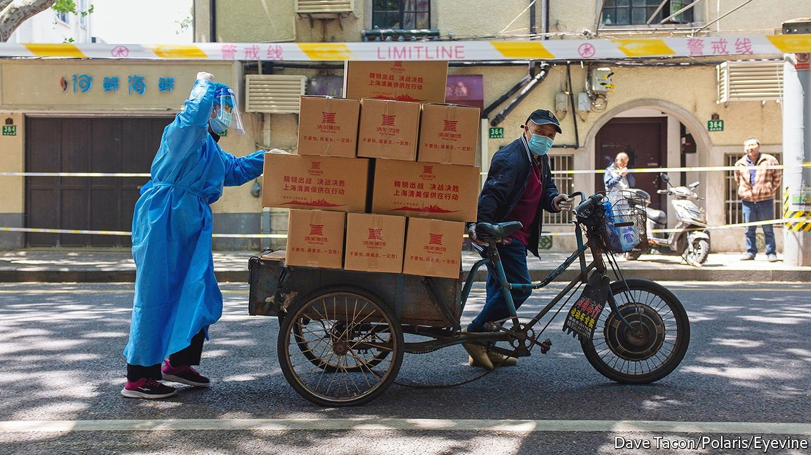

###### The hesitant v the urgent

# China’s two-front fight to quash the virus and revive its economy 

##### GDP held up in the first quarter, but retail sales slid in March 

 

> Apr 23rd 2022 

THE FORTUNES of the world’s second-biggest economy hinge on two kinds of hesitancy. The first is over vaccines.  are surprisingly reluctant to get inoculated against covid-19. That has saddled the country with a vulnerable population that could die in large numbers if the government abandons its . But this uncompromising stance, which tries to stamp out any outbreak of the virus, obliges China to impose ruinous lockdowns on some of its most productive cities, including , where some residents have been confined to their homes for over 30 days.

These limits on movement are wreaking economic havoc. Even before the worst restrictions were imposed, retail sales shrank by 3.5% year-on-year in March (in nominal terms), according to figures released on April 18th. Catering services fell by more than 16%. Unemployment in China’s 31 biggest cities is now 6%, higher than in 2020, points out Zhang Zhiwei of Pinpoint Asset Management. Overall GDP grew surprisingly fast, by 4.8% in the first quarter, compared with a year earlier. But that was mostly because of strength in the first two months of the year.


This quarter could look decidedly worse. Ting Lu of Nomura, a bank, thinks GDP could shrink. China’s rulers are not hiding their concern. Earlier this month Li Keqiang, the prime minister, told local authorities that they should show greater “urgency” in stabilising the economy.

Yet a second kind of hesitancy has marked the government’s response to the slowdown: a reluctance to stimulate the economy as forcefully as in the past. On April 15th the People’s Bank of China (PBoC) said it would reduce the amount of money that banks must hold in reserve. But it cut these requirements by only 0.25 percentage points for most banks, half as much as expected. And it has still not lowered its key policy rates since January, before the latest covid outbreak took hold. Instead this macro-institution has resorted to micro-management, issuing no fewer than 23 instructions to encourage lending for particular purposes, such as elderly care, transport and grain purchases.

What is holding the PBoC back? It says it will “refrain from a deluge of strong stimulus policies” and “strike a balance between internal and external equilibria”. It may worry that the monetary easing required to preserve growth would jeopardise China’s external balance with the rest of the world. In particular the PBoC may fear that capital would flee if it cut interest rates too boldly just as America’s Federal Reserve raises rates sharply. China has already suffered net capital outflows from its equity markets in recent months, as Russia’s invasion of Ukraine forced foreign investors to face up to geopolitical dangers they would rather not contemplate.

If China remains hesitant to ease monetary policy more dramatically, it must rely on fiscal stimulus. But even here, it faces impediments and reluctance. The finance ministry, for example, still has a prudish unwillingness to report a big headline budget deficit. Hence much of the extra public spending needed to stabilise growth this year will be carried out by local governments and special funds that do not appear in the headline figures.

Unfortunately, local authorities are themselves under renewed financial scrutiny. Last July, the banking regulator issued “Document No. 15” instructing banks not to increase the hidden debts of local governments. These rules were later shelved. But the threat of a future crackdown remains. Another directive issued by the finance ministry required local governments to pick spending projects more carefully if they wished to finance them with bonds.

Despite these intrusions, local governments probably have enough money as a group, reckons Hui Shan of Goldman Sachs, a bank. They have carried over unspent funds from last year and received transfers from the central government. But the money is not evenly spread. “Some provinces have projects but no money, others have money, but no projects,” she says.

In those parts of the country battling covid, the limits on stimulus may be logistical rather than financial. Lockdowns and other restrictions interfere with the manpower and supply chains necessary for public construction projects. Fighting covid may also monopolise officials’ attention. Yes, local officials are being urged to stabilise the economy with “urgency”. But they are also being sacked for losing control of the virus. That skews incentives towards cutting infections rather than expanding infrastructure. It is hard to be a covid hawk and a fiscal dove.

It is possible for stimulus to bypass such bureaucracy. In America fiscal easing took the form of “stimmy” cheques paid directly to households. China lacks an equivalent system for distributing government largesse. The next best thing, in theory, is cutting income taxes, which leaves more money in people’s pockets to spend. But as only a minority of Chinese pay income tax, such cuts would have little impact. The closest alternative is lower taxes on smaller firms, some of which are not much more than household operations anyway. Thus about a third of fiscal easing this year will take the form of cuts in taxes and fees for small and medium-sized enterprises, according to Goldman Sachs.

Again, however, covid poses an obstacle. The retailers and other small enterprises targeted by these tax cuts are often the same firms hit hardest by lockdowns and other restrictions. If the zero-covid policy deprives a firm of its customers, relieving it of taxes is scant consolation. A company with zero income does not care what tax rate it pays.

China may therefore have to wait until this covid wave subsides before it can revive its economy in earnest. And even then, it must hope that the economic comeback is not immediately halted by another outbreak. Until China’s elderly become less hesitant about vaccines, its economy will stay resistant to stimulus. ■

For more expert analysis of the biggest stories in economics, business and markets, , our weekly newsletter.

