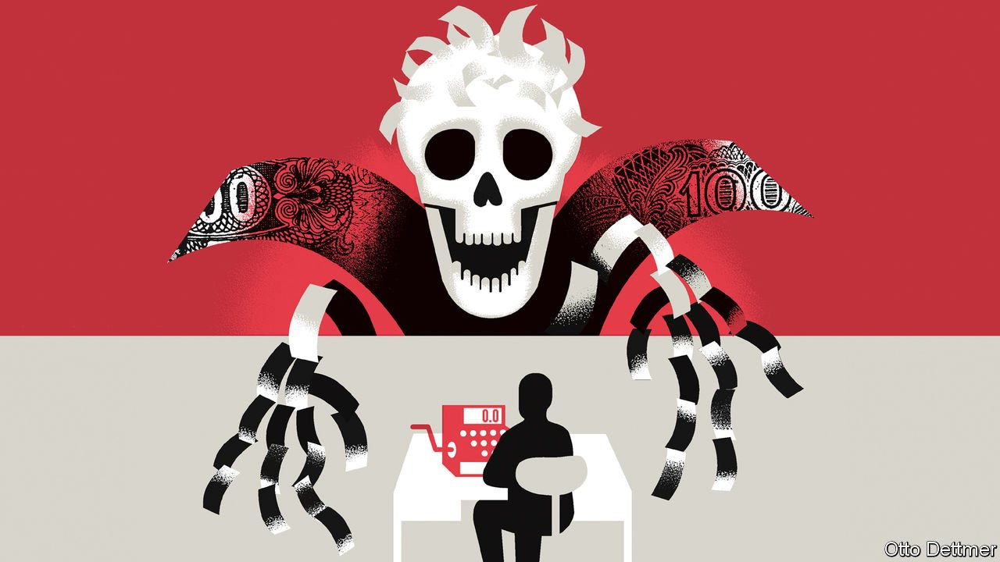

###### Free exchange

# Does high inflation matter? 

##### Economists and the public have very different views on the question 

 

> Apr 23rd 2022 

IT STARTED IN America, but the surge in inflation has spread to the rest of the rich world. Consumer prices across the OECD club of mostly rich countries are rising by 7.7%, year on year, the fastest pace of increase in at least three decades. In the Netherlands, inflation is nearing 10%, even higher than in America, while in Estonia it is over 15%. How forcefully should central banks respond to the inflationary surge? The answer depends on how much damage inflation is causing. And that depends on whom you ask.

Inflation is regarded as costly because it erodes people’s savings and distorts price signals. And there are unquestionably instances when it has brought an economy to its knees. During Weimar Germany’s period of hyperinflation in the 1920s people’s savings evaporated, eliminating the middle class and paving the way for the rise of fascism. Inflation also spiralled out of control in Zimbabwe under Robert Mugabe. As price signals broke down, millions went without food.


But in more moderate inflationary episodes, such as the current one, the evidence for economic carnage is weaker. One common worry is that increases in prices outpace rises in wages, causing people’s real incomes to decline. This has almost certainly been happening across rich countries in recent months. American real hourly earnings fell by nearly 3% in the year to March.

On the whole, though, economists see a tenuous connection between inflation and workers’ real living standards. Sometimes prices rise faster than wages; sometimes they do not. British real wages grew strongly during the inflationary era of the 1970s. According to a study published in 1975, American workers, whether unionised or not, had seen inflation-busting pay rises in the preceding decade. The Economist has looked at data for 35 OECD countries going as far back as 1990. In years when inflation exceeded 5%, we find, real wages rose on average. Inflation can also help the unemployed find jobs, even as it hurts people already in work. After the global financial crisis of 2007-09 sterling depreciated, lifting inflation in Britain and reducing real wages. Companies could then afford to hire more workers.

The notion that inflation messes with price signals, another putative economic cost, is also exaggerated at moderate levels. Capitalism allocates resources via movements in relative prices: if the price of cars rises compared with that for bicycles, more cars should eventually be produced. The worry is that inflation disrupts this process, making it harder to discern the “true” relative prices of cars and bicycles.

In a paper published in 2018, however, Emi Nakamura of the University of California, Berkeley, and colleagues examine price dispersion for the same sorts of products over time. Looking at the period of high inflation in the 1970s, they find “no evidence that prices deviated more from their optimal level” than just before the pandemic, when inflation was far lower. The “strong conclusions about [the] optimality of low inflation rates [in this regard] need to be reassessed”, they conclude.

Sophisticated papers such as these back up a broader body of work, going back decades, that questions the link between inflation and growth. A paper published by the IMF in 2014 noted that “few empirical studies have even tried to find costs of single-digit inflation.” In 1996 Michael Bruno and William Easterly, then both of the World Bank, found “no evidence of any relationship between inflation and growth at annual inflation rates less than 40%”. The next year Paul Krugman wrote that “even though inflation is universally regarded as a terrible scourge, efforts to measure its costs come up with embarrassingly small numbers.”

So does the rich world’s current bout of inflation have minimal costs, or even none at all? The trouble for economists is that there is a world outside their research. Few people know or care about their results. But they know what they think about inflation: they utterly, implacably loathe it.

Inflation seems to hold a special place in the public consciousness. Our analysis of English-language newspapers and blog posts suggests that during the 2010s media organisations mentioned inflation 50% more frequently than they mentioned unemployment, even though joblessness during that decade was a far bigger economic problem. In the 1990s Robert Shiller of Yale University asked people in a number of countries about their opinions on inflation, and compared them with the views of economists. He found that ordinary people held much more extreme views on the subject than the academics who study it for a living.

People believe that inflation makes them poorer. They worry it makes it harder to plan. And they believe that inflation is a sign that unscrupulous companies are taking advantage of them (two-thirds of Americans ascribe the recent rise in inflation to corporate greed). Economists, by contrast, are more equivocal in their answers. More than half of Americans “fully agreed” that preventing high inflation was as important as stopping drug abuse or maintaining educational standards, compared with just 18% of economists. In the same survey Mr Shiller found that 46% of people wanted the government to lower the price level after an inflation spike (ie, to engineer deflation), something few economists would recommend.

Get real

Perhaps policymakers should just ignore the views of ordinary people. If experts find that inflation has surprisingly low costs, then what more information is needed to guide policy? Another way of looking at it, however, is that the psychological costs of high inflation are real, and that central bankers and governments should take them into account. Fighting inflation by forcefully tightening fiscal or monetary policy is often seen as a hard-nosed choice because it cools the economy and risks provoking a recession. In fact it is one of the most populist policies out there. ■


