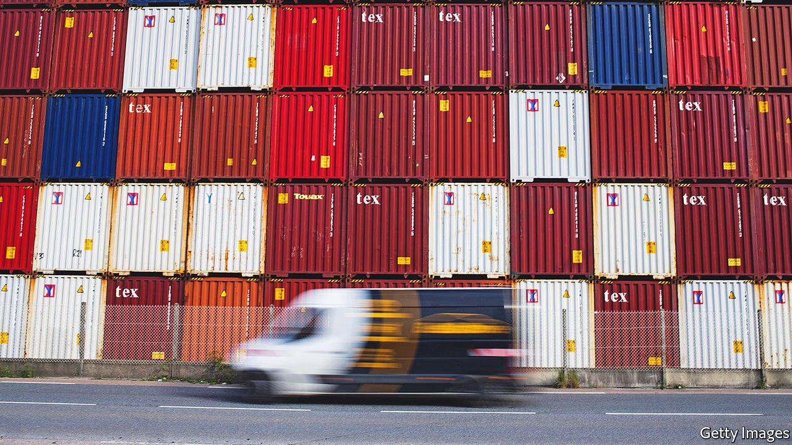
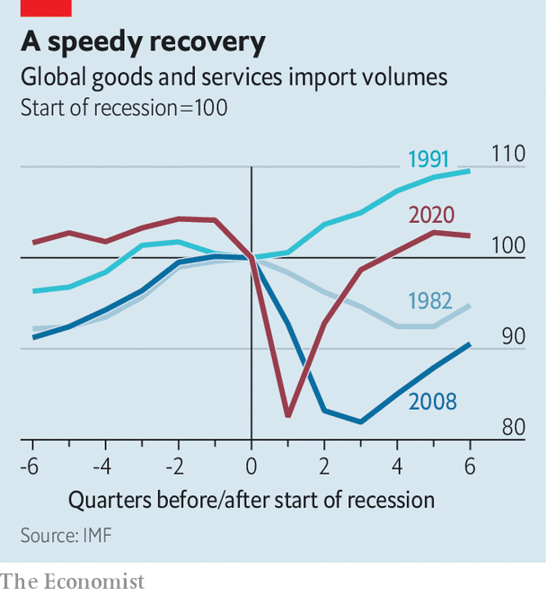

###### Stronger links

# New research spells out the benefits of diverse supply chains 

##### The IMF finds that reshoring leaves a country more exposed to shocks 

 

> Apr 23rd 2022 

OVER THE quarter-century before the pandemic, global manufacturing was transformed by the emergence of complex supply chains, through which firms could efficiently produce all sorts of goods at low cost and enormous scale. The pandemic put these supply chains through the wringer, causing wild swings in demand while forcing repeated lockdowns that frustrated both production and distribution. The result has been a surge in shipping delays, shortages of critical components and soaring prices.

Governments have become keener to boost domestic production, the better to reduce their vulnerability to disruptions in foreign supplies. But new work by the IMF suggests that this would be misguided. Supply chains held up better during the pandemic than is often assumed, it argues, and greater self-sufficiency is likely to leave countries more vulnerable to future shocks, not less.


The covid recession was unusual. Trade in goods fell sharply at its onset—by 12% in the second quarter of 2020, relative to late 2019—but then bounced back faster than has been common in recent downturns. To better understand these gyrations, the fund’s economists built a model that predicts trade patterns based on levels of spending within economies. They found large differences between the amount and type of trade predicted by the model and what actually happened during the pandemic—a sign of covid-related weirdness.

 


The virus distorted trade in part through its effects on domestic economies. Places that experienced higher caseloads and more restrictive lockdowns imported more goods than expected, given the blow to overall GDP, for instance. That in part reflects a shift in demand away from services and towards goods such as home electronics and protective equipment. Covid also interfered with the production of some goods at home, which then needed to be imported instead.

But lockdowns in some places also had spillover effects elsewhere. During the first half of 2020, the researchers note, about 60% of the decline in a country’s imports could be explained by lockdowns in its trading partners. These ripple effects hit goods that were reliant on long supply chains the hardest. But the drag was smaller when the places that were locked down had greater capacity to telework. And crucially, the effect of restrictions declined over time, as working patterns and supply chains adapted. Exporters in places that ended strict lockdowns earlier saw big gains in market share, with bigger increases occurring in the production of supply-chain-intensive goods.

A lack of data means that the fund’s analysis stops in mid-2021, after which a series of unfortunate events, from stranded ships to war, led to port backlogs and rising costs. Nonetheless, the fund reckons the model might suggest how best to protect an economy against disruptions. The answer is not by reshoring production, but by diversification: sourcing inputs from a wider variety of countries, and using components that can easily be substituted for if supply problems arise.

In most countries, the vast majority of components used to make goods tend to be sourced domestically. About 69% of parts in Europe and more than 80% in the western hemisphere are produced at home, for example. If a firm were to choose to import a critical component instead, it would face a more diverse choice: the market share of the average exporting country in the average industry is a little under a third. Re shoring would therefore tend to reduce the diversification of a supply chain rather than increase it, by making production even more dependent on a single country: the home economy. That could prove costly. The fund estimates that in the face of a big disruption (one that causes a 25% drop in labour supply in a single large producer of critical inputs), the average economy could be expected to suffer a fall in GDP of about 1%. Greater diversification stands to reduce the damage by about half.

Encouraging diversification is a tricky matter. The fund suggests that lowering barriers to trade and investing in infrastructure could help. Geopolitical tensions, sadly, mean that openness to deeper integration is in short supply. But the gains to be made, at least, are now clearer. ■


