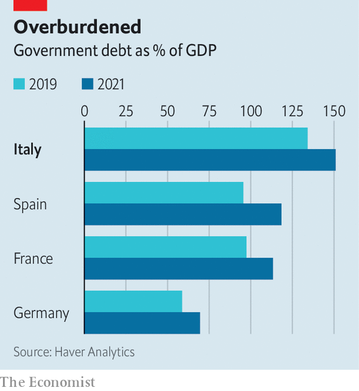

###### The Roman question

# What an end to quantitative easing means for Italian debt 

##### Investors will begin to follow Italy’s politics again 

 

> Apr 23rd 2022 

BEFORE THE pandemic, there were a few accepted facts about the euro zone. Heavily indebted southern member states would try to persuade northerners to agree to jointly issue bonds, and fail. Emmanuel Macron, the president of France, would talk of a big common budget, only to be met by opposition in Berlin. And everyone agreed—some would say pretended—that Italy’s government debt was manageable. That helped give the European Central Bank (ECB) political cover to buy Italian bonds during downturns.

Covid-19 has laid many of those truisms to rest. In 2020 the bloc set up a €750bn ($813bn) common recovery fund, financed by European bonds, to counter the economic fallout from the virus. The ECB‘s pandemic bond-buying scheme, through which it has bought €1.6trn in government debt, also helped contain borrowing costs for the zone’s more indebted members. But Italy’s big debt burden remains: in fact, it has grown, from 134% of GDP on the eve of the pandemic to 151% by the end of 2021. As inflation surges, the ECB has begun to signal that it will stop net bond purchases after the summer. What does that shift hold for Italian debt?


Italy’s bond yields depend in part on the country’s economic health. And it has been in better shape than its huge debt ratio might suggest. Recovery from the pandemic has been faster than expected, and the European Commission estimates that spending from the recovery fund could boost GDP by 1.5-2.5% over the next four years. The war in Ukraine, and the attendant rise in energy prices, is likely to dampen activity: on April 19th the IMF revised its forecasts for Italian GDP growth in 2022 down to 2.3%, from 3.8% in January. The hope, though, is that the reforms that are tied to receiving the EU’s recovery funds—such as an overhaul of public administration and the justice system—will bolster the economy over the long term.

 


With growth supported and inflation high, Italy’s nominal debt burden should eventually start to decline. Carlo Cottarelli, a former director of Italy’s fiscal watchdog, reckons that the country’s debt ratio could fall by three percentage points a year, provided that its growth spurt continues.

Yields will also be affected by what the ECB does next. It has indicated that it will stop making new purchases that add to its stock of holdings. But it is unlikely to reduce those holdings, whether by letting maturing bonds run off, or by making active sales (a policy known as quantitative tightening). Speaking on April 14th Christine Lagarde, the bank’s president, said that such balance-sheet shrinkage was much farther ahead along the path of monetary tightening. The central bank will therefore continue to maintain its stock of assets by re-investing the proceeds of maturing bonds, and so will continue to be a source of demand for Italian debt.

Furthermore, the central bank’s view of its role as a lender of last resort has matured. Ms Lagarde emphasised the bank’s philosophy of “flexibility”, in the name of ensuring that borrowing costs in weaker (ie, southern) parts of the euro area do not deviate too much from those for the rest of the bloc. That approach could extend to future quantitative tightening, which would be good news for Italy. The ECB could, for example, decide to reduce its holdings of German bonds first, to allow Italy more time to bring down its debt.

Perhaps the biggest change as the ECB scales back its asset purchases, though, is that investors will return to following Italian politics keenly. Parliamentary elections are due next spring, and there is a possibility that a populist government emerges victorious. It would probably be less enthusiastic about implementing the reforms that the recovery fund has so far encouraged. That would cloud the growth outlook and worsen the debt problem.

If the government were also hellbent on picking fights with the rest of Europe, the ECB may be forced to be a lot less flexible. Investors could begin to fear that the central bank might be unwilling to backstop a government that blatantly violates “macroeconomic reasonability”, worries Francesco Papadia, a former ECB official. In 2018 the formation of a populist coalition led the spread between Italian and German bond yields to double within days to nearly three percentage points. The fate of Italian bonds, in other words, ultimately rests with Rome. ■


